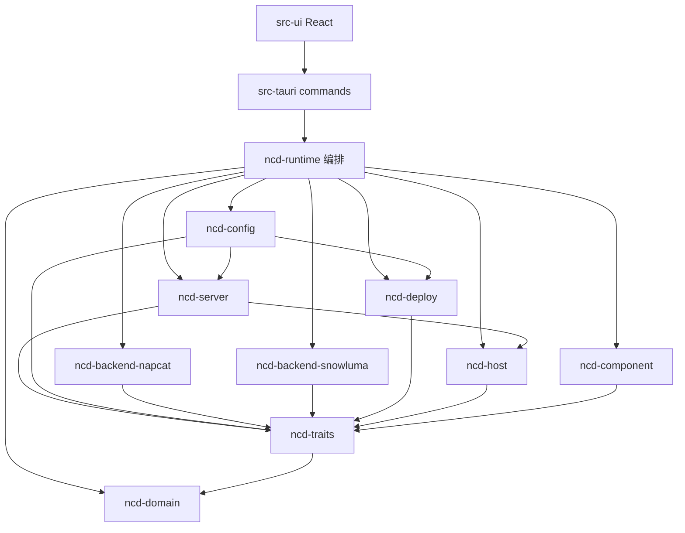

# Codemap — 功能域 → 代码落点

> 接手任务先查这张表锁域，再在闭包内搜/改。  
> 生成：2026-07-09 | HEAD 参考：`8140ebd0` | 主体迁移已完成  
> 旧 Python 对照根：**`.references/NapCatQQ-Desktop-main`**（不是 `legacy-python/`）

## 怎么用

1. 用业务关键词在下表找到 **域**。
2. 只打开该域「主路径」+「相关入口」；不要无理由全库扫。
3. NC/SL 启停/登录/WebUI/远端语义先读 `.claude/kb/INDEX.md`。
4. 跨边界类型：Rust `ts-rs` → `src-ui/core/ipc/generated/**`，前端只 re-export。



---

## 总览：仓库布局

| 路径 | 职责 |
|------|------|
| `crates/ncd-domain/` | Layer1 强类型模型、事件 payload、配置/ID/错误 |
| `crates/ncd-traits/` | Layer2 契约：BotBackend、ConfigStore、EventBus、SecretStore… |
| `crates/ncd-runtime/` | Layer3 编排：BotManager、域目录 bootstrap/launch/remote/…；config/server re-export |
| `crates/ncd-config/` | 配置横切：store/drift/migration/secret/path/discovery（runtime re-export 兼容） |
| `crates/ncd-server/` | 远端主机档案 / 凭据 / SSH 密钥 / HostResolver（runtime re-export 兼容） |
| `crates/ncd-backend-napcat/` | NapCat 本机+远端实现（WebUI/login poller/remote native） |
| `crates/ncd-backend-snowluma/` | SnowLuma daemon/poller + remote stack/tunnel |
| `crates/ncd-host/` | 本机 Windows / 远端 Linux SSH 主机抽象 |
| `crates/ncd-watch/` | 远端主机侧监控 bin：探活 + Webhook（Desktop 退出后） |
| `crates/ncd-component/` | 组件：Node/QQ/NoVnc/NapCat/SnowLuma/DesktopSelf（规划中：NcdWatch） |
| `crates/ncd-deploy/` | 部署计划、Docker/Native、配置渲染、RemoteQq 协调 |
| `crates/ncd-network/` | HTTP/下载/代理等 |
| `crates/ncd-update/` | 应用自更新 |
| `crates/ncd-log/` | 日志设施 |
| `crates/ncd-template/` | compose/模板生成 |
| `crates/ncd-test-support/` | 测试 fixture / mock |
| `src-tauri/` | Tauri 薄壳：bootstrap、commands、tray、lightweight |
| `src-ui/` | React UI：app / modules / hooks / core / shared |
| `.references/NapCatQQ-Desktop-main/` | 旧 PySide6 实现（只读对照） |
| `.references/SnowLuma/`、`NapCatQQ/` 等 | 上游/周边参考（只读） |
| `.claude/` | 本地 AI 状态/KB/plan（gitignore） |
| `docs/context/` | 给人/Agent 的活上下文（本 codemap） |
| `docs/dev/` | 架构/归档（本地，gitignore） |

---

## 域表

### 1) 应用启动 / 数据根 / Bootstrap

| 关注点 | 主路径 |
|--------|--------|
| 数据根解析 | `src-tauri/src/bootstrap.rs`（`resolve_data_root`：`NCD_DATA_ROOT` → **HKCU** DataRoot → **HKLM** DataRoot → ProgramData 默认） |
| 产品路径注册表 | `src-tauri/src/product_registry.rs`（HKLM 机器默认 + **HKCU 用户迁移指针** `write_user_data_root`）+ `src-tauri/wix/v2-orphan-cleanup.wxs`（HKLM DataRoot 机器默认；WiX3 无 NeverOverwrite）+ `src-tauri/wix/main.wxs`（HKCU `Software\NapCatQQ Desktop`；模板须 `Software\\{{product_name}}`）+ `legacy_install_cleanup.rs` |
| 数据根整树迁移 | `crates/ncd-runtime/src/data/relocate.rs` + `ncd-domain` `data_root_migrate.rs` + `src-tauri/src/commands/data_root_migrate.rs` + UI `DataRootMigrateDialog` / `DataTab`；活 plan `.claude/plan/data-root-relocate.md` |
| 启动快照 | `src-tauri/src/bootstrap.rs` + `ncd-domain` `bootstrap.rs` |
| App 组装 / AppState | `src-tauri/src/lib.rs` |
| 运行时句柄 | `src-tauri/src/runtime.rs` |
| 前端启动门 | `src-ui/app/AppBootGate.tsx`, `StartupSplash.tsx`, `AppProvidersNext.tsx` |
| 前端 bootstrap 服务 | `src-ui/core/services/bootstrap.service.ts` |
| hooks | `src-ui/hooks/bootstrap/` |
| domain 模型 | `src-ui/core/domain/bootstrap/` |
| 配置迁移 / 旧目录发现 | `ncd-config`（migration/app/bot/legacy_discovery/path_probe）；server profile 在 `ncd-server`；runtime 旧路径 re-export |
| Desktop 用户协议 / 隐私 | `src-tauri/legal/{EULA,PRIVACY}.md` + `src-tauri/src/desktop_consent.rs` + `commands/desktop_consent.rs`；前端 `desktop-consent.service.ts` / `useDesktopConsentGate` / `DesktopConsentDialog`；**启动进主界面即 gate**（不同意退出）；`start/upsert/batch_start` command 强制 `ensure_accepted`（`DESKTOP_CONSENT_REQUIRED`）；未同意时 bootstrap 跳过 auto_start；同意落 `data_root/config/desktop-consent.json`（content-hash，进程内 OnceLock 缓存正文） |
| 新手引导（可选） | `src-tauri/src/desktop_onboarding.rs` + `commands/desktop_onboarding.rs`；前端 `desktop-onboarding.service.ts` / `useOnboardingGate` / `OnboardingDialog` / `onboardingHost`；**consent 通过后**弹「了解 / 跳过」（门禁式，无 X）；设置·关于「重新查看入门」；**只认** `data_root/config/desktop-onboarding.json` 的 status，不探测 bot.json |
解析：`NCD_DATA_ROOT` → `HKCU\SOFTWARE\NapCatQQ-Desktop\DataRoot`（用户迁移，无 UAC）→ `HKLM\…\DataRoot`（MSI 机器默认；启动缺键补写；用户权威在 HKCU）→ ProgramData。业务模块禁止硬编码 ProgramData/LocalAppData。整树换根 ≠ layout 收敛（后者见 `data/consolidate.rs`）
权威数据根默认：`%ProgramData%\NapCatQQ Desktop`。Windows 生产以 `HKLM\SOFTWARE\NapCatQQ-Desktop\DataRoot` 为准（MSI 写入；启动缺键补写；后续可迁移改指针）；`NCD_DATA_ROOT` 环境变量可覆盖。业务模块禁止硬编码 ProgramData/LocalAppData。


---

### 2) Bot 生命周期（启停/重启/状态）

| 关注点 | 主路径 |
|--------|--------|
| 编排核心 | `crates/ncd-runtime/src/bot_manager/`（mod + helpers + listeners） |
| 路由 NC/SL × Local/Server × Native/Docker | `crates/ncd-runtime/src/launch/router.rs` + `bot_manager` `backend_for_config` |
| Actor 状态机 | `crates/ncd-runtime/src/bot_actor.rs` + `ncd-domain/bot_actor.rs` |
| 本机启动计划 | `crates/ncd-runtime/src/launch/plan.rs` |
| Docker 会话（隧道/日志/poller） | `crates/ncd-runtime/src/remote/docker_session.rs` |
| 远端 runtime 会话表 | `crates/ncd-runtime/src/remote/runtime_sessions.rs` |
| 远端日志 follow | `crates/ncd-runtime/src/remote/bot_log_follow.rs` |
| 冷启动 reconcile | `crates/ncd-runtime/src/bootstrap/reconcile.rs` |
| 原生部署适配 | `crates/ncd-runtime/src/native_deployment_adapter/` |
| Tauri commands | `src-tauri/src/commands/bot.rs` |
| 前端页 | `src-ui/modules/bot/BotPage.next.tsx`, `list/`, `log/`, `dialogs/` |
| 前端服务/hooks | `src-ui/core/services/bot.service.ts`, `src-ui/hooks/bot/` |
| 配置模型 | `crates/ncd-domain/src/bot_config.rs`, `runtime_scenario.rs` |
| BotBackend trait | `crates/ncd-traits/src/runtime_backend.rs` |

KB：`.claude/kb/desktop-routing.md`, `nc-vs-sl.md`

---

### 3) NapCat 后端

| 关注点 | 主路径 |
|--------|--------|
| crate 入口 | `crates/ncd-backend-napcat/src/lib.rs` |
| WebUI 客户端 | `.../napcat/webui_client.rs` |
| 登录轮询 | `.../napcat/login_poller.rs` |
| 端点表 | `.../napcat/endpoint_table.rs` |
| 离线通知 | `.../napcat/offline_notifier.rs` |
| 远端 NapCat session | `.../remote_native_napcat_session/`（含 `launch.rs` 启动规划） |
| runtime re-export | `crates/ncd-runtime/src/napcat/` |
| 事件原因类型 | `crates/ncd-domain/src/napcat_events.rs` |

旧对照：`.references/NapCatQQ-Desktop-main/src/core/runtime/`（napcat driver 等）

KB：`.claude/kb/napcat-runtime.md`

---

### 4) SnowLuma 后端

| 关注点 | 主路径 |
|--------|--------|
| crate 入口 | `crates/ncd-backend-snowluma/src/lib.rs` |
| 本机 daemon / session / poller | `.../snowluma/daemon.rs`, `session.rs`, `status_poller/` |
| WebUI 客户端 | `.../snowluma/webui_client/` |
| 进程树 / login probe | `.../snowluma/proc_tree.rs`, `qq_login_probe.rs`, `linux_proc_probe.rs` |
| 本机 runtime backend | `.../snowluma/runtime_backend.rs` |
| 远端 backend 总装 | `.../remote_snowluma/`（backend/daemon/inject/config/helpers） |
| 远端编排 / 栈 / 布局 / 隧道 / 日志 | `.../remote_snowluma/{orchestrator,stack,layout,tunnel,log}.rs` |
| 协议同意 / consent 文件 | `crates/ncd-runtime/src/snowluma/{agreements,consent_files}.rs` |
| Tauri SL 命令 | `src-tauri/src/commands/snowluma.rs` |
| 前端服务 | `src-ui/core/services/snowlumaApp.service.ts` |
| domain | `ncd-domain/daemon_state.rs`, `snowluma_start_mode.rs` |

KB：`.claude/kb/snowluma-runtime.md`, `snowluma-docker.md`  
活 plan（登录态）：`.claude/plan/remote-snowluma-login-status-fix.md`

---

### 5) 远程主机 / SSH / ServerManager

| 关注点 | 主路径 |
|--------|--------|
| ServerManager / 健康探活 | `crates/ncd-server/src/server_manager.rs`（`ncd_runtime::server_manager` re-export） |
| 凭据同步 | `crates/ncd-server/src/credential_sync.rs` |
| SSH keygen | `crates/ncd-server/src/ssh_keygen.rs` |
| Host 解析 | `crates/ncd-server/src/host_resolver.rs`, `src-tauri/src/bot_host_resolver.rs` |
| Host 抽象 | `crates/ncd-host/src/host.rs`, `local/`, `remote/` |
| Server profile 迁移 | `crates/ncd-server/src/server_profile_migration.rs` |
| Tauri | `src-tauri/src/commands/servers.rs`, `host_resolve.rs` |
| 前端页 | `src-ui/modules/remote/*`（`RemoteHostPanel`, `ServerCard`, `AddServerDialog`） |
| hooks | `src-ui/hooks/remote/` |
| 服务 | `src-ui/core/services/server.service.ts`, `remote.service.ts` |
| domain UI | `src-ui/core/domain/remote-host/` |

归档设计：`docs/dev/archive/bugfix/remote-ssh-stability/`  
Host 层命令/流：`ncd-host` `command.rs` `process.rs` `stream_chunk.rs` `package_manager.rs`

---

### 6) 组件安装 / 探测（Component × Host × Action）

| 关注点 | 主路径 |
|--------|--------|
| 组件实现 | `crates/ncd-component/src/{nodejs,qq,novnc,napcat,snowluma,desktop_self}.rs` |
| 上下文 / 进度 | `crates/ncd-component/src/context.rs`, `ncd-domain/progress.rs` |
| QQ 系统依赖 | `ncd-component/qq_deps/`, `ncd-domain/qq_dependency.rs` |
| 远端 QQ 入口 | `ncd-component/remote_qq_entry.rs` + `ncd-deploy/remote_coordinator.rs` |
| Tauri | `src-tauri/src/commands/components.rs` |
| 前端页 | `src-ui/modules/components/*`（`ComponentsPage`, `HostComponentsView`, `HostSwitcher`…） |
| hooks | `src-ui/hooks/components/` |
| 服务 | `src-ui/core/services/component.service.ts` |

铁律：装东西必须走 Component × Host × Action，不在 command 里硬编码安装脚本逻辑。

---

### 7) Docker / 部署

| 关注点 | 主路径 |
|--------|--------|
| 部署编排 | `crates/ncd-deploy/src/{deployment,plan,runner,result}.rs` |
| Docker 子树 | `crates/ncd-deploy/src/docker/` |
| Deployments（docker/native…） | `crates/ncd-deploy/src/deployments/` |
| 配置渲染（NC/SL docker payload） | `crates/ncd-deploy/src/backend_config_renderer.rs`（runtime 可能 re-export） |
| 模板 | `crates/ncd-template/` |
| 部署任务队列 | `crates/ncd-runtime/src/deploy/tasks.rs` + domain `deployment_task.rs` |
| Tauri | `src-tauri/src/commands/docker.rs`, `deployment_tasks.rs` |
| 前端 Docker 页 | `src-ui/modules/docker/*` |
| 任务队列页 | `src-ui/modules/task-queue/*` |
| hooks | `src-ui/hooks/docker/`, `task-queue/` |
| 服务 | `docker.service.ts`, `deployment-task.service.ts` |

---

### 8) 配置 / 设置 / 导入导出

| 关注点 | 主路径 |
|--------|--------|
| App 配置模型 | `crates/ncd-domain/src/app_config.rs` |
| **应用端框架轴（AppFramework）** | `ncd-domain/app_framework.rs`；traits `AppIntegration`/`AppRuntime`；runtime `app_framework/`（OneBot 导出 + Stub）；**不**进 `BackendType`；真框架对接未排期 |
| Bot 配置模型 | `crates/ncd-domain/src/bot_config.rs` |
| ConfigStore / Repo trait | `ncd-traits/config_store.rs`, `bot_config_repo.rs` |
| 本地实现 | `ncd-config/{store,bot_repo}.rs`（runtime 旧路径 `config_store_impl` / `bot_config_repo_impl` re-export） |
| drift / 渲染 | `ncd-config/{drift,renderer}.rs` |
| Bot/App 迁移 | `ncd-config/{bot_migration,app_migration,migration}.rs` |
| SecretStore | `ncd-config/secret_store.rs` + trait |
| DataPaths / PathProbe | `ncd-config/{data_paths,path_probe}.rs` |
| Tauri | `commands/app_settings.rs`, `config_transfer.rs` |
| 前端设置页 | `src-ui/modules/settings/*`（`SettingsPage`, `tabs/`, `settings-draft.ts`） |
| Bot 配置 UI | `src-ui/modules/bot/config/` |
| 服务 | `settings.service.ts`, `config-transfer.service.ts` |
| hooks | `src-ui/hooks/preferences/`, domain `settings/` |

---

### 9) 事件总线 / IPC / 生成类型

| 关注点 | 主路径 |
|--------|--------|
| DomainEvent 模型 | `crates/ncd-domain/src/domain_event.rs` |
| EventBus trait + Broadcast | `crates/ncd-traits/src/events.rs` |
| runtime 事件辅助 | `crates/ncd-runtime/src/events.rs` |
| 前端事件流 | `src-ui/core/services/event-stream.service.ts`, `domain-event-hub.ts` |
| hooks | `src-ui/hooks/events/` |
| 生成 TS | `src-ui/core/ipc/generated/**` |
| transport | `src-ui/core/ipc/transport.ts`, `types.ts` |
| mock | `src-ui/core/ipc/mock/` |
| 命令注册表 | `src-tauri/src/commands/mod.rs` |
| capabilities | `src-tauri/capabilities/main.json` |

事件 payload 带 `v: u32` envelope（R14）。`tauri_event_name()` 与 serde `kind` 单一字面量来源（R3）。

---

### 10) 桌面壳：托盘 / 轻量模式 / 退出 / 通知

| 关注点 | 主路径 |
|--------|--------|
| 轻量模式 | `src-tauri/src/lightweight.rs`, `lightweight_scheduler.rs` |
| 托盘 | `tray_icon.rs`, `tray_menu.rs`, `tray_summary.rs` + `commands/tray.rs` |
| 退出闸门 | `commands/exit.rs` + `src-ui/app/DesktopExitGate.tsx` + `exit.service.ts` |
| 窗口 | `commands/window.rs`, `window_icon.rs` |
| 桌面日志 | `desktop_log.rs`, `desktop_log_format.rs`, `commands/desktop_log.rs` |
| 通知 / Toast | `desktop_notify.rs`, `windows_toast.rs` |
| 离线多渠道 | `crates/ncd-runtime/src/notify/` + 设计归档 `docs/dev/archive/ncd-watch/offline-onebot-notice.md` |
| 远端脱管后监控（设计） | 设计归档 `docs/dev/archive/ncd-watch/`；活 plan `.claude/plan/ncd-watch.md`；crate `crates/ncd-watch` |

| 单实例 | `single_instance.rs` |
| hooks | `src-ui/hooks/desktop/` |

产品口径：托盘隐藏 ≠ 退出；退出停本机 Bot、远端脱管；再开走 bootstrap reconcile。

---

### 11) 发布 / 自更新 / Release

| 关注点 | 主路径 |
|--------|--------|
| runtime release 逻辑 | `crates/ncd-runtime/src/release.rs` |
| 更新 crate | `crates/ncd-update/` |
| domain snapshot | `ncd-domain/release_snapshot.rs` |
| Tauri | `commands/release.rs` |
| 前端 | `src-ui/core/services/release.service.ts`, domain `release/` |
| 清单 | `.claude/RELEASE_CHECKLIST.md` |

---

### 12) 网络 / 日志 / 系统指标

| 关注点 | 主路径 |
|--------|--------|
| 网络 | `crates/ncd-network/src/**` |
| 日志 crate | `crates/ncd-log/src/**` |
| 系统指标 command | `src-tauri/src/commands/system_metrics.rs` |
| 服务 | `system-metrics.service.ts` |
| 外链打开 | `src-ui/hooks/useOpenExternal.ts`（R4：走 opener 插件） |

---

### 13) 前端壳与路由

| 关注点 | 主路径 |
|--------|--------|
| 根应用 | `src-ui/app/AppNext.tsx` |
| 路由枚举 / 侧栏 | `src-ui/shared/components/next/Sidebar.tsx` |
| 路由：overview / bots / components / docker / remote / tasks / settings | 各 `src-ui/modules/*` |
| 设计 token / 主题 | `src-ui/core/design/`, `hooks/theme/` |
| 共享 UI | `src-ui/shared/ui/`, `shared/components/` |
| 入口 | `src-ui/main.tsx`, `src-ui/index.html` |


---

## 旧 Python 对照（`.references/NapCatQQ-Desktop-main`）

| 旧路径（参考树） | 新落点 |
|------------------|--------|
| `main.py` | `src-tauri` + `src-ui` 启动 |
| `src/core/runtime/*` | `ncd-runtime` + `ncd-backend-*` |
| `src/core/config/*` | `ncd-domain` bot/app config + runtime store/migration |
| `src/core/operation/*` | `ncd-host` + deploy/component |
| `src/core/remote/*` | `server_manager` + `ncd-host/remote` + remote backends |
| `src/ui/*` | `src-ui/modules/*`（勿平移 Fluent 结构） |

更细 driver 对照：`.claude/kb/legacy-python-map.md`（路径以本表 `.references/NapCatQQ-Desktop-main` 为准）。

---

## 改功能时的推荐闭包模板

复制到活 plan「功能闭包」：

```text
域: <上表编号/名称>
Rust: <crates/...>
Tauri: <src-tauri/src/commands/...>
UI: <src-ui/modules/... + hooks + services>
生成类型: <是否需要 npm run ts-bindings>
KB: <是否读 .claude/kb/...>
不碰: <邻域>
```

---

## 验证命令速查

| 场景 | 命令 |
|------|------|
| 前端类型 | `npm run typecheck` |
| 全量门禁 | `npm run verify` |
| 单 crate | `cargo check -p <crate>` / `cargo test -p <crate>` |
| Tauri 壳 | `cargo check -p ncd-tauri` |
| 重生 TS 绑定 | `npm run ts-bindings` |
