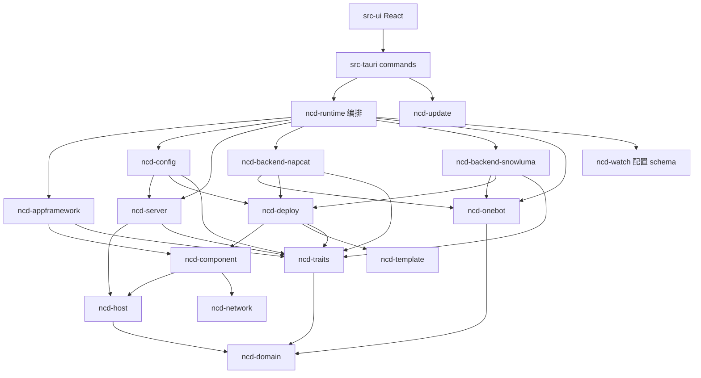

# Codemap — 功能域 → 代码落点

> 接手任务先查这张表锁域，再在闭包内搜/改。  
> 生成：2026-07-09 | 路径最近一次逐条核对：2026-09-29（`4eb35382`） | 主体迁移已完成  
> 旧 Python 对照根：**`.references/NapCatQQ-Desktop-main`**（不是 `legacy-python/`）

## 怎么用

1. 用业务关键词在下表找到 **域**。
2. 只打开该域「主路径」+「相关入口」；不要无理由全库扫。
3. NC/SL 启停/登录/WebUI/远端语义先读 `.claude/kb/INDEX.md`。
4. 跨边界类型：Rust `ts-rs` → `src-ui/core/ipc/generated/**`，前端只 re-export。


```mermaid
flowchart TB
  UI[src-ui React] --> IPC[src-tauri commands]
  IPC --> RT[ncd-runtime 编排]
  IPC --> UPD[ncd-update]
  RT --> AF[ncd-appframework]
  RT --> CFG[ncd-config]
  RT --> SRV[ncd-server]
  RT --> BN[ncd-backend-napcat]
  RT --> BS[ncd-backend-snowluma]
  RT --> OB[ncd-onebot]
  BN --> OB
  BS --> OB
  OB --> DOM
  RT --> WATCH[ncd-watch 配置 schema]
  CFG --> SRV
  CFG --> DEP[ncd-deploy]
  BN --> DEP
  BS --> DEP
  AF --> COMP[ncd-component]
  DEP --> COMP
  DEP --> TPL[ncd-template]
  COMP --> HOST[ncd-host]
  COMP --> NET[ncd-network]
  SRV --> HOST
  AF --> TR[ncd-traits]
  SRV --> TR
  CFG --> TR
  BN --> TR
  BS --> TR
  DEP --> TR
  TR --> DOM[ncd-domain]
  HOST --> DOM
```

图里只画主要的边：除 ncd-network / ncd-log / ncd-template 这几个无内部依赖的 crate，其余都直接依赖 ncd-domain；runtime 也直接用 host / component / deploy / network / log。两个 `ncd-backend-*` 互不依赖。

---

## 总览：仓库布局

| 路径 | 职责 |
|------|------|
| `crates/ncd-domain/` | Layer1 强类型模型、事件 payload、配置/ID/错误；跨 IPC 的类型大多在这里派生 ts-rs（`ComponentId` 与依赖图、`LogSnapshot`、应用端实例 / 配置错误…） |
| `crates/ncd-traits/` | Layer2 契约：BotBackend、ConfigStore、EventBus、SecretStore、AppIntegration… |
| `crates/ncd-runtime/` | Layer3 编排：BotManager、AppManager、ComponentExecutor、TerminalManager、DeploymentTaskManager，域目录 bootstrap/launch/remote/…；config/server re-export |
| `crates/ncd-config/` | 配置横切：store/drift/migration/secret/path/discovery（runtime re-export 兼容） |
| `crates/ncd-server/` | 远端主机档案 / 凭据 / SSH 密钥 / HostResolver（runtime re-export 兼容） |
| `crates/ncd-backend-napcat/` | NapCat 本机+远端实现（WebUI/login poller/remote native） |
| `crates/ncd-backend-snowluma/` | SnowLuma daemon/poller + remote stack/tunnel |
| `crates/ncd-onebot/` | OneBot 11 调试台协议层：动作目录（NapCat / SnowLuma 两种文档统一模型 + 内置快照）、HTTP / WS / SSE 客户端、重连退避、事件环形缓冲；只依赖 ncd-domain，不认识 Bot 和 Tauri |
| `crates/ncd-host/` | 本机 Windows / 远端 Linux SSH 主机抽象；shell 引号 `shell_single_quote`、Linux 包管理器 `LinuxPackageManager`、远端读文件 `remote_file` 都在这层 |
| `crates/ncd-watch/` | 远端主机侧监控 bin：探活 + Webhook（Desktop 退出后） |
| `crates/ncd-component/` | 组件：Node/uv/QQ/NoVnc/NapCat/SnowLuma/DesktopSelf/NcdWatch；`ComponentId`（含按实例装的 Karin / NoneBot2 / AstrBot / MaiBot / Koishi）定义在 ncd-domain，这里转出 |
| `crates/ncd-appframework/` | 应用端框架适配器：registry + `karin/`、`nonebot2/`、`astrbot/`、`maibot/`、`koishi/`（manifest / Component / Integration / 写配置备份还原），共用的挑口查口 `ports.rs` |
| `crates/ncd-deploy/` | 部署计划、Docker/Native、配置渲染、RemoteQq 协调 |
| `crates/ncd-network/` | HTTP/下载/代理等 |
| `crates/ncd-update/` | 应用自更新 |
| `crates/ncd-log/` | 日志设施 |
| `crates/ncd-template/` | compose/模板生成 |
| `crates/ncd-test-support/` | 测试 fixture / mock |
| `src-tauri/` | Tauri 薄壳：bootstrap、commands、tray、lightweight |
| `src-ui/` | React UI：app / modules / hooks / core / shared |
| `.references/NapCatQQ-Desktop-main/` | 旧 PySide6 实现（只读对照） |
| `.references/SnowLuma/`、`NapCatQQ/` 等 | 上游/周边参考（只读） |
| `.claude/` | 本地 AI 状态/KB/plan（gitignore） |
| `docs/context/` | 给人/Agent 的活上下文：本 codemap、后端能力速查 `capabilities.md`、前端分层 `frontend.md`、踩坑 `lessons.md` |
| `docs/dev/` | 架构/归档（本地，gitignore） |

---

## 域表

### 1) 应用启动 / 数据根 / Bootstrap

| 关注点 | 主路径 |
|--------|--------|
| 数据根解析 | `src-tauri/src/bootstrap.rs`（`resolve_data_root`：`NCD_DATA_ROOT` → **HKCU** DataRoot → **HKLM** DataRoot → ProgramData 默认） |
| 产品路径注册表 | `src-tauri/src/product_registry.rs`（HKLM 机器默认 + **HKCU 用户迁移指针** `write_user_data_root`）+ `src-tauri/wix/v2-orphan-cleanup.wxs`（HKLM DataRoot 机器默认；WiX3 无 NeverOverwrite）+ `src-tauri/wix/main.wxs`（HKCU `Software\NapCatQQ Desktop`；模板须 `Software\\{{product_name}}`）+ `legacy_install_cleanup.rs` |
| 数据根整树迁移 | `crates/ncd-runtime/src/data/relocate.rs` + `ncd-domain` `data_root_migrate.rs` + `src-tauri/src/commands/data_root_migrate.rs` + UI `DataRootMigrateDialog` / `DataTab`；活 plan `.claude/plan/data-root-relocate.md` |
| 启动快照 | `src-tauri/src/bootstrap.rs` + `ncd-domain` `bootstrap.rs` |
| App 组装 / AppState | `src-tauri/src/lib.rs` |
| 运行时句柄 | `src-tauri/src/runtime.rs` |
| 前端启动门 | `src-ui/app/AppBootGate.tsx`, `StartupSplash.tsx`, `AppProvidersNext.tsx` |
| 前端 bootstrap 服务 | `src-ui/core/services/bootstrap.service.ts` |
| hooks | `src-ui/hooks/bootstrap/` |
| domain 模型 | `src-ui/core/domain/bootstrap/` |
| 配置迁移 / 旧目录发现 | `ncd-config`（migration/app/bot/legacy_discovery/path_probe）；server profile 在 `ncd-server`；runtime 旧路径 re-export |
| Desktop 用户协议 / 隐私 | `src-tauri/legal/{EULA,PRIVACY}.md` + `src-tauri/src/desktop_consent.rs` + `commands/desktop_consent.rs`；前端 `desktop-consent.service.ts` / `useDesktopConsentGate` / `DesktopConsentDialog`；**启动进主界面即 gate**（不同意退出）；`start/upsert/batch_start` command 强制 `ensure_accepted`（`DESKTOP_CONSENT_REQUIRED`）；未同意时 bootstrap 跳过 auto_start；同意落 `data_root/config/desktop-consent.json`；**同意键 = 各文档声明版本**（`eula@1.3+privacy@1.2`，改正文不升版则不重弹），正文归一化换行后再算 `contentHash`（只记录，不判定），旧 content-hash 记录（LF/CRLF 两种）仍视为已同意；正文与指纹进程内 OnceLock 缓存 |
| 新手引导（可选） | `src-tauri/src/desktop_onboarding.rs` + `commands/desktop_onboarding.rs`；前端 `desktop-onboarding.service.ts` / `useOnboardingGate` / `OnboardingDialog` / `onboardingHost`；**consent 通过后**弹「了解 / 跳过」（门禁式，无 X）；设置·关于「重新查看入门」；**只认** `data_root/config/desktop-onboarding.json` 的 status，不探测 bot.json |
解析：`NCD_DATA_ROOT` → `HKCU\SOFTWARE\NapCatQQ-Desktop\DataRoot`（用户迁移，无 UAC）→ `HKLM\…\DataRoot`（MSI 机器默认；启动缺键补写；用户权威在 HKCU）→ ProgramData。业务模块禁止硬编码 ProgramData/LocalAppData。整树换根 ≠ layout 收敛（后者见 `data/consolidate.rs`）
权威数据根默认：`%ProgramData%\NapCatQQ Desktop`。Windows 生产以 `HKLM\SOFTWARE\NapCatQQ-Desktop\DataRoot` 为准（MSI 写入；启动缺键补写；后续可迁移改指针）；`NCD_DATA_ROOT` 环境变量可覆盖。业务模块禁止硬编码 ProgramData/LocalAppData。


---

### 2) Bot 生命周期（启停/重启/状态）

| 关注点 | 主路径 |
|--------|--------|
| 编排核心 | `crates/ncd-runtime/src/bot_manager/`（mod + helpers + listeners + `auto_restart.rs`；启动预检接口 `runtime_gate.rs` 的 `RuntimeReadinessGate`，实现是 `components/readiness_gate.rs` 的 `ComponentRuntimeGate`） |
| 路由 NC/SL × Local/Server × Native/Docker | `crates/ncd-runtime/src/launch/router.rs` + `bot_manager` `backend_for_config`；远端选中路径取自组件执行器那份 `RemoteInventoryService`（`BotManager::with_remote_inventory`） |
| Actor 状态机 | `crates/ncd-runtime/src/bot_actor.rs` + `ncd-domain/bot_actor.rs` |
| 本机启动计划 | `crates/ncd-runtime/src/launch/plan.rs` |
| Docker 会话（隧道/日志/poller） | `crates/ncd-runtime/src/remote/docker_session.rs` |
| 远端 runtime 会话表 | `crates/ncd-runtime/src/remote/runtime_sessions.rs` |
| 远端日志 follow | `crates/ncd-runtime/src/remote/bot_log_follow.rs` |
| 冷启动 reconcile | `crates/ncd-runtime/src/bootstrap/reconcile.rs` |
| 原生部署适配 | `crates/ncd-runtime/src/native_deployment_adapter/` |
| Tauri commands | `src-tauri/src/commands/bot.rs` |
| 前端页 | `src-ui/modules/bot/BotPage.next.tsx`, `list/`, `log/`, `dialogs/` |
| 前端服务/hooks | `src-ui/core/services/bot.service.ts`, `src-ui/hooks/bot/` |
| 配置模型 | `crates/ncd-domain/src/bot_config.rs`, `runtime_scenario.rs` |
| BotBackend trait | `crates/ncd-traits/src/runtime_backend.rs` |

KB：`.claude/kb/desktop-routing.md`, `nc-vs-sl.md`

---

### 3) NapCat 后端

| 关注点 | 主路径 |
|--------|--------|
| crate 入口 | `crates/ncd-backend-napcat/src/lib.rs` |
| WebUI 客户端 | `.../napcat/webui_client/`（trait / client / payloads / error） |
| 登录轮询 | `.../napcat/login_poller/`（loop / transitions / types + 测试） |
| 端点表 | `.../napcat/endpoint_table.rs` |
| 离线通知 | `.../napcat/offline_notifier.rs` |
| 远端 NapCat session | `.../remote_native_napcat_session/`（含 `launch.rs` 启动规划） |
| runtime re-export | `crates/ncd-runtime/src/napcat/` |
| 事件原因类型 | `crates/ncd-domain/src/napcat_events.rs` |

旧对照：`.references/NapCatQQ-Desktop-main/src/core/runtime/`（napcat driver 等）

KB：`.claude/kb/napcat-runtime.md`

---

### 4) SnowLuma 后端

| 关注点 | 主路径 |
|--------|--------|
| crate 入口 | `crates/ncd-backend-snowluma/src/lib.rs` |
| 本机 daemon / session / poller | `.../snowluma/daemon.rs`, `session.rs`, `status_poller/` |
| WebUI 客户端 | `.../snowluma/webui_client/` |
| 进程树 / login probe | `.../snowluma/proc_tree.rs`, `qq_login_probe.rs`, `linux_proc_probe.rs` |
| 本机 runtime backend | `.../snowluma/runtime_backend.rs` |
| 远端 backend 总装 | `.../remote_snowluma/`（backend/daemon/inject/config/helpers） |
| 远端编排 / 栈 / 布局 / 隧道 / 日志 | `.../remote_snowluma/{orchestrator,stack,layout,tunnel,log}.rs`；远端 bash 路径 `remote_bash.rs`（经 `Host::which` 按连接记住，不放进程级 static） |
| 协议同意 / consent 文件 | `crates/ncd-runtime/src/snowluma/{agreements,consent_files}.rs` |
| Tauri SL 命令 | `src-tauri/src/commands/snowluma.rs` |
| 前端服务 | `src-ui/core/services/snowlumaApp.service.ts` |
| domain | `ncd-domain/daemon_state.rs`, `snowluma_start_mode.rs` |

KB：`.claude/kb/snowluma-runtime.md`, `snowluma-docker.md`  
已归档 plan（登录态）：`.claude/plan/archive/remote-snowluma-login-status-fix.md`

---

### 5) 远程主机 / SSH / ServerManager

| 关注点 | 主路径 |
|--------|--------|
| ServerManager / 健康探活 | `crates/ncd-server/src/server_manager.rs`（`ncd_runtime::server_manager` re-export） |
| 凭据同步 | `crates/ncd-server/src/credential_sync.rs` |
| SSH keygen | `crates/ncd-server/src/ssh_keygen.rs` |
| 本机 SSH config 发现 | `crates/ncd-server/src/ssh_config.rs` + `discover_local_ssh_hosts`；UI `ImportSshConfigDialog` |
| 远端 Linux 安装库存 | `ncd-domain/remote_inventory.rs`；探测和内存副本 `ncd-runtime/src/remote/inventory.rs`（`RemoteInventoryService`，归 ComponentExecutor 持有，组件页、Bot 启动路由和预检、组件动作共用；装卸后 `invalidate` 让下次一定重探，每台机一把探测锁）；档案字段 `ServerProfile.path_overrides/inventory`；命令 `refresh_remote_inventory`；UI `RemoteInventoryDialog` |
| 远端默认布局 / Docker 目录 | `ncd-domain/remote_paths.rs`（`desktop_default_install_paths`、`docker_bot_project_dir`）；Bot 容器可能叫的名字 `ncd-deploy/src/deployments/docker.rs` 的 `bot_docker_container_candidates` |
| Host 解析 | `crates/ncd-server/src/host_resolver.rs`, `src-tauri/src/bot_host_resolver.rs`；host_id ↔ server_id 用 `ncd-domain/app_framework.rs` 的 `server_id_of_host` / `host_id_of_runtime_target` |
| Host 抽象 | `crates/ncd-host/src/host.rs`（`which` / `command_exists` / `rename` / `file_size` / `open_pty` / `list_drives`…）, `local/`, `remote/` |
| known_hosts | 行解析和主机匹配 `crates/ncd-host/src/remote/host_key.rs`（`parse_known_hosts_line` / `known_hosts_host_matches`）；从本机 OpenSSH 抄指纹 `crates/ncd-server/src/openssh_known_hosts.rs` |
| Server profile 迁移 | `crates/ncd-server/src/server_profile_migration.rs` |
| Tauri | `src-tauri/src/commands/servers.rs`, `host_resolve.rs` |
| 前端页 | `src-ui/modules/remote/*`（`RemoteHostPanel`, `ServerCard`, `AddServerDialog`） |
| hooks | `src-ui/hooks/remote/` |
| 服务 | `src-ui/core/services/server.service.ts`, `remote.service.ts` |
| domain UI | `src-ui/core/domain/remote-host/` |

归档设计：`docs/dev/archive/bugfix/remote-ssh-stability/`  
Host 层命令/流：`ncd-host` 的 `command.rs` `process.rs` `stream_chunk.rs`；shell 引号 `shell.rs`（`shell_single_quote`，拼 `sh -c` 只用它或 `HostShell::escape`）；Linux 包管理器 `linux_pkg.rs`（`LinuxPackageManager`）+ 装包输出解析 `pkg_output.rs` + dpkg 锁 `apt_lock.rs`；远端读文件大小 / 偏移 / 尾巴 `remote_file.rs`

---

### 6) 组件安装 / 探测（Component × Host × Action）

| 关注点 | 主路径 |
|--------|--------|
| 组件实现 | `crates/ncd-component/src/{nodejs,uv,qq,novnc,napcat,snowluma,desktop_self,ncd_watch}.rs`；应用端框架组件在 `ncd-appframework`（见 14） |
| ComponentId 与依赖图类型 | 定义在 `ncd-domain/component.rs`（`ComponentId`、`DependencyPlan`、`RuntimeReadiness`、`RequirementStatus`…，跨 IPC）；按 semver 比版本 `ncd-component/src/requirement.rs`（`VersionMatch` / `all_versions_match`） |
| ComponentId 穷尽点 | `ncd-runtime/src/components/{factory,graph,action_policy}.rs`（新组件必碰：工厂臂 / 依赖图黄金 / 下载槽·catalog） |
| 动作执行器 | `ncd-runtime/src/components/executor.rs`（`ComponentExecutor`：启动时建一份放进 AppState，排依赖闭包任务、取消、`runtime_readiness`、QQ 依赖安装、本机 Node 探测；持有活跃任务表 `active_tasks.rs` 和远端库存）；Bot 启动预检 `readiness_gate.rs`（`ComponentRuntimeGate`，和组件页 `resolve_runtime_readiness` 共用 `runtime_readiness`）；补主机命令 / QQ 依赖的任务 `system_package.rs`；包管理锁 `package_lock.rs` |
| 上下文 / 进度 | `crates/ncd-component/src/context.rs`, `ncd-domain/progress.rs` |
| QQ 系统依赖 | `ncd-component/qq_deps/`, `ncd-domain/qq_dependency.rs` |
| 远端 QQ 入口 | `ncd-component/remote_qq_entry.rs` + `ncd-deploy/remote_coordinator.rs` |
| Tauri | `src-tauri/src/commands/components/`（`mod.rs` 转发执行器，`qq_deps.rs`） |
| 前端页 | `src-ui/modules/components/*`（`ComponentsPage`, `HostComponentsView`, `HostSwitcher`…）；进度行 `src-ui/shared/components/progressView.tsx`（组件页、应用端安装进度、任务详情共用）；按主机新建 / 导入应用端实例的对话框从 `src-ui/modules/apps/index.ts` 拿 |
| hooks | `src-ui/hooks/components/` |
| 服务 | `src-ui/core/services/component.service.ts` |

铁律：装东西必须走 Component × Host × Action，不在 command 里硬编码安装脚本逻辑。

---

### 7) Docker / 部署

| 关注点 | 主路径 |
|--------|--------|
| 部署编排 | `crates/ncd-deploy/src/{deployment,plan,runner,result}.rs` |
| Docker 子树 | `crates/ncd-deploy/src/docker/` |
| Deployments（docker/native…） | `crates/ncd-deploy/src/deployments/` |
| 配置渲染（NC/SL docker payload） | `crates/ncd-deploy/src/backend_config_renderer.rs`（runtime 可能 re-export） |
| 模板 | `crates/ncd-template/` |
| 部署任务队列 | `crates/ncd-runtime/src/deploy/tasks.rs` + domain `deployment_task.rs` |
| Tauri | `src-tauri/src/commands/docker/`（`deploy` / `install` / `ops` / `progress`）, `deployment_tasks.rs` |
| 前端 Docker 页 | `src-ui/modules/docker/*` |
| 任务队列页 | `src-ui/modules/task-queue/*` |
| hooks | `src-ui/hooks/docker/`, `task-queue/` |
| 服务 | `docker.service.ts`, `deployment-task.service.ts` |

---

### 8) 配置 / 设置 / 导入导出

| 关注点 | 主路径 |
|--------|--------|
| App 配置模型 | `crates/ncd-domain/src/app_config.rs` |
| **应用端框架轴（AppFramework）** | `ncd-domain/app_framework.rs`；trait `AppIntegration`（纯计划）；适配器 `ncd-appframework`；编排 `ncd-runtime/src/app_framework/`；**不**进 `BackendType`；详见第 14 节 |
| Bot 配置模型 | `crates/ncd-domain/src/bot_config.rs` |
| ConfigStore / Repo trait | `ncd-traits/config_store.rs`, `bot_config_repo.rs` |
| 本地实现 | `ncd-config/{store,bot_repo}.rs`（runtime 旧路径 `config_store_impl` / `bot_config_repo_impl` re-export） |
| drift / 渲染 | `ncd-config/{drift,renderer}.rs` |
| Bot/App 迁移 | `ncd-config/{bot_migration,app_migration,migration}.rs` |
| SecretStore | `ncd-config/secret_store.rs` + trait |
| DataPaths / PathProbe | `ncd-config/{data_paths,path_probe}.rs` |
| App 设置读写 | `ncd-runtime/src/desktop/settings.rs`（`app-settings.json` 唯一写入口：`update_app_settings` / `replace_app_settings_with` 在同一把锁里改内存和文件，读用 `load_app_settings` / `read_app_settings_file`）；归一化只调 `AppSettings::normalize` |
| Tauri | `commands/app_settings.rs`（设置页）, `config_transfer.rs`（导入在设置写锁里提交） |
| 前端设置页 | `src-ui/modules/settings/*`（`SettingsPage`, `tabs/`, `settings-draft.ts`） |
| 功能模块开关 | 设置 · 功能（`tabs/FeaturesTab.tsx`）；存 `app-settings.json` 的 `features`（`ncd-domain` `FeatureToggles`：`napcat` / `snowluma` / `apps` + `hiddenAppFrameworks` / `dockerPage` / `ncdWatch` / `terminal`，缺字段当开，两个协议端至少留一个）；分组、文案、「关掉省什么」和拦不拦的规则都在 `core/domain/settings/features.ts`（`featureOffBlock` 等），运行时读 `hooks/preferences/featureTogglesStore.ts`（启动 hydrate、保存后 apply）。落点：`AppNext` 的 `hiddenRoutes`（侧栏 + 挡跳转）、容器页关时不探远端 Docker、终端关时不挂 `TerminalDock`（xterm 单拆 `vendor-xterm` 跟着懒加载）并 `terminalStore.closeAll()`；`useComponentsData` 按 `isComponentHiddenByFeatures` 滤组件目录（不列也不探测）；`useAppFrameworks` 滤掉藏起来的框架（设置页用不滤的 `useAppFrameworkCatalog`）；Bot `IdentityTab` 滤底座选项。后端：`app_instances_auto_start_effective()`；`commands/ncd_watch.rs` 心跳在 `ncdWatch` 关或该机没装 ncd-watch（`ncd_component::ncd_watch_bin_path` stat）时跳过。关掉会让东西没处管的由设置页拦住（有 Bot 用的协议端、有实例的框架、在跑的应用端、装着 ncd-watch 的远端）。新增一项：Rust 字段 → `FEATURE_GROUPS` → 各入口 `useFeatureEnabled` |
| Bot 配置 UI | `src-ui/modules/bot/config/` |
| 远端 onebot 回读 | 导入时：`ncd-runtime/src/remote/import_network.rs::fetch_imported_network`（NC/SL × Native/Docker 按库存路径读）；已有远端 Bot：`bot_manager/remote_network.rs::fetch_remote_network`（从 bot.json 推主机、容器名，复用上面那个）→ `commands/bot.rs::fetch_bot_remote_network`；前端连接页浮动条「从远端读取」→ `hooks/bot/useRemoteNetworkPull` → `core/domain/bot/imported-network.ts::previewImportedNetwork` 出增删改 → `modules/bot/dialogs/RemoteNetworkPullDialog.tsx` 确认后只改表单 |
| 服务 | `settings.service.ts`, `config-transfer.service.ts` |
| hooks | `src-ui/hooks/preferences/`, domain `settings/` |

---

### 9) 事件总线 / IPC / 生成类型

| 关注点 | 主路径 |
|--------|--------|
| DomainEvent 模型 | `crates/ncd-domain/src/domain_event.rs` |
| EventBus trait + Broadcast | `crates/ncd-traits/src/events.rs` |
| runtime 事件辅助 | `crates/ncd-runtime/src/events.rs` |
| 前端事件流 | `src-ui/core/services/event-stream.service.ts`, `domain-event-hub.ts` |
| hooks | `src-ui/hooks/events/` |
| 生成 TS | `src-ui/core/ipc/generated/**`（子目录 `domain/`、`maibot/`、`qq/`、`update/`，另有一批直接在根上，如退出闸门的 `WindowSignal` / `DesktopExitBlocked` / `PrepareExitDesktopResponse`）；ncd-domain 的在 `generated/domain/`，含 `LogSnapshot`、`ComponentId` 与依赖图、`AppInstanceWebUi` / `AppConfigError` |
| transport | `src-ui/core/ipc/transport.ts`, `types.ts` |
| mock | `src-ui/core/ipc/mock/` |
| 命令注册表 | `src-tauri/src/commands/mod.rs` |
| capabilities | `src-tauri/capabilities/{main,tray-panel}.json`（托盘面板只给 `core:default` 和按 http / https 开链接，面板要的窗口操作放后端命令） |

事件 payload 带 `v: u32` envelope（R14）。`tauri_event_name()` 与 serde `kind` 单一字面量来源（R3）。

---

### 10) 桌面壳：托盘 / 轻量模式 / 退出 / 通知

| 关注点 | 主路径 |
|--------|--------|
| 轻量模式 | `src-tauri/src/lightweight.rs`, `lightweight_scheduler.rs` |
| 托盘 | `tray_icon.rs`, `tray_panel.rs`（自绘托盘面板窗口）, `tray_summary.rs` + `commands/tray.rs`；前端面板 `src-ui/modules/tray/TrayPanel.tsx` |
| 退出闸门 | `commands/exit.rs`（`shutdown_and_exit`：菜单退出、托盘退出、应用内更新后重启共用一份收尾；`local_active_bots` 给闸门计数）+ 窗口通知名和信封 `src-tauri/src/window_events.rs`；前端 `src-ui/app/DesktopExitGate.tsx`（只渲染对话框）+ `hooks/desktop/useDesktopExitGate.ts` + `exit.service.ts`，三条窗口通知只经 `desktop.service.ts` 的 `windowEventService` 订 |
| 窗口 | `commands/window.rs`, `window_icon.rs` |
| 桌面日志 | `desktop_log.rs`, `desktop_log_format.rs`, `commands/desktop_log.rs` |
| 通知 / Toast | `desktop_notify.rs`, `windows_toast.rs` |
| 离线多渠道 | `crates/ncd-runtime/src/notify/` + 设计归档 `docs/dev/archive/ncd-watch/offline-onebot-notice.md` |
| 远端脱管后监控（设计） | 设计归档 `docs/dev/archive/ncd-watch/`；活 plan `.claude/plan/ncd-watch.md`；crate `crates/ncd-watch` |
| 单实例 | `single_instance.rs` |
| hooks | `src-ui/hooks/desktop/` |

产品口径：托盘隐藏 ≠ 退出；退出停本机 Bot 和本机应用端实例、关终端、关掉调试台的通道和 SSH 隧道（`DebugManager::close_all`），远端脱管；再开走 bootstrap reconcile。新的退出或重启入口只调 `shutdown_and_exit`，不再自己拼收尾。

---

### 11) 发布 / 自更新 / Release

| 关注点 | 主路径 |
|--------|--------|
| runtime release 逻辑 | `crates/ncd-runtime/src/release.rs` |
| 更新 crate | `crates/ncd-update/` |
| domain snapshot | `ncd-domain/release_snapshot.rs` |
| Tauri | `commands/release.rs` |
| 前端 | `src-ui/core/services/release.service.ts`, domain `release/` |
| 清单 | `.claude/RELEASE_CHECKLIST.md` |

---

### 12) 网络 / 日志 / 系统指标

| 关注点 | 主路径 |
|--------|--------|
| 网络 | `crates/ncd-network/src/**` |
| 日志 crate | `crates/ncd-log/src/**` |
| 系统指标 command | `src-tauri/src/commands/system_metrics.rs` |
| 服务 | `system-metrics.service.ts` |
| Bot 运行时指标（内存/OneBot 收发） | `crates/ncd-runtime/src/metrics/`（collector/inject/remote/docker/history）+ `ncd-domain/bot_runtime_metrics.rs` + `src-tauri/src/commands/bot_metrics.rs` + UI `src-ui/modules/bot/metrics/` |
| OneBot 流量探针 | `src-tauri/resources/metrics/ncd-ob11-stats.cjs`（`include_str!` 进 `metrics/inject.rs`；只挂 node 核心模块，改动跑 `pnpm run test:probe`） |
| 远端续采 | `crates/ncd-watch/src/metrics.rs` + `ncd-runtime/src/watch/sync.rs` |
| 外链打开 | `src-ui/hooks/useOpenExternal.ts`（走 opener 插件，transport 只放行 http / https，被拒弹错误条） |

---

### 13) 前端壳与路由

| 关注点 | 主路径 |
|--------|--------|
| 根应用 | `src-ui/app/AppNext.tsx` |
| 路由枚举 / 侧栏 | `src-ui/shared/components/next/Sidebar.tsx`（不显示的页由 `AppNext` 算好 `hiddenRoutes` 传进来：没有可用 Docker、功能开关关掉的模块） |
| 路由：overview / bots / apps / components / docker / remote / tasks / settings | 各 `src-ui/modules/*` |
| 设计 token / 主题 | `src-ui/core/design/`, `hooks/theme/` |
| 共享 UI | `src-ui/shared/ui/`, `shared/components/` |
| 入口 | `src-ui/main.tsx`, `src-ui/index.html` |

---

### 14) 应用端框架（AppFramework：安装 / 启停 / 对接协议 Bot）

| 关注点 | 主路径 |
|--------|--------|
| 领域模型 | `crates/ncd-domain/src/app_framework.rs`（`AppInstance` / `AppFrameworkManifest` / `OneBotLinkPlan` / `AppLinkRecord`；对接方向 `OneBotLinkMode { ReverseWs, ForwardWs }`，计划里的端点 `OneBotLinkEndpoint { WsClient, WsServer }`（内部标签 `kind`）；上游条款 `AppFrameworkManifest.terms: Vec<AppTermsDoc>` + `AppPendingTerms`，`CreateAppInstanceRequest.accept_terms`；配置文档 `AppConfigDocument` / `AppConfigFormat` / `AppConfigText` / `AppConfigIssue`）；事件 `AppInstanceChanged` / `AppInstanceLogAppended` / `AppInstanceLogReset`（另起一轮输出，先于新一轮的第一行） |
| 契约 | `crates/ncd-traits/src/app_framework.rs`（`AppIntegration` 纯计划；错误 `ConfigConflict` / `ConfigInvalid` / `ConfigUnsupported` / `PluginUnsupported`）；没有单独的运行时 trait，起停由 ncd-runtime 的 `NativeAppRuntime`（`app_framework/native_runtime.rs`）经 `AppManager` 做；碰 Host 的 `apply_link/unlink/rollback` + `config_documents/read_config/write_config/read_config_text/write_config_text` + 插件默认方法在 `ncd-appframework/src/adapter.rs::AppFrameworkAdapter`（默认 `ConfigUnsupported` / `PluginUnsupported`） |
| 框架适配器 | `crates/ncd-appframework/src/{karin,nonebot2,astrbot,maibot}/{manifest,component,integration,mod}.rs`；NoneBot2 另有 `config.rs`（窄 `.env.prod`）+ `store.rs`（toml 代管 + `uv add/remove`）；MaiBot 另有 `release.rs`（适配器最新 Release 的 `_manifest.json` 声明宿主范围 → 范围内最新 MaiBot Release，拿不到回落内置 `1.2.5` + `v1.4.0`）、`terms.rs`（EULA / 隐私条款 LF 归一后 md5 比对 `eula.confirmed` / `privacy.confirmed`）、`config/`、`schema/`（`scripts/maibot/codegen.py` 从上游 pydantic 类生成的强类型 + 默认文件）、`webui_client.rs`（回环 WebUI，Cookie `maibot_session`）、`api.rs` + `runtime.rs`（运行期能力 `MaiBotRuntimeApi`：状态 / 用量 / 会话 / 提供商与 MCP 探测 / 重启）、`resources/`（主配置之外的 WebUI 数据，一块一个文件：`prompts/` 提示词模板跑着走接口、停着改盘（`live.rs` / `disk.rs`），`expression` / `jargon` / `person` / `emoji`（缩略图取字节转 data URL、本机图片上传）、`memory/` 长期记忆（导入与任务、查、按来源删与恢复、图谱），`behavior` 学到的行为（上游只读），`chat` 试聊的一次性 ws 连接票与清空记录；不读上游 SQLite）、`store.rs`（官方 plugin-repo 市场，装到 `plugins/<id 点换下划线>/`，暂存在 `plugins/.ncd-stage/`，NapCat 适配器 `locked`；远端实例由桌面端走镜像下 `archive/HEAD.tar.gz` 写上去，服务器不用连 GitHub、不用 unzip）；源码包解压到实例内 `.ncd-stage/` 再 `Host::rename` 就位，`uv sync --locked --no-dev --no-install-project`；装之前 Linux 主机预检（架构只认 x86_64 / aarch64、glibc ≥ 2.28 因为锁里 pyarrow 只有 manylinux_2_28、musl 拒、剩余空间不足 3 GB 提醒），`uv_tooling::ensure_python` 先把 3.12 装好（主机自己下不动时桌面端按 `uv python list --output-format json` 的地址镜像竞速下好传到实例 `.ncd-python/`，`UV_PYTHON_INSTALL_MIRROR=file://` 装，`UV_PYTHON_INSTALL_BIN=0` / `REGISTRY=0` 不动用户 PATH 和注册表）；Koishi 在 `koishi/`：`release.rs`（boilerplate Release 按平台挑最新正式版的 `-node20.zip` 附件，拿不到回落内置 Windows v1.16.0 / Linux v1.16.1）、`component.rs`（下整包 → 远端先在本机经 `bundle.rs` 重打 tar.gz 保软链再传 → 放进实例目录，更新时保留 `koishi.yml` / `data` / `.env` 并把用户加的依赖并回新 package.json 再 `yarn install` → 缺 `koishi-plugin-adapter-onebot` 就 `yarn add`）、`yarn.rs`（用包里自带的 yarn 4：`node .yarn/releases/yarn-*.cjs`，起也是 `yarn start`，控制台插件市场靠它认包管理器）、`yml.rs`（`koishi.yml` ↔ 类型化插件树，键 `name:ident`、`~` 停用、`group:` 分组、`$` 元信息原样保留；首装去掉 server 的 `maxPort`、关 `console.open`）、`console.rs`（控制台 `/status` WebSocket 客户端，每实例一条长连接，只留 `status` / `config` 推送）、`live.rs`（跑着改配置：新旧两棵树差量成 `manager/reload|unload|remove|meta|app-reload`，停着才写文件，统一入口 `KoishiAdapter::mutate`）、`probe.rs`（在实例目录 `node -e` 现取插件 Schemastery schema 和已装包）、`store.rs`（`registry.koishi.chat` + 两个社区镜像，`yarn add` 后在树里加一条停用的，卸 = 摘条目 + `yarn remove`，核心包锁住）、`runtime.rs`（`KoishiRuntimeApi`：状态 / Bot 在线 / schema / 已装包 / 重启）；对接是反向 WS，桌面端在 `group:adapter` 下写 `adapter-onebot:ncd-link`（selfId = Bot QQ，path `/onebot/ncd` 独占），Bot 侧加一条 WS 客户端；控制台口要经 `wants_live_port` / `note_live_port` 由 manager 先备好（远端走隧道口）；条款钩子 `AppFrameworkAdapter::{pending_terms,accept_terms}`（默认无条款）；`registry.rs::with_builtin` 注册；`env_file.rs` 保序 dotenv；`store.rs` 框架无关商店条目；`node_tooling.rs` / `uv_tooling.rs`；挑口查口 `ports.rs`（`PortUsage`：本机 bind 回环再连一下，远端一次读 `/proc/net/tcp{,6}`）；AstrBot Dashboard 登录态 `DashboardSessions`（`astrbot/dashboard_client.rs`）归 `AstrBotAdapter` 持有，运行期接口和跑着改配置共用一份，不放进程级 static；落盘账号的哈希格式在 `astrbot/dashboard_auth.rs`；代登录优先上游 desktop-session（v4.28+，启动时经 `LaunchArgs.extra_env` 注入 `ASTRBOT_DESKTOP_MANAGED` / `ASTRBOT_DESKTOP_SESSION_SECRET`，密钥存 SecretStore 后缀 `desktop_session`），密码登录明文优先、md5 兜底（≤ v4.25 旧核心） |
| 商店代管 | 契约 `AppFrameworkAdapter::{list_installed,install/update/uninstall_store_item,set_store_enabled}` + `AppStoreResource { Plugin, Adapter }`；Karin 插件：`karin/plugin.rs`；NoneBot 适配器/插件：`nonebot2/store.rs`（官方 JSON 白名单、`[tool.nonebot]` + `[tool.ncd.nonebot]`、已对接禁卸/关 OneBot V11）；市场 HTTP：`ncd-runtime/src/app_framework/plugin_market.rs`（Karin `@karinjs/plugins-list`、NoneBot 对齐 nb-cli：`registry.nonebot.dev` + registry `results` 镜像竞速 + 30min 缓存，缓存 `MarketCache` 归 AppManager 持有）；任务 `DeploymentTaskKind::AppPlugin.resource` |
| 配置模型 | `config_doc.rs`（`AppInstanceConfig`：`karin` / `nonebot2` / `astrbot` / `maibot` / `koishi`）；`koishi` 是整棵插件树 + 全局设置（`KoishiInstanceConfig`，插件配置是第三方 schema 值，和 AstrBot 一样按 `serde_json` 值透传），配置文件格式 `AppConfigFormat::Yaml`；`karin/config.rs` 六份 JSON + `.env`；`nonebot2/config.rs` 只写 `.env.prod` 对接与常用键（PORT / token / SUPERUSERS…），适配器/插件列表不进连接 Tab；`maibot/config/` 管 `bot_config.toml` / `model_config.toml` 全字段（生成的强类型）和适配器 `plugins/MaiBot-Napcat-Adapter/config.toml` 的聊天名单：停止时 `toml_patch.rs` 差量写（只动改了的键，保注释和不认识的键），运行中两份主配置交给 MaiBot 自己的 WebUI 写（`write_live_config`），写入间隔 1.5s（`config_write_min_interval`）；需重启按字段判（`restart_inputs_changed`）；校验 `config/validate.rs`（生成的范围 / 选项 + 上游跨字段规则）；模型能用时标记 `data/webui.json` 首次配置完成 |
| AppManager 结构 | `crates/ncd-runtime/src/app_framework/manager.rs` 只留结构体、构建（`with_component_executor` / `with_secret_store` / `with_npm_registry`）和共用小工具；按职责拆在 `manager/`：`lifecycle.rs`（新建、导入、`install_instance`、启停、删除、实例口分配、`auto_start_instances`）、`install_dir.rs`（默认 / 自选目录、按实例目录探测组件）、`config.rs`（类型化 + 原始文件读写，写盘后联动端口、对接、重启）、`link.rs`（发现已有对接、预览、应用、解绑、`upsert_ws_client`）、`tunnel.rs`（桌面端握着的 SSH 转发和应用机常驻 ssh：`ensure_desktop_tunnel` 先看能不能复用、开完再核一遍再登记，`-L` / `-R` / 正向三条共用；对账、拆除）、`store.rs`（商店列表、`submit_store_op` 排任务、`run_store_op` 在任务里干活、启停）、`webui.rs`（`open_webui`、登录用户名兜底、WebUI 口和密钥缓存）、`astrbot.rs` / `maibot.rs` / `koishi.rs`（运行期接口；Koishi 的 `prime_live_port` 在对接、商店操作前把控制台口告诉适配器）、`terminal.rs`（`terminal_context`）。同目录另有 `native_runtime.rs`、`instances.rs`（`AppInstanceStore`）、`supervisor.rs`、`plugin_task.rs`、`resident_link.rs`、`existing_link.rs`、`listen_port.rs`、`log_tail.rs`、`export.rs` |
| 编排 | `AppManager`：安装经启动时接上的 `ComponentExecutor` 排任务（依赖闭包、去重、进度都在执行器），这里置 Installing、盯任务结束后 detect 对账；商店 `list_store` / `list_store_installed` / `submit_store_op` / `set_store_enabled`（Karin 启停仍走 `write_config` + `apply_plugin_enabled`）；NoneBot 改端口/token 且已对接则 relink，运行中改冷文件 `restart_required`；对接拓扑 `classify_app_link`（同机 / 本机 Bot→远端应用 Desktop `-L` / 远端 Bot→本机应用 Desktop `-R` / 两台远端应用机常驻 `-R`，不看 `BackendType`）；Docker 部署的 Bot 在 `link_context` 直接拒（容器里的 127.0.0.1 不是宿主机）；常驻编排 `resident_link.rs`（`ResidentForward::{ExposeApp, ReachBot}`：反向 `-R` + `permitlisten`，正向 `-L` + `permitopen`）；正向对接（MaiBot）听口 P 开在 Bot 那台机上，由 `listen_port.rs::allocate_stable_port` 回填（复用旧口，否则 FNV 起点避开 Bot 主机上的 Bot 服务口和实例口，本机再探 bind、远端避开 `/proc/net/tcp` 里在听的口，探测都借 `ncd_appframework::ports`），Bot 侧按名写 `websocket_servers`；跨机时应用端连自己机回环上的隧道口 Q：远端 Bot→本机麦麦桌面端 `-L`、本机 Bot→远端麦麦桌面端对应用机 `-R`（`ensure_forward_tunnel`，和反向两条一样走 `ensure_desktop_tunnel`，`tunnels` 键 `<id>:fwd`，Q 以适配器配置为准，冷启动 `reconcile_forward_tunnel` 先要原口、要不到才改适配器），两台远端应用机常驻 `ssh -L`（Q 记在 `resident_forward_port`）；远端建实例 / 改端口同样避开服务器上在听的口；条款 `pending_terms` / `accept_terms`，`create_instance` 缺 `accept_terms` 直接拒；MaiBot 运行期 `maibot_*`（`maibot_session` 备回环口 + 盘上 token + 远端主机 UTC 偏移，口 / 密钥 / 偏移按实例记在 `webui_endpoints`：远端现读一遍配置要十几次 SFTP，启停 / 写配置 / 写原文 / 对接 / 刷新时作废，状态接口回 401 或连不上也作废，另有 5 分钟时限；AstrBot / Karin 开 WebUI 同样走它；提供商探测按「盘上一模一样按名字 / 否则按草稿地址」路由）；停实例连进程树一起收（`native_runtime.rs`：本机 sysinfo 子孙，远端组长才 `kill -TERM -<pgid>`）；日志每轮另起（`native_runtime.rs`）：启动时上一轮挪到 `<日志>.1`，先发 `app_instance_log_reset` 再推新行，行里的终端颜色码原样带给前端；麦麦运行卡重启是上游拉新 worker、进程不换，`maibot_restart` 之后 `reset_log` 拷 `.1` 再原地截断；开页 `tail_log` 主日志文件在就认它（空也认），不回落到别的 `*.log`；开机自启 `auto_start_instances`（实例 `auto_start` + 全局 `appInstancesAutoStart`，后者界面没露） |
| 运行时依赖 | `ncd-component/src/{nodejs,uv}.rs`（远端 `Host::arch()` 写死 x86_64，uv 装之前按 `uname -m` 选包；NodeJs 还没改）；工厂 `components/factory.rs`（`ComponentId::is_app_framework()` 的都按 `AppComponentHint` 实例化） |
| Tauri | 配置 5 条同上；商店 `list_app_store` / `list_app_store_installed` / `submit_app_plugin_op(resource)` / `set_app_plugin_enabled(resource)`；条款 `app_pending_terms` / `accept_app_terms`；Karin 旧命令保留 |
| 前端页 | 详情外壳 `AppInstancePage.next.tsx`：头部 `DetailHeader`（运行状态徽章 + 身份行 + 更多菜单，菜单顶上「随桌面端启动」开关写实例 `auto_start`）+ 左侧分组导航 `DetailSideNav`（`shared/ui` 的 `TabsSideList` / `TabsSideTrigger`）+ 底部 `SaveBar`（有改动或有错才出现，错在别页时给「去看看」）。各框架在 `detail/<fw>/<fw>FrameworkUi.tsx` 给 `nav` 分组，原始文件 / 日志由 `frameworkUi.ts::buildDetailNav` 挂到「实例」组末尾；侧栏圆点由框架经 `onNavBadges`（`useSyncNavBadges`）上报，填错的页由外壳按保存句柄的 `issuePaths` 亮红点。Karin：配置（基础 / 权限 / 响应规则 / 渲染与存储）· 扩展（插件）· 实例（连接）。NoneBot2：扩展（适配器 / 插件，商店栅格 + `app-store-toolbar-slot`，槽位在内容区右上）· 实例（连接）；商店用通用的 `detail/AppStoreTab.tsx` + `hooks/apps/useAppStore.ts` + `core/domain/apps/appStore.ts`（工具条、槽位 id、卸载确认在 `detail/storeToolbar.tsx`，和 Karin 插件页共用），连接 `detail/nonebot2/NoneBot2ConnectionsTab.tsx`。四个框架的配置表单状态都走 `hooks/apps/useAppConfigForm.ts`，各框架只给校验和保存文案（`core/domain/apps/<框架>Config.ts`），字段错误按路径挂 `core/domain/apps/appConfigForm.ts` 的 `issuesByPath`。AstrBot：概览（默认页，`AstrBotOverviewTab` 状态卡 + 设置摘要）· AI（模型 / 人格 / 知识库 / 子代理）· 消息（回复设置 / 会话规则）· 扩展（插件）· 实例（连接与账号）；页名唯一来源 `astrbot/astrbotNav.ts`；提供商编辑模型页和概览共用 `astrbot/{providerDraft.ts,providerEditor.tsx,ProviderDialog.tsx}`；上手判定 / 唤醒文案 / 配置冲突在 `core/domain/apps/astrbotConfig.ts`（`astrbotSetup` / `astrbotWakeHint` / `astrbotConfigWarnings`）。AstrBot 每个设置只在一页改：默认 / 备用模型在模型页，默认人格在人格页，挂载知识库和检索参数在知识库页。MaiBot：概览（状态卡判对接 / 模型 / 名单放行 / 在跑；运行卡 `MaiBotRuntimeCard` 版本 / 时长 / 24h 用量 / 试聊 / 重启）· 试聊（`MaiBotTryChatTab` + `maibotChat{Parts,Composer}`，页面直连上游 WebSocket）· AI（模型 / 人格 / 提示词 / 记忆 / 表达学习）· 消息（聊天名单 / 回复设置 / 会话规则）· 资源（表情包 / 表达方式 / 黑话 / 人物 / 知识库 / 行为，改了就落库、不挂保存条，骨架 `detail/resourceParts.tsx`、共用件 `detail/entityParts.tsx`，没在跑时整页换成 `MaiBotLiveGate`）· 扩展（插件 / MCP）· 实例（连接 / 高级）；页名和「哪页铺哪几节 bot_config、校验路径落哪页」唯一来源 `maibot/maibotPages.ts`，schema 页由 `SchemaForm.tsx` + `MaiBotSchemaTab.tsx` 照 `core/domain/apps/maibotSchema/{bot,model}.json` 铺，模型页手写 `MaiBotModelsTab.tsx` + `maibotModelCards.tsx`，运行中小工具 `maibotProbes.tsx`（测连接 / 拉模型 / MCP 状态 / 从聊过的里选），列表控件 `listEditors.tsx`，小节标题右边的「高级选项」各节自己展开 `advancedToggle.tsx`（展开状态整个详情页共用，校验错误落在收起的字段上时自动展开）；表单状态同样是 `useAppConfigForm`。Koishi：概览（状态卡判对接 / 适配器 / 在跑 + 运行信息 Bot 在线 + 当前设置 + 工具直达）· 配置（服务器 / 全局设置）· 扩展（插件 / 插件市场）· 工具（试聊 / 指令 / 数据库 / 文件）· 实例（连接），在 `detail/koishi/`：工具组四页走控制台 WS（`console.rs` 留了 `explorer` / `entry` / `database` 推送键，认 `sandbox/message` / `sandbox/request` / `entry-data`；沙盒消息缓冲在连接上、前端轮询，发消息前先 `sandbox/get-user` 建档不然指令没权限不回话；dataview 参数返回过 `runtime.rs::dataview_serialize/deserialize`；指令列表从 entry 推送里按 `paths`+`initial` 形状认），试聊 `KoishiSandboxTab.tsx`、指令 `KoishiCommandsTab.tsx`（别名 / 权限 / 冷却 / 次数）、数据库 `KoishiDatabaseTab.tsx`（表目录 + 翻页只读）、文件 `KoishiFilesTab.tsx`（树 + 文本编辑 / 图片预览 / 新建改名删除）；插件页 `KoishiPluginsTab.tsx` 左树右详情（树里开关悬停或选中才出、核心插件上锁），详情 `koishiPluginDetail.tsx`（配置区右上「表单 / 原文 JSON」段控件；原文用共用的 CodeMirror `JsonCodeEditor`，空配置打开时按 schema 默认值预填（`materializeConfig`），写回时和默认值一样的键不落盘（`simplifyConfig`），键名 / 枚举补全由 `toJsonSchema` 转一份浅层 JSON Schema；插件没声明配置表单时是虚线空态，「按原文 JSON 写」再展开），表单 `SchemasteryForm.tsx` 照插件自己的 Schemastery schema 画（交叉分段；顶层标签联合的判别键已在别段下拉时按当前值展开成分支自己的段，同名段合并；画不了的给 JSON），市场复用 `AppStoreTab`（`onConfigure` 齿轮跳到插件页选中）；schema 解析 / 联合形状 / 默认值在 `core/domain/apps/koishiSchema.ts`，树操作和校验在 `koishiConfig.ts`，沙盒消息的元素串解析在 `koishiConsole.ts`。Koishi 日志 `2026-09-29 21:22:14 [I] loader …`（全年月日 + 单字母等级 + 来源名）在 `core/domain/events/log-buffer.ts` 里专门拆：时间进列、D/I/W/E/S 上色、来源名挖成 `LogEntry.scope` 由 `LogConsole` 弱化显示。上游条款：新建对话框有条款时要勾选才能创建；启动前 `useAppInstances.startMutation` 先查 `pendingTerms`，有就经 `hooks/apps/termsDialogStore.ts` 弹 `TermsConsentDialog`（宿主挂在应用端页）。对接对话框按 manifest 的 `link_modes` 认方向（正向反向能配的组合一样，只是跨机预览写「应用端经隧道连过来」），Docker 部署的 Bot 置灰并说明（`appLinkTopology.ts::isDockerBot`） |
| 日志 | 缓冲 `hooks/apps/appInstanceLogStore.ts`（收到 reset 清空；这一轮是从开头看着收的就不再拿盘上尾巴盖，桌面端打开前就在跑的才拉 `tail_log`）；面板和 Bot 日志页共用 `shared/log/LogConsole.tsx`（长行换行、虚拟列表按行 id 量高、按样式段上色、续行不重复时间和标签）；颜色码解析 `core/domain/events/ansi.ts`，拆时间 / 等级 `log-buffer.ts`（麦麦 lite 样式按时间戳颜色判等级，AstrBot / hypercorn 方括号时间，前导方括号组里的等级标签挖掉，无时间无等级的行继承上一条）；配色 `shared/log/ansi-style.ts`（OKLCH 亮度夹进 tokens `--log-ansi-l-min/max`，灰白走正文色）；mock 日志 `core/ipc/mock/app-log.mock.ts` |
| hooks / 服务 / mock | `useKarinPlugins` / `useAppStore`（装、卸、启停任务都经 `usePluginOps`，插件目录的筛选 / 排序 / 已装对照在 `core/domain/apps/pluginCatalog.ts`）/ `useAppConfigForm` / `useMaiBotRuntime` / `useKoishiRuntime`（`koishi.service.ts`；mock `koishi.mock.ts` + 从真实例导出的 `koishi-schemas.json`）；实例列表缓存键和 `upsertInstance` 在 `hooks/apps/appInstancesCache.ts`，实例状态和对接由根上的 `useAppInstanceEventsBridge` 跟着事件改；实例状态、对接拓扑的纯逻辑 `core/domain/apps/{instanceState,appLinkTopology}.ts`；MaiBot 数据页 `useMaiBot{Prompts,Learning,Emojis,Persons,Memory,Chat}`（操作共用 `maibotResourceAction.ts`：成功刷列表、失败走错误条）；`core/domain/apps/{karinConfig,nonebot2Config,astrbotConfig,maibotConfig,appConfigError,appConfigForm,appStore,karinPlugins}.ts`、`maibotSchema/`（界面 schema + 照 schema 查范围 `schemaIssues`）、`maibot{Prompts,Emoji,Chat}.ts`（`maibotChat.ts` 是试聊协议：上游帧解析 / 发出的帧 / 时间分组）、`graphLayout.ts`（知识库图谱布局）、`textDiff.ts`；`app-framework.service.ts` 的 `listStore*` / `pendingTerms` / `acceptTerms` / `maibot*`，数据页走 `maibot-resources.service.ts` / `maibot-memory.service.ts`，试聊连接 `maibot-chat.service.ts`（要票、握手开会话、心跳、断线带 restore 重连）；mock 含 Karin、NoneBot2、AstrBot、MaiBot 实例（MaiBot 走正向预览、条款弹框、`maibot-runtime.mock.ts` 运行期接口和插件商店，数据页 `maibot-{prompts,learning,emoji,person,memory,behavior,chat}.mock.ts`） |
| 上游事实 | `.references/Karin/`、`.references/MaiBot/`、`.references/MaiBot-Napcat-Adapter/`（只读）；键名 / 路径锁在各 `manifest.rs` 头注释；配置默认值 / 热加载列表见 `karin/config.rs` 头注释 |
| 活 plan | `.claude/plan/app-framework-d2-karin.md`、`app-instance-config-karin.md`、`karin-plugin-proxy.md`、`app-instance-nonebot2.md`、`app-remote-link-ssh-tunnel.md`（P0 `-L` / P1 `-R`）、`app-remote-link-p2.md`（两台远端常驻 `-R`）、`app-framework-maibot.md`（正向对接 + MaiBot）、`maibot-deep-config.md`（MaiBot 深度配置 / 运行期 / 插件）、`maibot-webui-parity.md`（MaiBot WebUI 数据页搬进桌面端：提示词 / 学到的 / 人物 / 表情包 / 知识库 / 行为 / 试聊）、`app-log-console.md`（应用端日志上色 / 换行 / 每轮另起 / 自启开关）、`maibot-remote.md`（麦麦远端：同机做扎实 + 正向跨机对接 + Docker Bot 挡掉；远端冒烟 `maibot_remote_smoke`）、`app-framework-koishi.md`（Koishi：整包安装 + 反向 WS 对接 + 插件树 + 控制台 WebSocket + 插件市场；真机冒烟 `koishi_real_smoke` / `koishi_live_smoke`） |

铁律：应用端不进 `BackendType` / 协议 Bot 列表；对接按方向往协议 Bot 的 `websocket_clients`（反向）或 `websocket_servers`（正向，Bot 写自己机上的口，应用端跨机时连隧道口）按名（`ncd-app:<instance_id>`）upsert 再走既有热推，不新写推送链路；Docker 部署的 Bot 不对接；跨机只按主机拓扑（本机 NapCat / SnowLuma 同一条隧道），不按后端分叉；接新框架只加子目录 + 注册一行 + `ComponentId` 变体。

页面分工：**组件页装、应用端页管**。应用端按实例安装（每个实例自带 `node_modules` / `.venv`），没有主机级「已安装 Karin」状态，所以组件页的应用端卡片展示的是「这台主机上的实例数 / 运行数 / 对接数 + 运行时依赖是否就绪」，主操作「新建实例」= 创建 + 安装（依赖闭包一并装）；`AppFrameworkManifest.runtime_component_ids` 供卡片显示依赖，注册表测试保证它与 `Component::requirements()` 一致。

配置页规则：类型化配置只写有变化的文档；前后端校验路径同名（`env/http_port`、`adapter/onebot/ws_client/{i}/url` …）；`base_revision` 不一致返回 `ConfigConflict`，UI 给「重新加载 / 覆盖」；`HTTP_PORT` / `WS_SERVER_AUTH_KEY` / `adapter.onebot.ws_server.enable` 在 UI 标「对接依赖」，改后由 `AppManager` 复用 `apply_link` 重新对接，不新写链路；`redis.json` 不热加载，改后 `restart_required`。接新框架的类型化配置：实现 `read_config / write_config` + 加 `AppInstanceConfig` 变体 + 前端一组侧栏页（`FrameworkUiModule.nav`）；不实现则自动只有「原始文件」「日志」两页（靠 `config_documents`）。

---

### 15) 内嵌终端（本机 / 远端主机 / 协议 Bot / 应用端实例）

| 关注点 | 主路径 |
|--------|--------|
| PTY 契约 | `crates/ncd-host/src/pty.rs`（`PtyRequest` / `PtyProgram { LoginShell, Program, Script }` / `PtySession` / `PtyExit`）；`Host::open_pty` 默认 Unsupported |
| 本机 ConPTY | `crates/ncd-host/src/local/pty_windows.rs`（`CreatePseudoConsole` 等运行时 `GetProcAddress`，1809 以前的系统照常启动、只是开不了终端；读 / 写 / 等退出三线程） |
| 远端 pty 通道 | `crates/ncd-host/src/remote/linux/pty.rs`（只在开通道时拿会话锁；输出发不出去时照收输入）；真机冒烟 `crates/ncd-host/tests/remote_linux_smoke.rs` 的 `smoke_pty_*`（ignore） |
| 领域模型 | `crates/ncd-domain/src/terminal.rs`（`TerminalTarget { local, server, bot{host_dir}, app_instance }`、`TerminalSessionInfo`、`TerminalStatus`、`TerminalEvent` + 带 `v` 的 envelope、文件栏 / 状态条类型） |
| 会话层 | `crates/ncd-runtime/src/terminal/manager.rs`（会话表上限 16、1 MiB 回放按行截、4 ms 攒批、按前端确认字节流控 2 MiB 停读 / 512 KiB 恢复、重开用 epoch 防旧 PTY 收尾误伤、`detach_all` / `close_all`、sudo 代填主机存的密码直写 PTY） |
| 目标 → 启动方案 | `terminal/plan.rs` + `plan/bot.rs`（本机 shell 探测 `shells.rs`；远端登录 shell 按主机缓存；Bot 运行目录 / Docker 容器 `docker exec` / 宿主机部署目录；实例目录 + `AppManager::terminal_context` 给的 PATH 和环境；标签名 `with_host_label` 不重复主机名） |
| shell 集成 | `terminal/integration.rs`（bash rcfile 走 fd 3 here-doc，PowerShell prompt 包装，cmd `PROMPT`，Git Bash rcfile 在 `data_root/cache/terminal/`；发 OSC 633 / 9;9） |
| 附加 | `terminal/stats.rs`（一次 exec 读 `/proc` + `df`）、`files.rs`（文件栏：打开文本前经 `Host::file_size` 看大小，超过 2 MB 不读；上传文件夹不跟进指向目录的链接；导出终端输出 `export_text`）、`external.rs`（系统终端打开） |
| 应用端环境 | `crates/ncd-appframework/src/terminal.rs`（`AppTerminalProfile`、`uv_venv_profile` / `node_profile`），各框架 `mod.rs` 给常用命令 |
| Tauri | `src-tauri/src/commands/terminal.rs`（输出走 `Channel<InvokeResponseBody::Raw>`，事件走另一条 JSON 通道）、`src-tauri/src/clipboard.rs`（右键粘贴读剪贴板，Win32）；退出收尾 `shutdown_and_exit` 里 `close_all`，进轻量模式 `detach_all` |
| 前端 | 面板 `src-ui/modules/terminal/`（`TerminalDock` 标签 / 分屏 / 拖高 / 最大化，`TerminalPane` 标题行 + 文件栏 + 状态条，`TerminalView` 右键菜单 / 粘贴确认 / sudo 按钮，`runtime.ts` 一会话一个 xterm 常驻模块里、DOM 挪进挪出，`registry.ts` 跟着会话表建销）；状态 `src-ui/hooks/terminal/`（`terminalStore` 会话 + 标签，`terminalPrefs` 偏好 + 布局，`terminalIo` 给 modules 用的 service 包装，文件栏 / 状态条 / 拖放）；纯逻辑 `src-ui/core/domain/terminal/`（OSC 解析、关键字高亮、sudo 提示、路径引号、配色）；服务 `terminal.service.ts` + mock `terminal.mock.ts`（假 shell）；设置 `modules/settings/tabs/TerminalTab.tsx` |
| 入口 | 标题栏 `TerminalToggleButton`（Ctrl+`）、`BotCard`、`ServerCard`、应用端 `DetailHeader` / `AppInstanceListPage`；页面贴底悬浮按钮加 `.float-above-terminal`（`app/index.css`，靠面板写的 `--terminal-dock-inset` / `data-terminal-covers`） |
| 活 plan | `.claude/plan/terminal.md` |

铁律：终端是给熟手的后门，主路径（装、配、启停、对接）照旧走界面；sudo 密码只在后端里从主机档案写进 PTY，不经前端；容器会话没有文件栏（文件在宿主机部署目录那个终端里传）。

---

### 16) OneBot 调试台（发 OneBot 动作、看事件流、存收藏和历史）

| 关注点 | 主路径 |
|--------|--------|
| 领域模型 | `crates/ncd-domain/src/onebot_debug.rs`（`DebugTarget` / `DebugChannelId` / `DebugCatalog` / `DebugCallRequest` / `DebugError` / `DebugEventBatch` / 工作区、收藏、历史；流式调用 `DebugStreamCallRequest` / `DebugLocalFile` / `DebugStreamProgress` / `DebugStreamStage`）；生成类型 `src-ui/core/ipc/generated/debug/` |
| 协议层 | `crates/ncd-onebot/`：`catalog/`（两种文档 → 统一目录，`snapshot/*.json` 是内置快照，`overrides.rs` 补安全等级 / 分类 / 参数角色，`diff.rs` 两个后端的参数差异）、`client/`（`http.rs` / `ws.rs` / `sse.rs` / `envelope.rs` 回包归一）、`backoff.rs`、`ring.rs`（事件环，序号只增） |
| 后端调试客户端 | `crates/ncd-backend-napcat/src/napcat/debug_client.rs`（WebUI 上的 schemas / 建适配器 / 调动作）、`crates/ncd-backend-snowluma/src/snowluma/debug_client.rs`（actions / invoke / SSE 流） |
| 编排 | `crates/ncd-runtime/src/onebot_debug/`：`DebugManager`（会话表 + 「一轮」epoch，`close_all` 换轮）；`plan.rs` 通道规划与「自动」选路，`calls.rs` 可取消 / 有时限的调用，`stream.rs` 流式调用编排（分块上传 / 下载、本机文件预置，进度经 `DebugStreamSink` 一拍一拍推），`catalog.rs` 目录合并，`receiver.rs` 每 Bot 一个事件接收器（50 ms 一批推送、seq 连续、自调用去重），`lifecycle.rs` 听 Bot 停止 / 登录事件、回收 30 分钟没人用的会话（连接和隧道随之关闭），`params.rs` 调用参数瘦身（事件流和历史共用），`storage.rs` + `persist.rs` 工作区 / 收藏 / 历史落盘；Bot 数据经窄接口 `DebugBotPort`（`bot_manager/debug_port.rs` 实现） |
| MCP 服务 | `crates/ncd-mcp/`：把 `DebugManager` 开成本机 agent 的 MCP 服务（localhost HTTP `POST /mcp`，Bearer token 在 SecretStore，axum + 手写 JSON-RPC）。`server.rs` 按设置启停 / 随机端口回填，`gate.rs` 权限闸（只读放行 / 副作用要一次性 confirm_token / 危险默认拒绝），`tools.rs` 22 个工具与 inputSchema，`rpc.rs` / `http.rs` 协议与传输；设置模型 `ncd-domain/src/mcp.rs`（`McpServerSettings` / `McpServerStatus`） |
| Tauri | `src-tauri/src/commands/onebot_debug.rs`（`onebot_debug_*` 24 条；事件走 `Channel<DebugEventBatch>`，流式进度走 `Channel<DebugStreamProgress>`）+ `commands/mcp.rs`（`mcp_status`，设置热应用 helper）；AppState 的 `onebot_debug` / `mcp`，启动时 `lib.rs` 按落盘值 `set_enabled`（`features.apiDebug`）并 apply MCP 设置、spawn `run_bot_event_listener` / `run_idle_sweeper`，退出收尾 `shutdown_and_exit` 里 `close_all`；弹出为独立窗口的命令在 `commands/window.rs`（`open/reveal/focus_debug_window`，label=`debug-console`，克隆主窗配置 + 起步隐藏由前端 reveal），窗事件 `debug-popout-closed` 走 `window_events` |
| 前端页 | 独立窗口壳 `src-ui/app/DebugPopoutApp.tsx`（`main.tsx` 按窗口 label 分发，托盘面板同款先例；只装调试台一页；主题 / 动画偏好渲染前从 app-settings.json 水合，localStorage 跨 WebView 不共享所以不靠它）；共存策略是「同一时间只有一个调试台页面」：顶栏「弹出为独立窗口」先 flush 工作区写盘、建窗后主窗导航走，主窗调试入口（侧栏 / Bot 卡片）在弹出窗开着时让位为聚焦弹出窗，弹出窗销毁后主窗作废工作区 store 与查询缓存重读盘。`src-ui/modules/debug/`：`DebugConsolePage`（三栏工作台、选 Bot、自动开始接收、栏宽与收起、标签快捷键）；顶栏 `TopBar` + `BotPicker` / `ChannelSelect` / `ReceivingIndicator`；`ColumnFrame`（栏外框、分隔条、左栏窄边、`useSlideAfterShift` 收起展开时内容滑动）；`CommandPalette`（Ctrl+K，回车只打开不发送）；跨栏共用的 `DangerConfirmDialog`（危险确认 + 「本次不再询问」）/ `SaveRequestDialog`（收藏起名）；`debugShortcuts.ts`（对话框、终端里不抢键）。`left/` 接口目录 / 收藏（拖动排序、导入导出）/ 历史（S 收藏、C 复制参数）；`center/` 请求标签、表单 ⇄ JSON、文档、发送条、响应（树 / 原文 / 表格，超大回包「另存完整内容」）；`right/` 聊天 / 列表视图、会话条、贴底与新消息胶囊、输入框（@ 成员、回复）。页面整页 lazy，不受 1280px 宽度上限（`AppNext` 的 `WIDE_ROUTES`）。入口是 Bot 卡片「调试」和右键「在调试台打开」 |
| 前端服务 / hooks / domain | `src-ui/core/services/onebot-debug.service.ts`（`saveResponseFile` = 另存为对话框 + `onebot_debug_save_response`，`callStream` = `onebot_debug_call_stream` + 进度 Channel，`pickLocalFile` = 选本机文件）；`src-ui/hooks/debug/`（`debugEventStore` / `debugWorkspaceStore` 模块级 store，`useDebugCall` 发调用并记每个标签的结果（下载动作 / 带本机文件占位自动走流式命令），`useDebug{Targets,Channels,Catalog,Contacts,Collections,History,Receivers,StorageNotices}` 查询，`useSaveResponse`，`debugScrollMemory` 各栏滚动位置，`debugNav` 跳转桥）；`src-ui/core/domain/debug/`（`catalogView` 分类与搜索排序、`palette` 命令面板的行、`chat` 事件 → 聊天条目、`chatFormat` / `chatFilter` 聊天文案与筛选、`composerModel` 输入框消息段、`schemaForm` / `paramsText` / `validate` 参数表单与 JSON、`collectionsOps` 收藏整理、`historyReplay` 历史重放、`streamActions` 流式动作名 / 本机文件占位 / 进度文案、`safety` / `dangerCopy` / `errorCopy` / `channelCopy` / `receiverCopy` 文案、`channelPick` / `targetGroups` / `workbenchLayout` / `responseView` / `segments` / `ids`） |
| mock | `src-ui/core/ipc/mock/onebot-debug*.mock.ts`（三个假 Bot，浏览器预览走通整条链路；`callStream` 假拍几拍进度）、`onebot-debug.mock.ts` 的 `pickLocalFile` 假路径 |
| 共用件 | `src-ui/shared/ui/{JsonCodeEditor,JsonTree,DataTable}.tsx` |

铁律：调试台只读 Bot 配置，从不改 Bot 的 OneBot 配置；token 不明文展示，也不写进历史和收藏；内部通道（NapCat WebUI 适配器 / SnowLuma 调试接口）按上游能力探测，太老的版本报 `UpstreamTooOld` 并让「自动」避开；调用没拿到回包是数据（`DebugCallResponse.result` 里的 `DebugError`），不是命令失败；分块传输只走内部通道（NapCat 走适配器 WS 取中间帧，SnowLuma 走 `/api/debug/invoke-stream` SSE），点名的用户 HTTP / WS 通道报「该通道不支持流式」，不硬发；本机文件参数是 `ncd-local-file://<路径>` 占位，发送时后端先传到 Bot 一侧（SnowLuma 走 `/api/debug/upload` 原始字节，NapCat 走 `upload_file_stream` 分块）再替换调目标动作；功能开关 `features.apiDebug` 启动与设置保存两处按落盘值调 `set_enabled`（关着连 MCP 工具也一起不可用）；MCP 服务只读 Bot 配置，bearer token 在 SecretStore，不进任何工具输出。


---

### 17) 聊天（内嵌与独立窗口）

| 关注点 | 主路径 |
|--------|--------|
| 页面与入口 | `src-ui/modules/chat/ChatPage.tsx` / `ChatTimeline.tsx` / `ChatComposer.tsx` / `chat.css`；主侧栏「聊天」，`AppNext` lazy 全宽路由；宽屏双栏、窄宽会话返回；`ChatDivider` 支持拖动与键盘调宽，`ChatDetails` 为资料弹层，`ChatAvatar` 共用头像。`ConversationList` 提供 Ctrl/Cmd+K、方向键/Enter 与右键置顶/本地已读；`conversationDate.ts` 区分今天、昨天与旧日期 |
| 搜索与消息操作 | `ChatSearch` + `chat-search.css`：当前已加载范围、字面命中高亮、方向键/Enter 定位、显式读取更早历史与增量展开结果；`ChatMessageActions` 复用共享 ContextMenu 提供回复/复制/提及/失败恢复，`messageActions.ts` 保留草稿并消解同名 @；保留原侧边按钮密度。菜单与键盘切会话后聚焦输入框，点击发送/取消引用后可继续输入 |
| 状态与协议边界 | `src-ui/core/domain/chat/`：字符串消息标识、账号/会话分区、收发去重、档案合并；`messageIdentity.ts` 合并唯一对应的旧私聊 ID/序号表示，保留同秒重复发送，档案恢复与历史读取一并去重。`hooks/chat/chatStore.ts`：先离线恢复档案，连接建立后同步联系人与最近会话，串行保存；草稿仅留内存。内存保留全局最近 5,000 条与正在阅读/加载的会话旧页，裁剪同步失效历史游标 |
| 聊天档案 | `ncd-domain/src/chat_archive.rs` 定义 ts-rs 契约；`ncd-runtime/src/chat_archive.rs` 在注入的 `data_root/state/chat/archives/<Bot SHA256>/<QQ>.json` 原子保存，每账号最多 5,000 条消息、1,000 个会话、16 MiB。校验身份与关系，损坏文件拒绝覆盖；剔除消息段凭据、本机附件 URI 与内嵌图片，不存草稿附件 |
| 群盒子 / 历史 | `groupBox.ts` 默认聚合所有群聊并汇总未读，主列表搜索穿透盒子；兼容旧档案的 boxed 字段，不再手动移入移出。`useHistoryPaging.ts` 上翻自动加载，加载旧页前解除贴底；时间线不再提供顶部加载按钮，读取失败由全局 InfoBar 重试。`useTimelinePosition.ts` 只恢复一次显式窗口交接锚点，正常打开/切换会话贴底。`timelineReadingAnchor.ts` 对视口上方的首测与媒体变高统一补偿；`NativeTimeline` 同帧更新行位置，按消息复用正文渲染。连续发送者压缩间距，私聊隐藏昵称，右下角图标返回最新。NapCat 的 `message_seq` 实际传短 `message_id`，SnowLuma 传数字 `message_id` |
| 资料 / 头像 / 图片查看 | `chat-profile.service.ts` 投影上游群/个人资料与成员；`ChatDetails` 支持成员搜索、名片和发起私聊，成员列表按 60 人自动续展并虚拟渲染，滚动条仅悬停/聚焦时显示；头像/标题与图标共用弹层。`ChatAvatar` 使用群与个人头像。`ChatImageViewer` + `imageView.ts` 提供长图可读宽度、原尺寸/适应、滚轮缩放、拖动和键盘操作 |
| 媒体与表情 | `chat-media.service.ts` + `modules/chat/media/`：合并转发按需读取（最多 5 层/每层 500 节点）、语音转码与转文字、视频/图片刷新；仅消费 URL/base64，不将上游主机路径映射成本机资产。`SegmentView` 图片按账号和完整资源缓存成功地址，不把收藏表情共用的文件名 `0` 当资源或尺寸标识；刷新优先完整 URL，排除 `0` 回退。刷新请求去重、两次自动尝试、读取/解码超时与手动重试，刷新和失败保留相同比例占位。QQ face 与收藏表情组成 face/image 段，选择只进入草稿；收藏接口逐次扩大读取数量直至完整，选择网格按行虚拟化。媒体回包按图片/文件 16 MiB、语音 8 MiB、转发 2 MiB 设 inline 上限；旧回包失效保护避免串媒体，新消息不重置已加载资源。调试页注入原 sendCall，沿用所选通道和历史。自己刚发的图在回显/回包合并时把本机来源挂到 `local_file`，预览经 `chat_read_local_image` 直读本机字节（16 MiB 上限）、读不到回退协议链路，重发与草稿恢复同样认 `local_file` |
| 转发记录导航 | `ChatForward.tsx` 在单个弹窗内维护最多 5 层路径，返回复用内容与滚动位置，阻止资源循环引用并拒绝迟到回包；图片查看器在记录弹窗内接管图片操作，`DialogContent.layer` 为图片提供更高遮罩与内容层级，关闭后返回原记录 |
| 图片尺寸 / 表情目录 | `SegmentView` 按资源身份保留已解码尺寸，地址过期仍可复用；等价消息对象不重置加载，图片绝对定位避免固有尺寸反向撑高容器。`qq-face.service.ts` 区分 QFace 图片目录与账号可发送目录：SnowLuma 通过 `fetch_sys_faces(refresh=true)` 刷新服务端映射，按 Bot+QQ 缓存 10 分钟；去掉 Unicode/残缺超级表情并在发送前核对编号，旧端失败只提供经典表情，失败更新保留上次有效目录。完整目录 inline 上限 2 MiB。面板支持名称/别名/编号搜索与虚拟网格。SnowLuma 收藏读取完整后统一反转为面板顺序，NapCat 保留返回顺序 |
| 输入与界面偏好 | `ChatComposer`：带头像的 @ 键盘选择、QQ/收藏表情、附件读取反馈；`useComposerResize.ts` 支持拖动/键盘调高、双击恢复自动高度，窗口缩小时保留消息阅读空间。`chatPreferences.ts` 将列表宽度、手动输入高度与隐藏会话存入 localStorage `ncd.chat.ui.v1`，不存消息正文或草稿 |
| 滚动缓动 | `useSmoothWheel.ts` 对离散滚轮按剩余增量分帧，保留虚拟行高补偿和原生触控板输入；`useLatestScroll.ts` 从当前位置快速滑向实时底部，逐帧修正剩余路程，输入/隐藏/卸载立即取消，遵循动画开关与减少动画。右下角箭头在返回途中提供下滑反馈 |
| 聊天动效 | `modules/chat/chatMotion.tsx` 适配共享 `useMotion` / `GsapPresence` / `Button`：优雅淡入、标准轻位移、丰富增加小控件弹性，正文不缩放。固定 `.native-chat-message-pane` 视口，只移动内部 `.native-chat-conversation-surface`；纵向滚动容器不提供横向滚动。覆盖列表标签与会话选择指示、未读计数、消息操作/复制确认、搜索/引用、附件单项退场、拖放、新消息胶囊、编辑器与发送就绪反馈；`ChatSendStatus` 只暴露失败/未确认：红色感叹号悬停看原因、点击重发，发送中与已成功不留痕。消息复用 `useStickToBottom` 一次性入场，小批次短错峰，历史/上翻/隐藏会话/>8 条批次静态；总开关、挡位、速度及系统减少动画统一约束，偏好变化和禁用控件清除中间态 |
| 传输与生命周期 | `crates/ncd-runtime/src/chat.rs`：动作白名单与独立协议会话，复用 `DebugManager::new_ephemeral`；`chat/desktop.rs` 持有界面/后台租约，最后一个消费者离开时释放连接、隧道与缓存，并失效迟到的调用。聊天窗与后台共用每 Bot 接收器；保留 Chat/Debug 原有物理会话隔离 |
| 窗口 / 账号托盘 | `ncd-domain/src/chat_desktop.rs` → `ncd-runtime/src/chat/{desktop,inbox}.rs`：按 Bot+QQ 默认关闭后台/托盘，最多 8 个后台账号、9 个完整收件箱（每个消息体缓存 2 MiB），暂停后只保留有界未读摘要。`src-tauri/src/{chat_window,chat_tray}.rs` 管单实例 `chat-panel`、带确认/取消的草稿交接、独立 QQ 头像托盘与控制台回收；头像异步下载、最多 4 并发，不创建后台 WebView。`ChatPopoutApp` / `ChatAccountControls` / `chat-desktop.service` 为前端入口；视图保存校验窗口所有者和挂载代次，关闭后销毁聊天 WebView |
| 新消息提示 / 群忽略 | `chat/notifications.rs` 把 QQ `GroupMsgMask` 与账号本地 `ignoredGroups` / `hiddenGroups` 合并，消息与普通未读继续保留，`notificationUnread` 单独控制托盘。NapCat 的 `get_group_detail_info` 按需读取，最多 4 并发、成功缓存 5 分钟；SnowLuma 当前不返回 QQ 档位，未知群默认不提示，账号设置可显式开启。`useChatNotifications` + 会话右键保存本地免打扰、迁移既有隐藏群。右键只展示可执行操作，聊天设置按账号/消息提醒/窗口单栏分区，托盘提醒方式带实时预览，并提供免打扰群恢复入口。托盘默认静态蓝点，也可选 1.8 秒蓝点呼吸或关闭，头像常亮；12 帧预计算、150ms 切帧只在需要提醒时运行，不轮询账号或创建 WebView；128px 头像复用于聊天窗标题、任务栏和 Alt+Tab，账号切换同步更新独立 Windows 任务栏身份 |
| 远端聊天恢复 | `onebot_debug/port.rs` 的 `recover_webui` 由 `bot_manager/debug_port.rs` 实装：缺少远端 WebUI 端点时单飞取得活 SSH 并复用运行态接管，独立任务不被接收器连接超时半途取消；保留 ServerManager 冷却限制，不启动新 Bot。SSH 恢复事件唤醒接收器，后台租约每 15 秒重新核对停止状态 |
| IPC / 预览 | `src-tauri/src/commands/chat.rs`：`chat_targets/call/call_stream/subscribe/unsubscribe` 与 `chat_archive_load/save`；前端 `core/services/chat.service.ts` / `chat-archive.service.ts`，档案类型来自 `generated/chat/`。`core/ipc/mock/chat.mock.ts` 提供多页历史，`chat-archive.mock.ts` 仅在浏览器预览用 localStorage 模拟存储。`lib.rs` 接 Bot 生命周期、页面重载清理；`commands/exit.rs` 统一释放聊天连接 |
| 复用边界 | 复用 debug 的 BotPicker、消息段解析、@ 组装、SegmentList 与虚拟列表贴底；弹层使用 shared/ui/Popover；不导入 DebugConsolePage 或调试工作区 store |

未覆盖：无限量消息仓储、完整群管理等 QQ 客户端能力。SnowLuma 当前上游 `get_recent_contact` 返回空列表，首次使用无法据此发现未曾归档的旧会话；已有档案正常恢复。语音转码依赖服务端能力，SnowLuma 的 get_file 暂只解析图片/语音缓存，视频过期地址可能无法刷新；仅返回主机路径的媒体显示失败与重试。本机/远端 NapCat/SnowLuma 的真实账号收发及媒体仍需实机验收。

---

## 旧 Python 对照（`.references/NapCatQQ-Desktop-main`）

| 旧路径（参考树） | 新落点 |
|------------------|--------|
| `main.py` | `src-tauri` + `src-ui` 启动 |
| `src/core/runtime/*` | `ncd-runtime` + `ncd-backend-*` |
| `src/core/config/*` | `ncd-domain` bot/app config + runtime store/migration |
| `src/core/operation/*` | `ncd-host` + deploy/component |
| `src/core/remote/*` | `server_manager` + `ncd-host/remote` + remote backends |
| `src/ui/*` | `src-ui/modules/*`（勿平移 Fluent 结构） |

更细 driver 对照：`.claude/kb/legacy-python-map.md`（路径以本表 `.references/NapCatQQ-Desktop-main` 为准）。

---

## 改功能时的推荐闭包模板

复制到活 plan「功能闭包」：

```text
域: <上表编号/名称>
Rust: <crates/...>
Tauri: <src-tauri/src/commands/...>
UI: <src-ui/modules/... + hooks + services>
生成类型: <是否需要 pnpm run ts-bindings>
KB: <是否读 .claude/kb/...>
不碰: <邻域>
```

---

## 验证命令速查

| 场景 | 命令 |
|------|------|
| 前端类型 | `pnpm run typecheck` |
| 前端单测 | `pnpm run test:unit` |
| 全量门禁 | `pnpm run verify`（ts-bindings + typecheck + `cargo check --workspace --all-targets`） |
| 单 crate | `cargo check -p <crate>` / `cargo test -p <crate>` |
| Tauri 壳 | `cargo check -p ncd-tauri` |
| 重生 TS 绑定 | `pnpm run ts-bindings` |
| OneBot 流量探针 | `pnpm run test:probe` |
