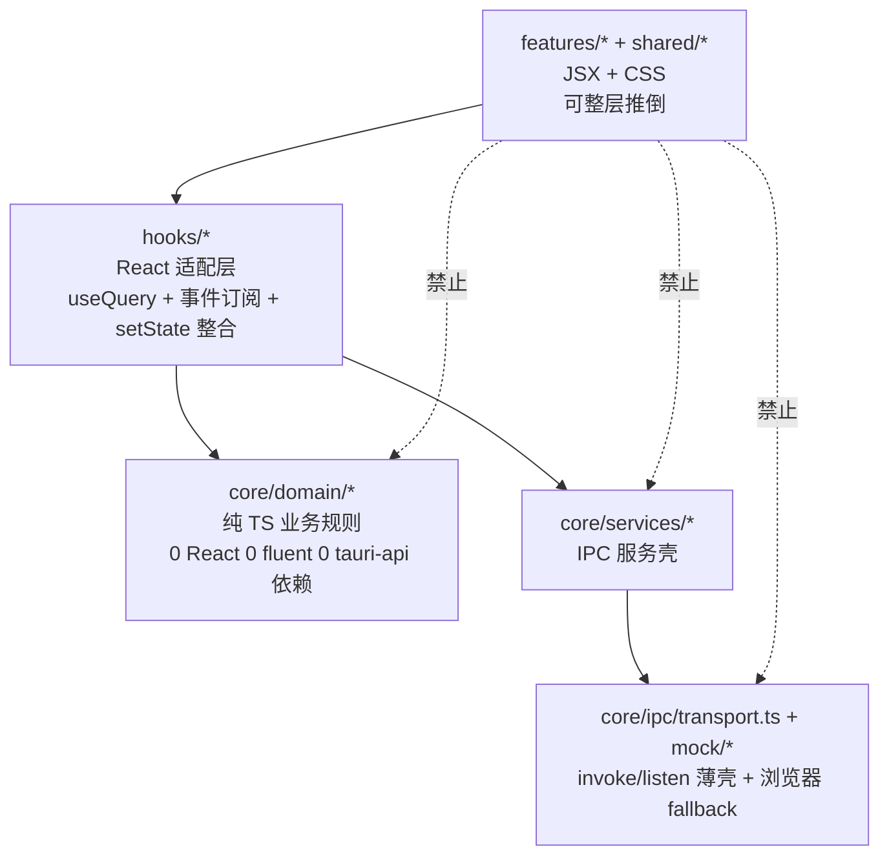
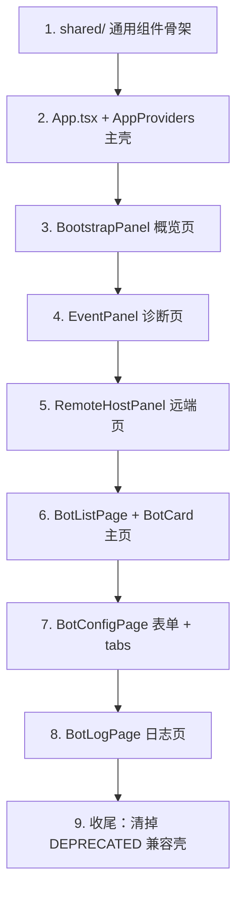

# 前端分层铁律 + 推倒重写 Playbook + 前端能力速查

> 从原 .claude/CLAUDE.md §5 + §8.9-8.12 拆出。后端能力在 capabilities.md,踩坑在 lessons.md。
> 动前端代码前必读本文。当前 `features/` 即 `src-ui/modules/`（保留旧名以减少 git 变更）。

---

## 1. 4 层目录责任

## 2. 各层硬约束

`core/ipc/transport.ts`：唯一允许 `import '@tauri-apps/api/core'` / `'@tauri-apps/api/event'` / `'@tauri-apps/plugin-opener'` 的位置。对外只暴露 `invoke<T>` / `listen<T>` / `isTauri` / `openExternalUrl`。不允许出现任何业务字符串（command 名、event 名）。

`core/services/*.service.ts`：唯一允许出现 Tauri command / event 字符串字面量的位置（R3 单一字面量来源）。每个 service 按业务域聚合。浏览器 fallback 走 `core/ipc/mock/*`。当前 services：
- `bootstrap.service.ts` 引导自检 / 数据目录 / 迁移报告
- `bot.service.ts` Bot 配置 / 生命周期 / 日志快照 / QQ 进程枚举（合并自 bot-log + qq-process）
- `remote.service.ts` 远端 SSH 主机 / 文件 / 运行时 / WebUI 端点
- `event-stream.service.ts` Tauri 事件流订阅（`DOMAIN_EVENT_NAMES` 是事件名单一来源）
- `desktop.service.ts` 系统级杂项（窗口控制 + 诊断 demo + SnowLuma WebUI 端点）

`core/domain/*`：零运行时依赖，禁止 `import 'react'` / `'@tauri-apps/*'` / `'@fluentui/*'`。只放纯函数 + 类型 + reducer。可以 import `core/ipc/types` 与 `core/ipc/generated/**`。当前模块：`bot/{flavor,status,config-defaults}.ts` / `webui/availability.ts` / `events/{login-aggregator,snowluma-aggregator,event-label,log-buffer}.ts` / `bootstrap/format.ts`。

`hooks/**`：唯一允许调 `services/*` 的层（除 transport 自己用）。通常组合 `useQuery` + `useDomainEvents`（订阅）+ domain reducer + 一个 useState/useReducer。不允许 `import '@tauri-apps/*'`。

`features/*`（即当前 `modules/*`）和 `shared/*`：严禁 import 任何 `core/ipc/*`（除 `types` 与 `generated/**`）、`core/services/*`、`@tauri-apps/*`。只允许 import `hooks/*`、`core/domain/*`、`core/ipc/types`、`core/ipc/generated/**`、Fluent UI / Tailwind / Radix、自身 CSS。这层是"可推倒"层。

P1 阶段保留的兼容壳 `core/ipc/{client,botCommands,events}.ts` 已在 P2 清理删除。

## 3. PR 必过自检清单

- 新增 Tauri command 名只出现在某个 `core/services/*.service.ts`，不泄漏到 hooks 或 features
- 新增事件类型先扩 `DomainEvent`（types.ts），事件名加到 `event-stream.service.ts` 的 `DOMAIN_EVENT_NAMES`，再写聚合 reducer 在 `core/domain/events/`，最后写 hook
- features 文件 grep：`from '@tauri-apps` → 必须为 0；`from '../core/services'` / `from '../../core/services'` → 必须为 0
- `npm run typecheck` 通过

## 4. 添加新功能 4 步走

1. transport 不动
2. 在 `core/services/` 加（或扩展）一个 service 文件，集中所有 IPC 字符串
3. 在 `core/domain/` 写所有派生 / 校验 / 状态机，纯函数
4. 在 `hooks/` 暴露 React 友好接口；`features/` 只 consume hook

## 5. 前端反例

- 在 `BotCard.tsx` 里直接 `import { invoke } from '@tauri-apps/api/core'`
- 在 `BotListPage.tsx` 里手写 `useState` + `useEffect` 聚合 6 个 SnowLuma 事件
- 在 `client.ts` 里同时塞真 IPC 和浏览器 mock
- 在 `domain/bot/status.ts` 里 `import { Badge } from '@fluentui/react-components'`

---

## 6. 推倒重写 Playbook

旧 Fluent v9 中性灰和 NapCat 用户群（萌系 + 偏个人工具）不匹配。决定整套换 `Tailwind v4 + Radix(shadcn) + lucide + 自绘 SVG chart`。Fluent 旧树通过蓝绿模式（`VITE_UI_NEXT=1`）保留，新树写在 `app/AppNext.tsx` + `shared/components/next/` 子目录。

推倒顺序（按风险升序）：

理由：shared 先行让"原子"先就位；BootstrapPanel / EventPanel / RemoteHostPanel 业务依赖最少（≤ 1 hook）适合摸新风格；BotListPage 是主战场（依赖 6 hook）放熟悉新风格之后再动；BotConfigPage 表单交互多但 hook 少；BotLogPage 有自动滚动 + 1000 行 viewport 性能问题留最后。

每段共通的 5 步法：
1. 读 hook 接口，把返回字段抄到 component 顶部 `interface ViewModel`
2. 新写 JSX 骨架，用 ViewModel 占位填假数据，先让 TSX 跑通
3. 接 hook，一次只接一个，每接一个 typecheck 一次
4. 接 mutation / 副作用，回调全走 hook 暴露的方法（不要新写 `invoke` / `listen` / `useMutation`）
5. CSS 套用最后才换

如果第 3 步发现 hook 接口不够用，优先改 hook 不改 component。

蓝绿模式：不要直接 `fs_write` 覆盖。`BotListPage.tsx` 当前线上用，新风格写在 `BotListPage.next.tsx`。在 `BotPage.tsx` 加 `import.meta.env.VITE_UI_NEXT === '1'` 开关，新版跑通后改成正式名。两个版本之间不共享 component-local state，只通过 hook 共享。

重写期间红线：
- 不允许在 `modules/**` 或 `shared/**` 里 `import '@tauri-apps/*'`
- 不允许在 `modules/**` 或 `shared/**` 里 `import 'core/services/*'`（含相对路径）
- 不允许新建 `.kiro/specs/` `.claude/plan/` 之类的"重写计划文档"。重写计划就是 Playbook + git 分支
- 不允许为了新风格把 `core/domain/*` 的纯函数搬到组件里"内联用"

### 推倒过程中的 7 个常见坑

- 坑 1：`Badge color` 把 `tiny` / `neutral` 当合法值传。`domain/bot/status.botStateBadge` 兼容历史返回值有 `tiny`/`neutral`，但 Fluent UI Badge 不收。重写组件时用 `StatusBadge` 包装，不直接展开 `botStateBadge` 结果。
- 坑 2：`useDomainEvents` 不要在多个 hook 里重复订阅同一事件。`useNapcatLogin` 和 `useSnowlumaState` 都已各自全量订阅，hook 内部判断 `event.kind`。新组件不要把两个 hook 的 reducer 合并成一个（破坏边界）。
- 坑 3：列表性能。当前 `BotListPage` 是 plain `.map`，bot 数量到几十就有重渲染卡顿。重写时可引入 `react-window` / `@tanstack/react-virtual`，但 props 的 ViewModel 形状不要因此改变。
- 坑 4：`BotLogPage` 的环形缓冲。`useBotLogStream` 上限 1000 条每行触发一次 setState 全量替换。如果新 UI 是终端风格高频滚动，给 hook 加 `subscribeOnly: true` 选项让 hook 只暴露增量回调，或在组件里用 `useRef` 缓冲 + `requestAnimationFrame` 批量 flush。
- 坑 5：Tauri 拖拽区域。`CustomTitleBar` 的 `data-tauri-drag-region` 属性不能丢，否则窗口拖不动。重写标题栏样式时单独 grep 一遍这个 attribute。
- 坑 6：路由切换徽章丢失。`AppNext.tsx` 的 `RouteOutlet` 是 switch 渲染，路由切走整个 page unmount → hook 内部 `useReducer` state 清零 + 事件订阅取消。切回来时事件订阅刚启动，之前后端推过的 `BotOnline` / `LoginStateChanged` 等事件已经过去了，新订阅只能等下一次推送。所以"切走再切回徽章不见"。修法：把"长期累积、跨路由保留"的聚合 state 全改造成模块级 store（详见第 10 节 + `hooks/utils/createStore.ts`），事件订阅在 store 第一次有 React 订阅者时挂一次，永远不卸载。新 hook 写之前自问：state 是"瞬时显示"（useReducer 没问题）还是"长期累积"（必须 store）。
- 坑 7：BotCard 固定高度遇到稀疏内容时下方留白严重。`h-[120px]` 看起来"启停时高度不抖"很合理，但 stopped 状态只有 1-2 个 chip 时整张卡下半截全空。修法：自适应高度 + 普通状态文案合到副标题行（QQ ID · flavor · 时间 · 状态文案），不单独占一行；只有错误 / 被踢这类高 priority 红色标签独占一行。操作区按钮按状态收缩：日志 / WebUI 只在 `running` / `starting` 显示。

### 推倒完成的标志

1. `src-ui/modules/**` 全部 module 改完，typecheck + verify 双绿
2. `grep -r '@tauri-apps' src-ui/modules src-ui/shared` 输出为空
3. `grep -r 'core/services' src-ui/modules src-ui/shared` 输出为空（`shared/components/CustomTitleBar.tsx` 已包成 `useWindowControls` hook）
4. 真机 Tauri 跑一遍冷启动 + 创建 Bot + 启停 + 看日志 + 远端连接，全链路无 console error
5. 把踩过的新坑补到本节

---

## 7. 前端已落地能力（src-ui）

- 蓝绿模式：`VITE_UI_NEXT=1` 走新 Tailwind v4 + Radix 树（`app/AppNext.tsx`），默认仍 Fluent v9
- 已落地新组件（`src-ui/shared/ui/`）：`Button` / `Card` / `Badge` / `Tabs` / `Tooltip` / `Dialog` / `Spinner` / `Progress` / `InfoBar` / `InfoBarStack`
- AppShell：`next/CustomTitleBar.tsx`（36→48px + `data-tauri-drag-region`）/ `next/Sidebar.tsx`（220px / 56px）/ `next/StatusBar.tsx` / `next/PagePlaceholder.tsx`
- Overview 真页：`modules/bootstrap/BootstrapPanel.next.tsx`（7:5 双列）+ `widgets/OccupancyChart.tsx`（自绘 SVG 严格 1:1 对应 legacy `_OccupancyCanvas`）+ `next/Mascot.tsx`（运行时 `replaceAll` 衣服两色 `#6a95aa` / `#527388` 跟主题）
- Components 真页：`modules/components/ComponentsPage.next.tsx` + 单机视图（`HostSwitcher` / `HostComponentsView` / `MachineComponentRow` / `DockerRow` / `FrameworkDockerDeploy`）
- Bot 列表真页（Step 7）：`modules/bot/BotPage.next.tsx`（list/config/log 浅路由壳）+ `modules/bot/list/BotListPage.next.tsx` + `next/{BotCard,FloatingActions,BatchBottomBar,QrCodeDialog}.tsx`。卡片走自适应高度 + 状态文案合到副标题行 + 操作按钮按 bot 状态收缩
- 字体：3 个 variable font 自托管（`@fontsource-variable/{plus-jakarta-sans, inter, jetbrains-mono}`）单文件 ~30KB woff2 涵盖所有 weight。CJK 不打包，fallback `HarmonyOS Sans SC → MiSans → PingFang SC → Microsoft YaHei UI → Microsoft YaHei`。OpenType feature：body 开 `cv11 / ss01 / ss03`，mono 开 `calt / liga`，全局 `font-variant-numeric: tabular-nums`
- npm scripts：`dev` / `build`（前端）· `tauri:dev` / `tauri:build` / `tauri:watch`（桌面应用，build 出 exe/msi）· `verify` / `ts-bindings` / `typecheck` / `rust:check` / `rust:test`（验证）。Fluent 旧树删除后蓝绿模式退役，`:next` 系列脚本已合并回普通脚本

## 8. Bot hook 速查表（推倒重写时对照）

| 模块 | 依赖 hook | 关键返回字段 |
| :--- | :--- | :--- |
| `App.tsx` | `useBootstrap` | `openDataDir` / `isOpeningDir` |
| `BootstrapPanel` | `useBootstrap` + `useResourceMonitor` | bootstrap / isLoading / error / cpu / ram |
| `EventPanel` | `useEventStream` + `useDiagnostics` | events / clear / publishDemo |
| `RemoteHostPanel` | `useRemoteSession(botId)` | connected / currentPath / files / runtimeStatus / webuiEndpoint / connect / isConnecting |
| `BotListPage` | 7 个：`useBotSnapshots` / `useBotMutations` / `useBotBatchSelection` / `useBotFlavorMap` / `useBotConfigsMap` / `useNapcatLogin`★ / `useSnowlumaState`★ | data / refetch / mutations.{startBot,stopBot,batch*,isPending} / batch.{isBatchMode,selectedIds,toggleSelect,toggleBatch,exitBatch} / flavorByBot / configByBot / napcat.byBot / snowluma.{daemonState,byBot} |
| `BotCard` | `useOpenWebui` | `openWebui({botId, flavor, napcat})` |
| `BotConfigPage` | `useBotConfig(botId, callbacks)` | config / isLoading / error / save / isSaving / remove / isDeleting |
| `BotBasicTab` | `useQQProcessList` | processes / isLoading / error / load |
| `BotLogPage` | `useBotLogStream(botId)` | logs / clear |

★ 标记的 hook 是模块级 store 视图（`napcatLoginStore` / `snowlumaStore`），跨路由保留 state，事件订阅一次永不卸载。其它"长期累积聚合"hook 也应这么写，参考第 6 节坑 6。

`CustomTitleBar` 是唯一例外（直接调 `windowControlService`），重写时建议包成 `useWindowControls` hook。

## 9. 全局 InfoBar 队列（任意页面 / hook / service 都能喊话）

整个 App 唯一的"喇叭"。新写功能时，错误提示 / 完成提示 / 警告提示都走这套，不要再每页自己造一份 banner state。

三件套（路径 `src-ui/hooks/ui/`）：
- `globalInfoBarStore.ts`：模块级单例 store。`push(opts)` / `dismiss(id)` / `clear()`，可选 `key` 字段做"同 key 顶替"。导出 `pushInfoBar` / `dismissInfoBar` 顶层方法供非 React 代码直接调用。
- `useGlobalInfoBars.ts`：React hook，返回 `{ bars, push, dismiss }`，`useSyncExternalStore` 订阅 store。组件内推荐用法。
- `app/AppNext.tsx`：顶层挂一次 `<InfoBarStack items={bars} onDismiss={dismiss} />`，整个 App 唯一渲染处。跨路由切换 banner 不丢。

用法：

    // React 组件 / hook 内
    import { useGlobalInfoBars } from '../../hooks/ui/useGlobalInfoBars';
    const { push } = useGlobalInfoBars();
    push({ key: 'remote-connect', tone: 'danger', title: 'SSH 连接失败', content: '超时' });

    // 非 React 上下文（service / 普通 ts 文件 / mutation onError）
    import { pushInfoBar } from '../../hooks/ui/globalInfoBarStore';
    pushInfoBar({ tone: 'success', title: 'Bot 启动成功' });

`key` 字段语义：
- 传了 `key`：同 key 旧条目被新条目替换，位置不变（避免反复重试时 banner 抖动）。典型用例：SSH 反复重连失败、useQuery refetch 反复出错。
- 没传 `key`：append 到队列末尾，新 id。典型用例：每次 component-action 失败要单独显示。

与其它 store 的关系：
- `componentActionStore` 记任务进度（状态机），跟本 store 是两件事，不要合并。
- `useComponentActionErrors` 是个纯副作用 hook：扫 `componentActionStore` 终态自动 `pushInfoBar`，本身不返回值。其它页面写类似 hook 时可以照抄这个模式。

不要踩的坑：
- 任何页面在自己组件树里再挂一份 `<InfoBarStack>` —— 同一条 banner 会渲两次。
- 把 banner 的 dismiss 计时器写在业务 hook 里 —— 走 store + autoDismissMs 就好。
- 在 effect 里依赖 `useGlobalInfoBars().push` 引用稳定性 —— 直接 `import { pushInfoBar }` 走顶层方法，避免 effect 依赖项抖动。

## 10. 模块级 store 通用套路（跨路由不丢状态）

凡是"事件流累计 / 后台任务进度 / 全局通知队列"这类生命周期需要长于单个组件挂载周期的状态，一律走模块级 store + `useSyncExternalStore` 订阅，不要用 `useReducer` 写在 hook / 组件里。

何时用 store，何时用 useReducer：

| 状态形态 | 选型 |
| :--- | :--- |
| 长期累计、跨路由切换不能丢（事件聚合、活跃任务表、登录态、全局 banner 队列） | 模块级 store |
| 视图临时态（折叠开关、当前选中 tab、表单本地草稿） | `useState` / `useReducer` |
| 服务端数据（拉一次缓存到 cache key） | `useQuery` |

判断方法：把组件卸载（路由切走）后再挂回来，状态是不是必须保留？必须保留 → store。无所谓 → 组件级。

通用工厂 `hooks/utils/createStore.ts`：四个 store 都基于同一个工厂，避免每个 store 重写一遍 listeners + emit + setState 的样板。

    import { createStore } from '../utils/createStore';
    const store = createStore<MyState>(initialState);
    // store.getSnapshot() / store.subscribe(fn) / store.setState(next) / store._reset()

工厂提供：`getSnapshot()` 同步返回当前 state；`subscribe(listener)` 注册返回 unsubscribe；`setState(next)` 引用相等短路变化时 emit；`_reset()` 测试 / dev 重置用，生产代码不要碰。业务 store 只在工厂之上写自己的 mutator 方法，不要再手写 listeners 集合。

事件订阅启动模式（`ensureSubscribed`）：事件驱动的聚合 store（`napcatLoginStore` / `snowlumaStore`）首个 React 订阅者来时挂一次 `eventStreamService.subscribe`，永不卸载。这样路由切走再切回不会断流，也不会重复订阅。

    let subscribePromise: Promise<() => void> | null = null;
    function ensureSubscribed(): void {
        if (subscribePromise) return;
        subscribePromise = eventStreamService.subscribe((event) => {
            const next = reduceXxx(store.getSnapshot(), event);
            store.setState(next);
        });
    }
    export const xxxStore = {
        getSnapshot: store.getSnapshot,
        subscribe(listener) { ensureSubscribed(); return store.subscribe(listener); },
        _reset() { store._reset(); },
    };

不要在 React effect 里写 `useEffect(() => eventStreamService.subscribe(...), [])`，那是组件挂载周期，会随路由切走而 unsubscribe → 路由切回前那段时间的事件全部丢失。

现成的 4 个 store（写新 store 前先抄）：

| store | 路径 | 职责 |
| :--- | :--- | :--- |
| `globalInfoBarStore` | `hooks/ui/globalInfoBarStore.ts` | 全局 banner 队列；`push` 支持 `key` 顶替 |
| `componentActionStore` | `hooks/components/componentActionStore.ts` | component-action 任务表 + 终态 linger 3s 计时器 |
| `napcatLoginStore` | `hooks/webui/napcatLoginStore.ts` | NapCat 登录态聚合 + 被踢 toast 3s 自动消失 |
| `snowlumaStore` | `hooks/webui/snowlumaStore.ts` | SnowLuma daemon + per-bot 状态聚合 |

React 端用法统一：

    export function useNapcatLogin(): NapcatLoginState {
        return useSyncExternalStore(napcatLoginStore.subscribe, napcatLoginStore.getSnapshot);
    }

非 React 上下文直接 `import { pushInfoBar } from '...'` 调顶层方法，不要绕一圈走 hook。

常见踩坑：
- 在 hook 里写 `useReducer` 收事件 —— 路由切走 reducer state 直接清空
- 多个 hook 各自 `eventStreamService.subscribe` 同一种事件 —— 重复订阅且各自 reducer 状态不一致
- 把 linger / autoDismiss 计时器写在组件 effect 里 —— 组件卸载时计时器被 cleanup。计时器应该和 state 一起放在 store 模块作用域（`Map<id, Timer>`）
- `setState({ ...current, foo: 1 })` 每次都新对象 —— 工厂内部已经做引用相等短路，直接传新对象就行；但 reducer 端如果数据没变要返回 `current` 本体让短路生效

## 11. 动画体系（GSAP + 三档语义）

统一框架 GSAP 3.15 + @gsap/react 2.1。三档语义 + 速度滑块 + reduced-motion 兜底。所有过渡走这套，禁止再在业务代码里手写 `@keyframes` 或重新接入 framer-motion 等其它动画库。Spinner / progress-indeterminate 这俩遗留 CSS animation 保留即可（跟动画库无关）。

档位语义（`core/design/motion.ts` 的 `motionPresets`）：
- `elegant` 优雅：base 160ms，ease `power2.out/in`，无弹性，hover/tap 不缩放，列表无 stagger
- `standard` 标准（默认）：base 200ms，ease `power3.out`，hover `back.out(1.4)`，scale 1.02/0.96，stagger 35ms
- `rich` 丰富：base 240ms，enter `back.out(1.7)`，hover `back.out(2)`，tap `elastic.out(1, 0.4)`，scale 1.04/0.92，stagger 45ms，状态点呼吸 + 数字 rolling + 角落柔光呼吸

速度倍率 `motionSpeed`（0.5x ~ 1.5x）在档位 baseline 上再除一次。系统 `prefers-reduced-motion` 命中或 `motionEnabled=false` 时强制 duration 0，业务调 gsap.to 也只是瞬时跳到终态。

读偏好统一入口：`hooks/preferences/useMotion.ts`。返回 `{ level, speed, reduced, enabled, preset, duration(kind) }`。业务从这里取 ease 字符串、scale、stagger 数值，不要自己读 motionPresets。

### GsapPresence — 核心新增件

GSAP 没有 framer 的 `<AnimatePresence>`。`shared/ui/motion/GsapPresence.tsx` 实现等价物：父级控制 visible，本组件根据 visible 切换跑 enter/exit timeline，exit 完成后才真 unmount。Dialog/InfoBar/路由切换/Tabs 内容切换/Bot 卡按钮切换全部基于这个。

用法（外层固定 mount，内层 GSAP 控制可见）：

    <GsapPresence visible={open} onEnter={enterFn} onExit={exitFn}>
      <Body />  {/* forwardRef 组件,GsapPresence 自动注入 ref */}
    </GsapPresence>

children 必须是单个 ReactElement 且能接收 ref（forwardRef 或带 ref 的原生元素）。enter/exit 工厂签名 `(el, env) => gsap.timeline | gsap.tween`，env 是 useMotion 返回值。

Body 一定要在 `style={{ visibility: 'hidden', opacity: 0 }}` 起始态，避免 enter 第一帧闪一下。GSAP 用 `autoAlpha` (= visibility + opacity) 自动接管这两个属性。

### motion 原子件目录 `shared/ui/motion/`

- `GsapPresence` 见上
- `PageTransition` 路由级 fade + scale + slide-y（AppNext 的路由切换接它）
- `ListItem` 列表项 wrapper + hoverable hover lift；stagger 由父级 useGSAP 调用
- `MotionCard` 给 Card 加 hover lift；列表里直接用 `ListItem hoverable` 即可
- `StatusDot` running/loading 呼吸状态点（GSAP timeline.yoyo.repeat -1）
- `Counter` rich 档数字 rolling
- `Shimmer` rich 档 skeleton 扫光

### 接入约定 / 已落地点

- 路由切换 ✓ AppNext 的 `displayedRoute + pageVisible` 双 state pattern：route 变 → pageVisible=false 跑 exit → onExited 切 displayedRoute + 设 visible=true
- 列表 stagger ✓ BotListPage / DockerPage / RemoteHostPanel 用 `useGSAP(() => gsap.from(containerRef.current.children, { stagger, ... }))` + `dependencies: [items.length, m.enabled, ...]`
- 按钮弹性 ✓ Button.tsx 内挂 mouseenter/leave/down/up 用 gsap.to 控制 scale；`flat=true` 关闭
- IconButton（BotCard） ✓ forwardRef 让 GsapPresence 拿 ref；按钮按 visible 进退场（QrCode / Play↔Square / 日志 / WebUI）
- Dialog 进退场 ✓ Radix forceMount + 两块 GsapPresence 各管 overlay/content
- InfoBar 进退场 ✓ InfoBarStack 自管 displayed 列表，每条用 GsapPresence + onExited 清理
- Tabs 内容切换 ✓ TabsContent 读 ActiveValueContext，GsapPresence 控 mount + GSAP fade+slide-x
- 角落柔光呼吸 ✓ AppNext 在 rich 档 + overview 路由时加 `is-breathing` CSS 类
- FloatingActions / BatchBottomBar ✓ 互斥两个 GsapPresence(visible=...)，各自跑 fly-in/fly-out

### 性能红线

- 全部走 transform / autoAlpha，禁动 width / height / margin（layout reflow）
- GSAP camelCase prop（backgroundColor / rotationX），用 transform aliases（x / y / scale）而非 raw `transform` 字符串
- 列表 useGSAP 必带 `scope: ref` 让选择器限定在容器内（参考 gsap-react skill）
- useGSAP 自动 cleanup（unmount 时 revert），不需要业务自己 timeline.kill()
- StatusDot / Shimmer 等长循环 timeline 在 useEffect cleanup 里 kill 掉，避免 hot reload 累积

### 设置页

`prefs.motionEnabled / motionLevel / motionSpeed`（preferencesStore，localStorage 兼容旧值无字段时落默认）。`MotionLevelSegment` + `MotionSpeedSlider` 在 `_shared.tsx`。原版本里有过的"动画预览卡"已经按用户反馈移除——预览不应在设置页。
