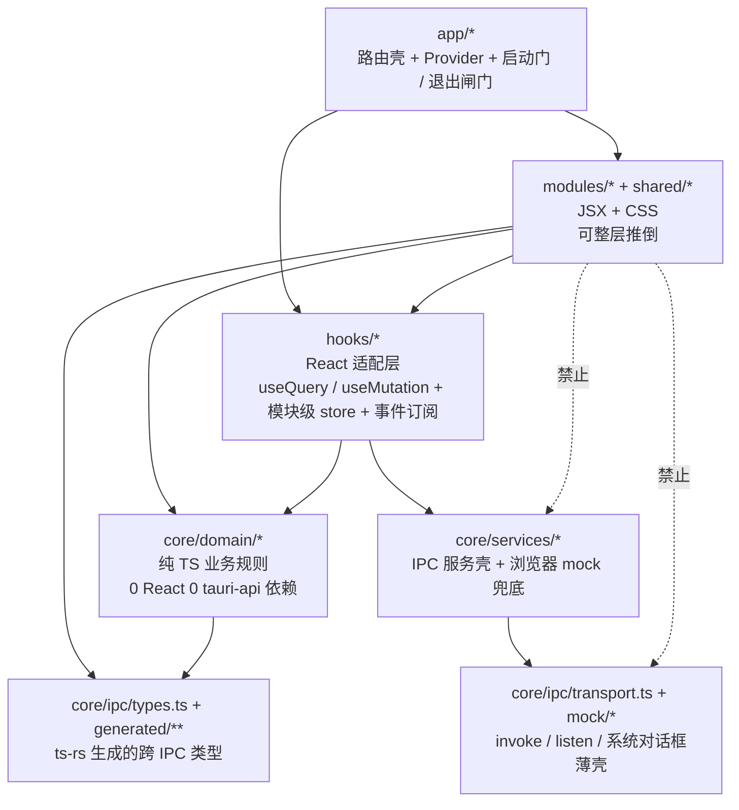

# 前端分层铁律 + 落点约定 + 推倒重写记录 + 前端能力速查

> 动前端代码前必读本文。功能域 → 代码落点查同目录 `codemap.md`，后端已有能力查 `capabilities.md`，踩坑查 `lessons.md`；NapCat / SnowLuma 运行语义在本地 `.claude/kb/`（不入库）。
> 旧版本文把 `src-ui/modules/` 叫 `features/`，现在统一叫 modules。

---

## 1. 目录责任

```mermaid
flowchart TB
    APP[app/*<br/>路由壳 + Provider + 启动门 / 退出闸门]
    UI[modules/* + shared/*<br/>JSX + CSS<br/>可整层推倒]
    H[hooks/*<br/>React 适配层<br/>useQuery / useMutation + 模块级 store + 事件订阅]
    D[core/domain/*<br/>纯 TS 业务规则<br/>0 React 0 tauri-api 依赖]
    S[core/services/*<br/>IPC 服务壳 + 浏览器 mock 兜底]
    T[core/ipc/transport.ts + mock/*<br/>invoke / listen / 系统对话框薄壳]
    G[core/ipc/types.ts + generated/**<br/>ts-rs 生成的跨 IPC 类型]

    APP --> UI
    APP --> H
    UI --> H
    UI --> D
    UI --> G
    H --> D
    H --> S
    S --> T
    D --> G
    UI -.禁止.-> S
    UI -.禁止.-> T
```

`shared/` 是可复用 UI，不 import 任何 `modules/**`。`modules/<a>` 之间不互相伸进内部文件，怎么共用见第 3 节。

## 2. 各层硬约束

`core/ipc/transport.ts`：唯一允许 `import '@tauri-apps/*'`（`api/core` / `api/event` / `api/webview` / `api/window` / `plugin-opener`）的位置。对外暴露 `invoke<T>` / `listen<T>` / `isTauri` / `Channel`（终端字节流）、`openExternalUrl`（只放行 http/https，别的 scheme 直接 reject）、`onFileDragDrop`（窗口原生拖放，坐标已换成逻辑像素；hooks 里经 `hooks/ui/useTauriFileDrop.ts` 的 `useFileDragDrop` 用），以及系统对话框 `pickDirectory` / `pickZipFile` / `pickImageFiles` / `pickTextFiles` / `pickAnyFiles` / `saveFileAs` / `saveZipFile`。不允许出现业务 command 名、event 名（对话框插件自己的 `plugin:dialog|*` 除外）。

`core/services/*.service.ts`：唯一允许出现 Tauri command / event 字符串字面量的位置，后端改命令名只改这一处。每个 service 按业务域聚合，浏览器预览走 `core/ipc/mock/*`（生产包里 mock 也留着，性能工具要用）。当前 services：
- 启动与桌面：`bootstrap` / `desktop`（窗口、托盘）/ `desktop-consent` / `desktop-onboarding` / `desktop-update` / `exit` / `data-root-migrate` / `config-transfer` / `settings` / `system-metrics`
- Bot：`bot`（配置 / 生命周期 / 日志快照 / QQ 进程枚举）/ `snowlumaApp`
- 主机与部署：`remote` / `server` / `component` / `docker` / `deployment-task` / `release` / `ncd-watch` / `terminal`
- 应用端：`app-framework`（实例、配置、商店、AstrBot / 麦麦运行期接口）/ `maibot-chat` / `maibot-memory` / `maibot-resources`
- 事件：`event-stream.service.ts`（`DOMAIN_EVENT_NAMES` 是事件名单一来源）+ `domain-event-hub.ts`（全应用只 listen 一份再分发，业务侧一律 `subscribeDomainEvents`）

跨 IPC 的类型由 Rust 侧 ts-rs 导出到 `core/ipc/generated/<short-name>/`，`core/ipc/types.ts` 只 re-export。service 里手写的载荷接口（`bot.service.ts` 的 `SnowLumaAgreementsPayload` / `QQProcessInfo`、`settings.service.ts` 的 `BackendSettings` 等）是待换成生成类型的旧账，别再加新的。

`core/domain/*`：零运行时依赖，禁止 `import 'react'` / `'@tauri-apps/*'` / `'@tanstack/*'`。只放纯函数 + 类型 + reducer + 文案表，配单测。可以 import `core/ipc/types` 与 `core/ipc/generated/**`。按域分目录：`apps/`（实例状态、对接拓扑、商店与插件目录、各框架配置校验、麦麦的试聊 / 表情包 / 提示词…）/ `bot/` / `bootstrap/` / `components/` / `docker/` / `events/`（登录、SnowLuma 聚合，日志缓冲）/ `onboarding/` / `overview/` / `performance/` / `release/` / `remote-host/` / `settings/` / `task-queue/` / `terminal/` / `ui/`（错误条文案、相对时间）/ `webui/`，根上还有 `errors.ts`（`errorText`，把 invoke 抛出的裸字符串和 Error 统一成人话）/ `app-meta.ts` / `credits.ts` / `desktop-log.ts`。

`hooks/**`：唯一允许调 `core/services/*` 的层（除 transport 自己用）。组合 `useQuery` / `useMutation` + `subscribeDomainEvents`（订阅）+ domain reducer + 模块级 store。不允许 `import '@tauri-apps/*'`，也不反过来 import `modules/**`。

`modules/*` 和 `shared/*`：严禁 import `core/ipc/*`（除 `types` 与 `generated/**`）、`core/services/*`（`import type` 也算）、`@tauri-apps/*`。只允许 import `hooks/*`、`core/domain/*`、`core/ipc/types`、`core/ipc/generated/**`、`shared/*`、Tailwind / Radix / lucide / GSAP、自身 CSS。这层是"可推倒"层。

`app/*`：路由壳、Provider、启动门、退出闸门，照 modules 的规矩来。

### 现存偏差（改到附近时顺手收掉，别照抄）

- modules 直连服务：`bot/config/BotConfigPage.next.tsx`、`bot/dialogs/{ImportRemoteBotsDialog,SnowLumaConsentDialog}.tsx`、`bot/list/BotListPage.next.tsx`、`bot/list/next/BotCard.tsx`、`components/{ComponentsPage.next,QqDependencyDialog}.tsx`、`remote/{AddServerDialog,ImportSshConfigDialog}.tsx`、`settings/{ConfigImportDialog,DataRootMigrateDialog}.tsx`、`settings/settings-draft.ts`、`settings/tabs/{AboutTab,NcdWatchRemoteSection,NotificationsTab,RuntimeTab,WindowTab}.tsx`、`settings/tabs/notifications/{DeliveryHistoryDialog,OneBotMessengerPicker}.tsx`、`task-queue/{TaskDetailPanel,TaskQueueListItem,TaskQueuePage.next}.tsx`。`modules/apps/**` 和 `shared/**` 已经清零，保持住。
- transport 之外直接碰 `@tauri-apps/*`：`main.tsx`（启动时动态 import 窗口 API 认托盘面板窗口，还没挂 React，留着）、`core/services/desktop.service.ts`（窗口控制和托盘面板事件动态 import 窗口 API、标题栏关闭直接 `emit`）。
- `app/AppNext.tsx` 直接用 `desktopUpdateService`。
- `hooks/preferences/useBackendSettings.ts` 反过来 import `modules/settings/settings-draft`。
- 模块互相伸手：`bot/metrics` → `bootstrap/widgets/occupancyChartGeometry`、`components` → `docker/SudoPasswordDialog`（两处）、`remote/ServerCard` → `bot/list/next/BotManageCard`、`task-queue/TaskDetailPanel` → `components/DockerPullLayersPanel`；`shared/components/next/OnboardingPreviews.tsx` 引了 `bot/.../BotManageCard` 和 `components/ComponentEntityCard`。

## 3. 落点约定（放哪儿、只留几份）

- 纯逻辑进 `core/domain/<域>/`：派生、校验、状态机、文案表，带单测。hooks 要用的规则不许留在 modules 里让 hooks 反向 import，应用端的对接拓扑、实例状态、Karin / 商店目录规则就是这么挪进 `core/domain/apps/` 的。
- 同一件事只留一份：
  - 「N 分钟前」→ `core/domain/ui/relativeTime.ts`
  - 插件目录的筛选 / 排序 / 已装对照 → `core/domain/apps/pluginCatalog.ts`；装、卸、启停任务 → `hooks/apps/usePluginOps.ts`（Karin 市场和应用端商店共用）
  - 商店页的工具条、槽位 id、卸载确认 → `modules/apps/detail/storeToolbar.tsx`；通用商店页 `detail/AppStoreTab.tsx` + `hooks/apps/useAppStore.ts` + `core/domain/apps/appStore.ts`
  - 四个框架的配置表单状态 → `hooks/apps/useAppConfigForm.ts`，各框架只给一份 `validate` 和保存文案（`core/domain/apps/<框架>Config.ts`），字段错误按路径挂（`core/domain/apps/appConfigForm.ts` 的 `issuesByPath`）
  - 安装 / 下载进度行 → `shared/components/progressView.tsx`（组件页、应用端安装进度、任务详情共用）
- 服务端数据一律 react-query，别在组件里 `useEffect` + `let cancelled` 手搓 fetch：
  - 缓存键就近导出成工厂（`appConfigKey(id)` / `astrbotPersonasKey(id)` …），只在本文件用的键不导出。根组件也要的键单独成文件：实例列表的 `APP_INSTANCES_KEY` + `upsertInstance` 在 `hooks/apps/appInstancesCache.ts`，免得事件桥把整套应用端 hook 拖进主包。
  - 每次打开都得是当下状态的（对接计划 `useAppLinkPlan`、插件配置文件列表 `useAppPluginConfigDocs`）：`staleTime: 0` + `gcTime: 0`，重新拉的途中不给旧数据。
  - 只给发起方用一次的结果（导入前检查项目、拉模型列表、测连接）：`useMutation`，不进缓存。
  - 后端会推事件的改动（实例状态、对接）不在调用结果里重复回写，交给根上的 `useAppInstanceEventsBridge`。`useAppInstances` 里还回写的三处是事件管不到的：新建 / 导入（对话框一关就按新 id 往下走）、启动（实例已在跑时后端原样返回不发事件）、重新探测（只换了 `last_error` 不发事件）。
- 外链一律 `hooks/useOpenExternal.ts`（被 scheme 白名单拒了会弹错误条，同 key 只留一条），hook 外面的调用方（终端、Docker 下载页）用同文件的 `openExternalOrReport`；要先问后端拿地址再打开的（打开 WebUI、noVNC）在各自的 hook 里调 `openExternalUrl`，失败由那个 hook 报或抛给调用方报，不许吞；选本机目录 `hooks/usePickDirectory.ts`；麦麦挑图、挑文件走 `useMaiBotChatImages` / `useMaiBotEmojiFiles` / `useMaiBotMemoryImportFiles`（失败统一经 `hooks/apps/maibotResourceAction.ts` 的 `localFilesOrNothing` 弹条、当没挑）。modules 里不出现 `openExternalUrl` / `pick*`。
- 失败别吞：`.catch(() => {})` 只留给确实无所谓的收尾；用户在等结果的一律 `pushErrorBar`，带 `key`。
- 模块之间共用：
  - 纯展示、几个模块都要的 → `shared/`（`shared/` 自己不许 import modules）。
  - 某模块的功能件给别的模块用 → 在该模块根上开 `index.ts` 当入口，别处只从入口拿。现有 `modules/apps/index.ts`（组件页按主机新建、导入实例用的两个对话框）。入口只挂别处真要静态引入的东西，不挂页面、详情 Tab，否则引入口的页面会把它们的依赖一起打进包。
  - 为分包用 `lazy(() => import(...))` 按需加载时，可以直接指向那一个文件，chunk 只带它：Bot 配置页的「对接应用端」就是 lazy 进 `modules/apps/AppLinkDialog`。
- 导出：只导出文件外真在用的；单测经公开函数测，不为了测把内部小函数 export 出去。
- 前端要镜像后端枚举的（`AppConfigErrorKind` 的 kind 表）写成 `{ ... } satisfies Record<生成的联合类型, true>`，Rust 加了一种前端没跟上，typecheck 直接红。
- 注释写为什么，不写做了什么；中文，别带「R3」「Step 7」这类过程编号。

## 4. PR 必过自检清单

- 新增 Tauri command 名只出现在某个 `core/services/*.service.ts`，不泄漏到 hooks 或 modules
- 新增事件：Rust 侧 payload 带 `v` 信封并导出 ts-rs 类型，`DomainEvent`（`core/ipc/types.ts`）接上，事件名加到 `event-stream.service.ts` 的 `DOMAIN_EVENT_NAMES`，聚合 reducer 写在 `core/domain/events/`，最后写 hook（订阅走 `subscribeDomainEvents`）
- modules / shared / app 文件 grep，静态 import 和动态 `import()` 各查一遍，输出只能是第 2 节「现存偏差」里的旧账，不能多：

      grep -rnE "from ['\"][^'\"]*(core/services|core/ipc/(transport|mock)|@tauri-apps)" src-ui/modules src-ui/shared src-ui/app
      grep -rnE "import\(['\"][^'\"]*(core/services|core/ipc/(transport|mock)|@tauri-apps)" src-ui/modules src-ui/shared src-ui/app

- `pnpm run typecheck` + `pnpm run test:unit` 通过；动了依赖或分包再跑 `pnpm exec vite build --config src-ui/vite.config.ts`

## 5. 添加新功能 4 步走

1. transport 不动（真要新的系统能力，比如另一种文件对话框，才加一个不带业务字符串的薄函数）
2. 在 `core/services/` 加（或扩展）一个 service 文件，集中所有 IPC 字符串，mock 放 `core/ipc/mock/`
3. 在 `core/domain/` 写所有派生 / 校验 / 状态机，纯函数带单测
4. 在 `hooks/` 暴露 React 友好接口（react-query / 模块级 store）；modules 只 consume hook

## 6. 前端反例

- 在 `BotCard.tsx` 里直接 `import { invoke } from '@tauri-apps/api/core'`
- 在 `BotListPage.next.tsx` 里手写 `useState` + `useEffect` 聚合 6 个 SnowLuma 事件
- 在一个 service 里同时塞真 IPC 和大段假数据（假数据放 `core/ipc/mock/*`）
- 在 `core/domain/bot/status.ts` 里 import UI 组件
- 对话框里 `useEffect` + `let cancelled` + `service.xxx().then(setState)` 手搓请求
- 组件里 `void openExternalUrl(url)`：链接被拒了没人报
- `void service.refresh(id).catch(() => {})`：结果和失败一起扔掉

---

## 7. 推倒重写记录（已完成，蓝绿模式已退役）

旧 Fluent v9 中性灰和 NapCat 用户群（萌系 + 偏个人工具）不匹配，整套换成 `Tailwind v4 + Radix(shadcn) + lucide + 自绘 SVG chart`。重写期间 Fluent 旧树靠蓝绿模式（`VITE_UI_NEXT=1`）保留；现在 Fluent 旧树已删，蓝绿开关和 `:next` 系列脚本都已退役。留下的只有 `*.next.tsx` 这个文件名后缀（`AppNext.tsx`、`BotPage.next.tsx`…）和 `app/index.css` 头上「仅在新 UI 树下加载」那句注释，看到 `.next` 就是现行版本，暂不改名。

以下留作重写单个页面时的参考。

每段共通的 5 步法：
1. 读 hook 接口，把返回字段抄到 component 顶部 `interface ViewModel`
2. 新写 JSX 骨架，用 ViewModel 占位填假数据，先让 TSX 跑通
3. 接 hook，一次只接一个，每接一个 typecheck 一次
4. 接 mutation / 副作用，回调全走 hook 暴露的方法（不要在组件里新写 `invoke` / `listen` / `useMutation`）
5. CSS 套用最后才换

如果第 3 步发现 hook 接口不够用，优先改 hook 不改 component。

重写期间立下、现在照样生效的红线：
- 不允许在 `modules/**` 或 `shared/**` 里 `import '@tauri-apps/*'` / `core/services/*`（含相对路径）
- 不允许新建 `.kiro/specs/` `.claude/plan/` 之类的"重写计划文档"。重写计划就是本文 + git 分支
- 不允许为了新风格把 `core/domain/*` 的纯函数搬到组件里"内联用"

### 推倒过程中的 7 个常见坑

- 坑 1（已退役）：Fluent `Badge color` 不收 `tiny` / `neutral`。Fluent 删掉后不再适用，状态徽章统一走 `shared/ui/Badge`。
- 坑 2：同一事件不要在多个 hook 里各订一套。底层 listen 已经由 `domain-event-hub` 合成一份，但 `useNapcatLogin` 和 `useSnowlumaState` 的 reducer 各管各的，新组件不要把两个 hook 的 reducer 合并成一个（破坏边界）。
- 坑 3：列表性能。bot 数量到几十就有重渲染卡顿时上虚拟列表（`@tanstack/react-virtual` 已在依赖里，`shared/log/LogConsole.tsx` 在用），但 props 的 ViewModel 形状不要因此改变。
- 坑 4：日志的环形缓冲。Bot 日志和应用端日志都走 `shared/log/LogConsole`，缓冲规则在 `core/domain/events/log-buffer.ts`。高频推行时在 hook / store 里攒批，别每行 setState 一次全量替换。
- 坑 5：Tauri 拖拽区域。`shared/components/next/CustomTitleBar.tsx`、`Sidebar.tsx` 的 `data-tauri-drag-region` 属性不能丢，否则窗口拖不动。改标题栏样式时单独 grep 一遍这个 attribute。
- 坑 6：路由切换徽章丢失。`AppNext.tsx` 的路由切换是 `displayedRoute + pageVisible` 双 state，路由切走整个 page unmount → hook 内部 `useReducer` state 清零 + 订阅取消，切回来时之前推过的 `BotOnline` / `LoginStateChanged` 已经过去了。修法：把"长期累积、跨路由保留"的聚合 state 做成模块级 store（第 11 节 + `hooks/utils/createStore.ts`），订阅在 store 第一次有 React 订阅者时挂一次，永远不卸载。新 hook 写之前自问：state 是"瞬时显示"（useReducer 没问题）还是"长期累积"（必须 store）。
- 坑 7：BotCard 固定高度遇到稀疏内容时下方留白严重。修法：自适应高度 + 普通状态文案合到副标题行（QQ ID · flavor · 时间 · 状态文案），只有错误 / 被踢这类高 priority 红色标签独占一行。操作区按钮按状态收缩：日志 / WebUI 只在 `running` / `starting` 显示。

完成标志里「`grep -r 'core/services' src-ui/modules src-ui/shared` 为空」还没达到，剩的见第 2 节「现存偏差」。

---

## 8. 前端已落地能力（src-ui）

- 技术栈：Tailwind v4 + Radix + lucide + GSAP，服务端数据走 `@tanstack/react-query`（`app/AppProvidersNext.tsx` 里默认不在窗口聚焦时重拉、不自动重试）
- 原子件 `shared/ui/`（从 `shared/ui/index.ts` 统一引）：`Button` / `Card` / `Badge` / `Tabs` / `Tooltip` / `Dialog`（尺寸表 `dialogSizes.ts`）/ `Popover` / `ContextMenu` / `Select` / `Checkbox` / `Switch` / `RadioGroup` / `TextField` / `TextAreaField` / `NumberField` / `StringListField` / `KeyValueListEditor` / `SyntaxTextEditor` / `SimpleMarkdown` / `CopyCodeBlock` / `TimePicker` / `DayOfMonthPicker` / `MonthCalendar` / `FormSection` / `Spinner` / `Progress` / `InfoBar` / `InfoBarStack` / `PagePlaceholder` / `RouteErrorBoundary` / `GlobalTitleTooltip`
- 组合件 `shared/components/`：`RemoteDirectoryPicker`（远端目录选择）、`progressView`（进度行）；`shared/log/LogConsole`；AppShell 在 `shared/components/next/`：`CustomTitleBar.tsx`（`data-tauri-drag-region`，窗口按钮走 `useWindowControls`）/ `Sidebar.tsx` / `TerminalToggleButton.tsx`，外加协议、新手引导、聚光灯导览几个对话框。早期的 StatusBar 已去掉
- Overview：`modules/bootstrap/BootstrapPanel.next.tsx`（7:5 双列）+ `widgets/OccupancyChart.tsx`（自绘 SVG）+ `shared/components/next/Mascot.tsx`（运行时 `replaceAll` 衣服两色 `#6a95aa` / `#527388` 跟主题）
- 组件页：`modules/components/ComponentsPage.next.tsx` + 单机视图（`HostSwitcher` / `HostComponentsView` / `MachineComponentRow` / `DockerRow` / `AppFrameworkRow` / `FrameworkDockerDeploy`）
- Bot：`modules/bot/BotPage.next.tsx`（list / config / log / metrics 浅路由壳）+ `list/BotListPage.next.tsx` + `list/next/{BotCard,FloatingActions,BatchBottomBar,QrCodeDialog}.tsx`。卡片走自适应高度 + 状态文案合到副标题行 + 操作按钮按 bot 状态收缩
- 应用端：`modules/apps/AppsPage.next.tsx` + `list/AppInstanceListPage.tsx` + `detail/AppInstancePage.next.tsx`（外壳：侧栏导航、原始文件、日志 Tab）；`detail/frameworkUi.ts` 是框架注册表，各框架在 `detail/{karin,nonebot2,astrbot,maibot}/` 里给导航和 Tab；通用商店 `detail/AppStoreTab.tsx`；对话框 `CreateInstanceDialog` / `ImportInstanceDialog` / `AppLinkDialog` / `DeleteInstanceDialog` / `TermsConsentDialog` / `WebUiAccountDialog`
- 字体：3 个 variable font 自托管（`@fontsource-variable/{plus-jakarta-sans, inter, jetbrains-mono}`）单文件 ~30KB woff2 涵盖所有 weight。CJK 不打包，fallback `HarmonyOS Sans SC → MiSans → PingFang SC → Microsoft YaHei UI → Microsoft YaHei`。OpenType feature：body 开 `cv11 / ss01 / ss03`，mono 开 `calt / liga`，全局 `font-variant-numeric: tabular-nums`
- npm scripts：`dev` / `build`（前端）· `tauri:dev` / `tauri:build` / `tauri:watch`（桌面应用，build 出 exe/msi）· `verify` / `ts-bindings` / `typecheck` / `test:unit` / `rust:check` / `rust:test`（验证）。Fluent 旧树删除后蓝绿模式退役，`:next` 系列脚本已合并回普通脚本

### Bot 配置 · 运行宿主（本机 Windows）

- 本机：只显示「本机 / 远程」；不展示 Docker 启动方式、不写「本机不支持 Docker」说明条、不展示运行时依赖引导（组件页运行时 / Docker 引导）。
- NC / SL 在本机均为直接运行，不引导用户装 Docker 或去组件页装「运行时」。
- 远程：保留「直接运行 / Docker」与远程 Docker 依赖检查；详见 memory `project_bot_docker_remote_routing`。

### Bot 配置 · 底座类型（GUI 口径）

- **NapCat**：不带 QQ GUI（运行时关闭 QQ 客户端窗口）。
- **SnowLuma**：带 QQ GUI（保留 QQ 客户端窗口）。`modules/bot/config/next/IdentityTab.tsx` 的 `BACKEND_ITEMS` 勿写反。

## 9. 主页面 hook 速查表

| 页面 | 依赖 hook |
| :--- | :--- |
| `app/AppNext.tsx`（根上挂一次的桥和门） | `useComponentActionEventBridge` / `useDeploymentTaskBridge` / `useAppInstanceEventsBridge` / `useDockerInstallProgressBridge` / `useDockerDeployProgressBridge` / `useHostConnectionEvents` / `useHostHealthAlerts` / `useGlobalInfoBars` / `useBootstrap` / `useDesktopConsentGate` / `useOnboardingGate`；退出闸门 `DesktopExitGate` 用 `useDesktopExitGate` |
| `BootstrapPanel` | `useBootstrap` / `useBackendSettings` / `useBotSnapshots` + `useBotConfigsMap` / `useReleases` / `useNoticeEvents` / `useServerManager` / `useOpenExternal` |
| `RemoteHostPanel` | `useServerManager` |
| `BotListPage` | `useBotSnapshots` / `useSortedBots` / `useSyncRemoteRuntimes` / `useBotMutations` / `useBotBatchSelection` / `useBotFlavorMap` / `useBotConfigsMap` / `useBotDockerStartGate` / `useBotRuntimeStartGate` / `useNapcatLogin`★ / `useSnowlumaState`★ / `useOpenWebui` / `useOpenSnowlumaNovnc` / `useBotSnapshotAlerts` |
| `BotConfigPage` | `useBotConfig` / `useBotSnapshots` / `useBotDockerStartGate` / `useBotRuntimeStartGate` |
| `BotLogPage` | `useBotLogStream` |
| 应用端列表 / 详情 | `useAppInstances` / `useAppFrameworks` / `useServerManager`；详情各 Tab 按框架取 `useAppInstanceConfig` / `useAppConfigForm` / `useAppStore` / `useKarinPlugins` / `useAstrBot*` / `useMaiBot*`，日志 `useAppInstanceLog`，对接 `useAppLinkPlan` / `useApplyAppLink` |

★ 标记的 hook 是模块级 store 视图（`napcatLoginStore` / `snowlumaStore`），跨路由保留 state，事件订阅一次永不卸载。其它"长期累积聚合"hook 也应这么写，参考第 7 节坑 6。

`CustomTitleBar` 的窗口按钮已经包成 `useWindowControls`，不再是例外。

## 10. 全局 InfoBar 队列（任意页面 / hook / service 都能喊话）

整个 App 唯一的"喇叭"。错误提示 / 完成提示 / 警告提示都走这套，不要再每页自己造一份 banner state。

三件套（路径 `src-ui/hooks/ui/`）：
- `globalInfoBarStore.ts`：模块级单例 store。`push(opts)` 返回 id，可选 `key` 字段做"同 key 顶替"。导出 `pushInfoBar` / `dismissInfoBar` 顶层方法供非 React 代码直接调用；按 key 收掉一条用 `` dismissInfoBar(`key:${key}`) ``。
- `useGlobalInfoBars.ts`：React hook，返回 `{ bars, push, dismiss, remove }`，`useSyncExternalStore` 订阅 store。
- `app/AppNext.tsx`：顶层挂一次 `<InfoBarStack items={bars} onDismiss={dismiss} onAutoDismiss={remove} />`，整个 App 唯一渲染处。跨路由切换 banner 不丢。

报错统一用 `pushErrorBar`（`hooks/ui/pushErrorBar.ts`）：传 `title` + 后端原话 `raw`，原话进 console，条上的正文由 `core/domain/ui/errorBarCopy.ts` 压成一句人话。

用法：

    // React 组件 / hook 内
    import { useGlobalInfoBars } from '../../hooks/ui/useGlobalInfoBars';
    const { push } = useGlobalInfoBars();
    push({ key: 'remote-connect', tone: 'danger', title: 'SSH 连接失败', content: '超时' });

    // 非 React 上下文（service / 普通 ts 文件 / mutation onError）
    import { pushInfoBar } from '../../hooks/ui/globalInfoBarStore';
    pushInfoBar({ tone: 'success', title: 'Bot 启动成功' });

    // 失败
    import { pushErrorBar } from '../../hooks/ui/pushErrorBar';
    pushErrorBar({ key: `app-start:${id}`, title: '启动失败', raw: errorText(err) });

`key` 字段语义：
- 传了 `key`：同 key 旧条目被新条目替换，位置不变（避免反复重试时 banner 抖动）。典型用例：SSH 反复重连失败、useQuery refetch 反复出错。
- 没传 `key`：append 到队列末尾，新 id。典型用例：每次 component-action 失败要单独显示。

与其它 store 的关系：
- `componentActionStore` 记任务进度（状态机），跟本 store 是两件事，不要合并。
- `useComponentActionErrors` 是个纯副作用 hook：扫 `componentActionStore` 终态自动 `pushInfoBar`，本身不返回值。其它页面写类似 hook 时可以照抄这个模式。

不要踩的坑：
- 任何页面在自己组件树里再挂一份 `<InfoBarStack>` —— 同一条 banner 会渲两次。
- 把 banner 的 dismiss 计时器写在业务 hook 里 —— 走 store + autoDismissMs 就好。
- 在 effect 里依赖 `useGlobalInfoBars().push` 引用稳定性 —— 直接 `import { pushInfoBar }` 走顶层方法，避免 effect 依赖项抖动。

## 11. 模块级 store 通用套路（跨路由不丢状态）

凡是"事件流累计 / 后台任务进度 / 全局通知队列 / 全局只开一个的对话框"这类生命周期需要长于单个组件挂载周期的状态，一律走模块级 store + `useSyncExternalStore` 订阅，不要用 `useReducer` 写在 hook / 组件里。

何时用 store，何时用 useReducer：

| 状态形态 | 选型 |
| :--- | :--- |
| 长期累计、跨路由切换不能丢（事件聚合、活跃任务表、登录态、全局 banner 队列、实例日志缓冲） | 模块级 store |
| 视图临时态（折叠开关、当前选中 tab、表单本地草稿） | `useState` / `useReducer` |
| 服务端数据（拉一次缓存到 cache key） | `useQuery` |

判断方法：把组件卸载（路由切走）后再挂回来，状态是不是必须保留？必须保留 → store。无所谓 → 组件级。

通用工厂 `hooks/utils/createStore.ts`：所有 store 都基于同一个工厂，避免每个 store 重写一遍 listeners + emit + setState 的样板。

    import { createStore } from '../utils/createStore';
    const store = createStore<MyState>(initialState);
    // store.getSnapshot() / store.subscribe(fn) / store.setState(next) / store._reset()

工厂提供：`getSnapshot()` 同步返回当前 state；`subscribe(listener)` 注册返回 unsubscribe；`setState(next)` 引用相等短路变化时 emit；`_reset()` 测试 / dev 重置用，生产代码不要碰。业务 store 只在工厂之上写自己的 mutator 方法，不要再手写 listeners 集合。

事件订阅启动模式（`ensureSubscribed`）：事件驱动的聚合 store 在首个 React 订阅者来时挂一次 `subscribeDomainEvents`（`core/services/domain-event-hub.ts`），永不卸载。底层 Tauri listen 由 hub 合成一份，store 不直接 `eventStreamService.subscribe`。

    let unsubDomain: (() => void) | null = null;
    function ensureSubscribed(): void {
        if (unsubDomain) return;
        unsubDomain = subscribeDomainEvents((event) => {
            const next = reduceXxx(store.getSnapshot(), event);
            store.setState(next);
        });
    }
    export const xxxStore = {
        getSnapshot: store.getSnapshot,
        subscribe(listener) { ensureSubscribed(); return store.subscribe(listener); },
        _reset() { unsubDomain?.(); unsubDomain = null; store._reset(); },
    };

不要在 React effect 里写 `useEffect(() => subscribeDomainEvents(...), [])` 去攒长期状态，那是组件挂载周期，会随路由切走而 unsubscribe → 路由切回前那段时间的事件全部丢失。只关心"挂着时收到的事件"的（`useDomainEvents`、主机连接提示）才这么写。

现成的 store（写新 store 前先抄）：

| store | 路径 | 职责 |
| :--- | :--- | :--- |
| `globalInfoBarStore` | `hooks/ui/globalInfoBarStore.ts` | 全局 banner 队列；`push` 支持 `key` 顶替 |
| `componentActionStore` | `hooks/components/componentActionStore.ts` | component-action 任务表 + 终态 linger 计时器 |
| `deploymentTaskStore` / `taskQueueMetaStore` | `hooks/task-queue/` | 部署任务队列快照与元数据 |
| `napcatLoginStore` | `hooks/webui/napcatLoginStore.ts` | NapCat 登录态聚合 + 被踢 toast 3s 自动消失 |
| `snowlumaStore` | `hooks/webui/snowlumaStore.ts` | SnowLuma daemon + per-bot 状态聚合 |
| `noticeEventStore` | `hooks/events/noticeEventStore.ts` | 概览页的通知事件流 |
| `appInstanceLogStore` | `hooks/apps/appInstanceLogStore.ts` | 应用端实例日志缓冲，按实例存，收到 reset 清空 |
| `termsDialogStore` / `webuiAccountDialogStore` | `hooks/apps/` | 全应用只挂一个的上游条款框、WebUI 账号框 |
| docker 三个 store | `hooks/docker/` | Docker 操作、安装进度、部署进度 |
| terminal 三个 store | `hooks/terminal/` | 终端会话、偏好、最近命令 |

React 端用法统一：

    export function useNapcatLogin(): NapcatLoginState {
        return useSyncExternalStore(napcatLoginStore.subscribe, napcatLoginStore.getSnapshot);
    }

非 React 上下文直接 `import { pushInfoBar } from '...'` 调顶层方法，不要绕一圈走 hook。

常见踩坑：
- 在 hook 里写 `useReducer` 收事件 —— 路由切走 reducer state 直接清空
- 多个 hook 各自订同一种事件再各自 reduce —— 各自 reducer 状态不一致
- 把 linger / autoDismiss 计时器写在组件 effect 里 —— 组件卸载时计时器被 cleanup。计时器应该和 state 一起放在 store 模块作用域（`Map<id, Timer>`）
- `setState({ ...current, foo: 1 })` 每次都新对象 —— 工厂内部已经做引用相等短路，直接传新对象就行；但 reducer 端如果数据没变要返回 `current` 本体让短路生效

## 12. 动画体系（GSAP + 三档语义）

统一框架 GSAP 3.15 + @gsap/react 2.1。三档语义 + 速度滑块 + reduced-motion 兜底。所有过渡走这套，禁止再在业务代码里手写 `@keyframes` 或重新接入 framer-motion 等其它动画库。Spinner / progress-indeterminate 这俩遗留 CSS animation 保留即可（跟动画库无关）。

档位语义（`core/design/motion.ts` 的 `motionPresets`）：
- `elegant` 优雅：base 160ms，ease `power2.out/in`，无弹性，hover/tap 不缩放，列表无 stagger
- `standard` 标准（默认）：base 200ms，ease `power3.out`，hover `back.out(1.4)`，scale 1.02/0.96，stagger 35ms
- `rich` 丰富：base 240ms，enter `back.out(1.7)`，hover `back.out(2)`，tap `elastic.out(1, 0.4)`，scale 1.04/0.92，stagger 45ms，状态点呼吸 + 数字 rolling + 角落柔光呼吸

速度倍率 `motionSpeed` 在档位 baseline 上再除一次。系统 `prefers-reduced-motion` 命中或 `motionEnabled=false` 时强制 duration 0，业务调 gsap.to 也只是瞬时跳到终态。

读偏好统一入口：`hooks/preferences/useMotion.ts`。返回 `{ level, speed, reduced, enabled, preset, duration(kind) }`。业务从这里取 ease 字符串、scale、stagger 数值，不要自己读 motionPresets。

### GsapPresence — 核心件

GSAP 没有 framer 的 `<AnimatePresence>`。`shared/ui/motion/GsapPresence.tsx` 实现等价物：父级控制 visible，本组件根据 visible 切换跑 enter/exit timeline，exit 完成后才真 unmount。Dialog/InfoBar/路由切换/Tabs 内容切换/Bot 卡按钮切换全部基于这个。

用法（外层固定 mount，内层 GSAP 控制可见）：

    <GsapPresence visible={open} onEnter={enterFn} onExit={exitFn}>
      <Body />  {/* forwardRef 组件,GsapPresence 自动注入 ref */}
    </GsapPresence>

children 必须是单个 ReactElement 且能接收 ref（forwardRef 或带 ref 的原生元素）。enter/exit 工厂签名 `(el, env) => gsap.timeline | gsap.tween`，env 是 useMotion 返回值。

Body 一定要在 `style={{ visibility: 'hidden', opacity: 0 }}` 起始态，避免 enter 第一帧闪一下。GSAP 用 `autoAlpha` (= visibility + opacity) 自动接管这两个属性。

### motion 原子件目录 `shared/ui/motion/`（从 `index.ts` 统一引）

- `GsapPresence` 见上；`ExpandPresence` / `ExpandChevron` 折叠展开；`DialogStepTransition` 对话框分步切换
- `PageTransition` 路由级 fade + scale + slide-y（AppNext 的路由切换接它）
- `ListItem` 列表项 wrapper + hoverable hover lift；stagger 由父级 useGSAP 调用（`listEnter.ts`）
- `MotionCard` 给 Card 加 hover lift；列表里直接用 `ListItem hoverable` 即可
- `StatusDot` running/loading 呼吸状态点（GSAP timeline.yoyo.repeat -1）
- `Counter` rich 档数字 rolling；`Shimmer` rich 档 skeleton 扫光
- `MotionIcon` / `ActionMotionIcon` / `SegmentMotionIcon` 图标动效（按钮里用 `ActionMotionIcon`）；`SplashConfetti` 启动彩带

### 接入约定 / 已落地点

- 路由切换 ✓ AppNext 的 `displayedRoute + pageVisible` 双 state pattern：route 变 → pageVisible=false 跑 exit → onExited 切 displayedRoute + 设 visible=true
- 列表 stagger ✓ BotListPage / DockerPage / RemoteHostPanel 用 `useGSAP(() => gsap.from(containerRef.current.children, { stagger, ... }))` + `dependencies: [items.length, m.enabled, ...]`
- 按钮弹性 ✓ Button.tsx 内挂 mouseenter/leave/down/up 用 gsap.to 控制 scale；`flat=true` 关闭
- IconButton（BotCard） ✓ forwardRef 让 GsapPresence 拿 ref；按钮按 visible 进退场（QrCode / Play↔Square / 日志 / WebUI）
- Dialog 进退场 ✓ Radix forceMount + 两块 GsapPresence 各管 overlay/content
- InfoBar 进退场 ✓ InfoBarStack 自管 displayed 列表，每条用 GsapPresence + onExited 清理
- Tabs 内容切换 ✓ TabsContent 读 ActiveValueContext，GsapPresence 控 mount + GSAP fade+slide-x
- 角落柔光呼吸 ✓ AppNext 在 rich 档 + overview 路由时加 `is-breathing` CSS 类
- FloatingActions / BatchBottomBar ✓ 互斥两个 GsapPresence(visible=...)，各自跑 fly-in/fly-out

### 性能红线

- 全部走 transform / autoAlpha，禁动 width / height / margin（layout reflow）
- 卡顿先把动画挪到合成层（transform / opacity），不靠砍动画解决
- GSAP camelCase prop（backgroundColor / rotationX），用 transform aliases（x / y / scale）而非 raw `transform` 字符串
- 列表 useGSAP 必带 `scope: ref` 让选择器限定在容器内
- useGSAP 自动 cleanup（unmount 时 revert），不需要业务自己 timeline.kill()
- StatusDot / Shimmer 等长循环 timeline 在 useEffect cleanup 里 kill 掉，避免 hot reload 累积

### 设置页

`prefs.motionEnabled / motionLevel / motionSpeed`（preferencesStore，localStorage 兼容旧值无字段时落默认）。`MotionLevelSegment` + `MotionSpeedSlider` 在 `modules/settings/_shared.tsx`，外观 Tab 里用。原版本里有过的"动画预览卡"已经按用户反馈移除——预览不应在设置页。
