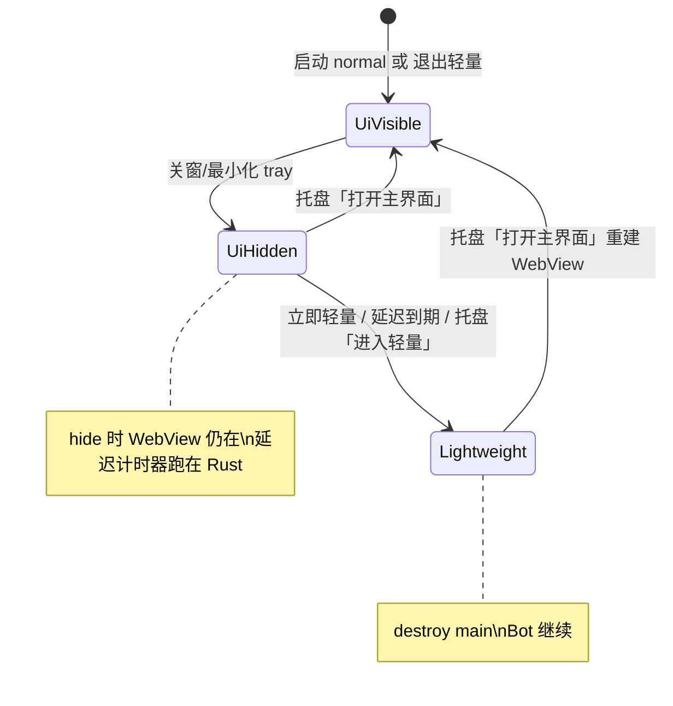

# 轻量模式产品设计（后台托管 Bot + WebView 按需）

> 状态：设计草案，未实施  
> 日期：2026-06-13  
> 关联：`webview2-memory-risk.md`、`memory-leak-risk-scan.md`  
> 参考实现：[farion1231/cc-switch](https://github.com/farion1231/cc-switch) `lightweight.rs` + 托盘菜单

---

## 1. 产品一句话

**托盘常驻的托管进程：Bot 在 Rust 里一直跑；掉线/异常用系统通知提醒；完整桌面 UI（组件安装、改配置、扫码）仅在用户需要时再创建 WebView。**

与现状差异：

| 现状 | 目标 |
|------|------|
| 启动即创建 `main` WebView | 可配置：启动即 UI / 启动仅托盘 |
| 关窗 ≈ `hide()`，WebView2 仍在 | **轻量** = `destroy` WebView，进程与 Bot 继续 |
| 掉线仅 log（`NoopOfflineNotifier`） | 原生通知（可叠加 webhook/邮件） |

---

## 2. 进入轻量的时机：可配置、尽量无感

核心原则：**不强迫用户理解「轻量」一词**；用「关窗后怎么办」「多久不用就省资源」表达。进入轻量 = 释放 WebView2，不是退出程序。

### 2.1 建议的设置项（写入 `app-settings.json` / `AppSettings`）

| 字段（草案名） | 类型 | 默认（建议） | 含义 |
|----------------|------|--------------|------|
| `ui_mode_on_startup` | enum | `normal` | `normal`：启动显示主窗口；`tray_only`：启动仅托盘（无 WebView，直接轻量） |
| `close_button_action` | enum | 沿用现有 `close_action` | `tray`：关窗不退出进程；`exit`：关窗退出（保持现有语义） |
| `after_close_ui_behavior` | enum | `hide` | 关窗且 `close_action=tray` 时：**仅隐藏** vs **延迟进入轻量** vs **立即进入轻量** |
| `enter_lightweight_delay_secs` | u32 | `300`（5 分钟） | 当 `after_close_ui_behavior=delayed_lightweight` 时，主窗口**不可见**累计多久后 `destroy`（0 = 视为立即） |
| `minimize_to_tray_counts_as_hidden` | bool | `true` | 最小化到托盘是否计入「不可见」计时（与 hide 同等） |
| `notify_on_offline` | bool | `true` | 是否发桌面通知（实现 `OfflineNotifier`） |
| `notify_on_bot_crashed` | bool | `true` | 进程退出/崩溃是否通知 |
| `notify_on_login_kicked` | bool | `true` | NapCat 踢线等是否通知 |

说明：

- **`close_action` 与轻量解耦**：用户已习惯「关窗进托盘」；轻量是**资源策略**，在 `close_action=tray` 前提下才讨论 hide / 延迟 destroy / 立即 destroy。
- **`exit` 关窗**：不走轻量，仍 `shutdown_all` + 退出（与 `lib.rs` 今日一致）。

### 2.2 三种「无感」进入路径（可并存）

**路径 A — 关窗后延迟进入轻量（推荐默认「无感」）**

1. 用户关窗 → `prevent_close` + `hide()`（与现在相同，**瞬间无感**）。
2. Rust 启动**单飞**计时器：`enter_lightweight_deadline = now + delay_secs`。
3. 若在 deadline 前用户 **打开主界面** → 取消计时器，保持 hide 恢复 show 即可（WebView 从未销毁）。
4. deadline 到且窗口仍不可见 → 调用 `enter_lightweight_mode()`（`destroy` + 设标志）。

体验：关窗和现在一样快；几分钟不用后自动省 WebView2，无需用户点「轻量」。

**路径 B — 关窗后立即进入轻量**

- `after_close_ui_behavior = immediate_lightweight`：hide 后**紧接着** destroy（或 hide 与 destroy 合并为一步，避免双动画）。
- 适合极度在意内存的用户；扫码/装组件前需接受「开界面 = 冷启动 UI」。

**路径 C — 仅托盘菜单 / 勾选进入轻量**

- 托盘增加：**「进入轻量模式」**（Check 项，对齐 cc-switch）或 **「释放界面内存」**（通俗文案）。
- 用户可在 **界面仍开着** 时点选 → 先 save 窗状态 → destroy（适合：Bot 跑着，用户主动关 UI 去玩游戏）。
- 与 **路径 A** 不冲突：菜单是**立刻**，延迟是**自动**。

**路径 D — 启动即轻量**

- `ui_mode_on_startup = tray_only`：setup 后不 `show` 主窗，或创建后立刻 `enter_lightweight`（若 Tauri 要求必须有窗，则 **visible: false** + 可选立即 destroy，以实现为准）。
- 适合「装完当服务跑」的用户；第一次要改配置需托盘「打开主界面」。

### 2.3 托盘交互（建议）

| 菜单项 | 行为 |
|--------|------|
| 打开主界面 | 有窗 → show/focus；轻量中 → `exit_lightweight_mode` 重建 |
| 进入轻量 / 释放界面内存 | `enter_lightweight_mode`（窗存在则 destroy） |
| 退出程序 | 现有 `quit_from_tray` / `request_exit_app` |
| （可选）Bot 摘要 | 只读：N 个运行 / M 个离线（Rust 查 `BotManager`，不依赖 React） |

左键托盘：

- **可配置**：`tray_left_click` = `show_window` | `show_menu_only`（cc-switch 后期偏向只出菜单，减少误触开大 UI）。

### 2.4 与「配置了托盘」的关系

用户说的「配置了托盘」可映射为：

- `close_action = tray`（已有），和/或
- `ui_mode_on_startup = tray_only`，和/或
- 开启 **延迟轻量**（`after_close_ui_behavior = delayed_lightweight`）。

建议在设置页 **「外观 / 关闭行为」** 同一组：

1. 关闭按钮：最小化到托盘 / 退出程序  
2. 关窗后界面：保持隐藏（占内存）/ **一段时间不用后释放界面（推荐）** / 立即释放  
3. 延迟时间：1 / 3 / 5 / 15 / 30 分钟  
4. 启动时：显示主界面 / 仅托盘  

这样「无感」= 默认仍是 hide，**自动**在后台计时 destroy，而不是让用户记「轻量」两个字。

---

## 3. 技术要点（实施时）

### 3.1 Rust 模块（对齐 cc-switch）

- `src-tauri/src/lightweight.rs`（或 `ncd-runtime` 薄封装 + tauri 调窗口 API）
  - `LIGHTWEIGHT_MODE: AtomicBool`
  - `enter_lightweight_mode(app)`：`save_window_state` → 平台 `skip_taskbar` 等 → **`window.destroy()`**
  - `exit_lightweight_mode(app)`：有窗 show；无窗 **`WebviewWindowBuilder::from_config`**
- `src-tauri/src/lib.rs`：`.run(|app, event| …)` 处理 **`RunEvent::ExitRequested`** + `prevent_exit`（destroy 后进程不退出）
- **延迟计时器**：`AppState` 里 `Option<JoinHandle<()>>` 或 `tokio::time::Sleep` + cancel token；窗口 show 时 cancel

### 3.2 无 WebView 时 Bot 与通知

- **不改动** Bot 编排主路径：`BotManager` bootstrap、poller、daemon、Docker 会话照旧。
- **新增** `TauriOfflineNotifier`（或统一 `DesktopNotifier`）实现 `OfflineNotifier` + 订阅 `DomainEvent`（`BotProcessExited`、`NapCatLoginInvalidated`、`bot_error` 等）→ Windows Toast（`tauri-plugin-notification` 或平台 API）。
- 无窗时 **不必**为 UI 停 poller；可选优化：无 WebView 时跳过 `emit` 仅 log+通知（降 CPU，P1）。

### 3.3 重建 WebView 后前端

- 冷启动：Splash → `list_bot_snapshots`、settings 等重新拉取（与今日首次启动类似）。
- 扫码：通知文案带「打开主界面登录」；或点击通知直接 `exit_lightweight`。

### 3.4 组件安装 / 任务队列

- 安装任务在 Rust 可**无窗继续**；无进度 UI。
- 产品策略：**安装完成通知** + 「打开主界面查看」；或检测到用户在装组件时禁止自动轻量（`active_tasks` 非空则暂停 destroy 计时器）。

---

## 4. 阶段划分

| 阶段 | 交付 | 用户可见 |
|------|------|----------|
| **P0** | destroy/rebuild + `prevent_exit` + 托盘「打开/进入轻量/退出」 | 能手动轻量，能再开 |
| **P0** | 桌面通知（离线/崩溃/踢线） | 「掉线通知一下」 |
| **P1** | 设置项：`after_close` + `delay_secs` + 计时器 | **无感延迟轻量** |
| **P1** | `ui_mode_on_startup = tray_only` | 开机即托管 |
| **P2** | 托盘 Bot 摘要、单实例、安装中禁止自动轻量 | 抛光 |

---

## 5. 默认策略建议（讨论用）

若希望多数用户无感且省 WebView2：

- `close_action` = `tray`（保持）
- `after_close_ui_behavior` = **`delayed_lightweight`**
- `enter_lightweight_delay_secs` = **300**
- `ui_mode_on_startup` = **`normal`**（避免升级后首启「怎么没界面」惊吓；高级用户改 tray_only）

若希望极客默认最省内存：

- `ui_mode_on_startup` = `tray_only`
- `after_close_ui_behavior` = `immediate_lightweight`

---

## 6. 风险与验收

| 风险 | 缓解 |
|------|------|
| destroy 后 `ExitRequested` 误退出 | `prevent_exit` + Windows 实测 |
| 延迟内用户以为「还在跑 UI」实际已 destroy | 托盘 tooltip 显示「轻量模式」 |
| 扫码时窗口已 destroy | 通知 + poller 侧可选「待扫码」通知 |
| 重建窗慢 | 接受；文案「正在打开界面…」 |

**验收（无自动化可先手工）**：

1. Bot 运行中 enter 轻量 → 任务管理器 WebView2 工作集明显下降，Bot 仍 Running。  
2. 延迟 1 分钟配置：关窗 → 1 分钟内打开 → 不 destroy；超过 1 分钟 → destroy。  
3. 离线/踢线 → Toast 出现，无 WebView。  
4. 托盘打开 → UI 状态与 Rust snapshots 一致。

---

## 7. 与 cc-switch 差异摘要

| cc-switch | NapCat 本设计 |
|-----------|----------------|
| 托盘切供应商（Rust 写配置） | 托盘以 **开/关 UI + 通知** 为主；Bot 已在 Rust 托管 |
| 轻量菜单 Check | 同样可有；**另加延迟自动轻量**（更无感） |
| 单实例唤起窗 | 建议 P2 照搬 |

---

*实施前需将 `AppSettings` 字段落 `ncd-domain` + ts-rs + 设置页；本文档不写具体 commit 计划。*