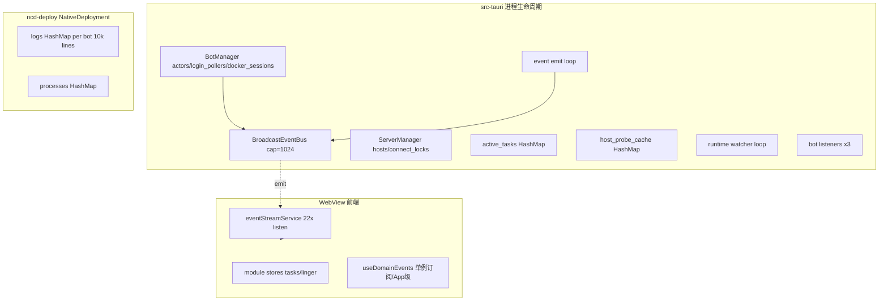

# NapCatQQ-Desktop 内存泄漏风险扫描报告

> 扫描范围：Rust 后端（ncd-runtime / ncd-deploy / ncd-host / src-tauri）+ React 前端（src-ui）  
> 方法：静态代码检索 + 长生命周期资源路径追踪（未做运行时 profiling / Valgrind）  
> 日期：2026-06-13  
> 结论：**未发现典型「无界堆增长」的确定性泄漏**；存在若干**有界但可累积**、**慢泄漏**与**设计取舍**项，按严重度分级如下。

---

## 1. 执行摘要

| 等级 | 含义 | 数量（本报告） |
|------|------|----------------|
| **P1** | 长时间运行可能持续涨内存或句柄，建议排期修复 | 3 |
| **P2** | 有上限或场景受限，但边界外可能膨胀 | 5 |
| **P3** | 设计已知、有文档/注释，需产品策略或观测 | 4 |
| **OK** | 有清理/有界/生命周期对齐 | 多处 |

桌面端为**长驻进程**（Tauri + 多路 `tokio::spawn` + SSH 连接缓存 + 前端全局事件订阅），风险集中在：**Map 只增不减**、**broadcast 丢事件 vs 慢消费者**、**模块级 store 终态保留**、**每 Bot 常驻任务**。

---

## 2. 架构与长生命周期资源地图

---

## 3. Rust 后端

### 3.1 P1：`ServerManager` 辅助 Map 无删除路径

**位置**：`crates/ncd-runtime/src/server_manager.rs`

| 结构 | 用途 | 删除时机 |
|------|------|----------|
| `hosts` | `server_id → Arc<dyn Host>` SSH 会话 | `delete_server`、`disconnect_cached_host`、更新 profile 时 remove |
| `connect_locks` | `server_id → Arc<Mutex<()>>` 连接单飞锁 | **未见**随 `delete_server` 清理 |
| `auto_connect_cooldown_until` | 自动连失败冷却 | 成功时 remove(id)；**失败条目依赖 Instant 过期**，Map 条目**不 shrink** |

**风险**：

- 用户**反复添加/删除远端配置**（或改 server id）时，`connect_locks` 可能**只增不减**，每个条目一个 `Arc<Mutex<()>>`，体量小但属**确定性慢泄漏**。
- `auto_connect_cooldown_until` 在大量不同 `server_id` 尝试自动连接后，会保留大量已过期 `Instant` 键，直到进程结束。

**对比**：`hosts` 在 `delete_server`（约 L524）会 `remove(id)`，行为正确。

**建议（未改代码，仅记录）**：`delete_server` 时同步 `connect_locks.remove(id)`、`auto_connect_cooldown_until.remove(id)`。

---

### 3.2 P1：Tauri → 前端事件桥 + `broadcast` 容量 128

**位置**：

- `crates/ncd-runtime/src/events.rs`：`BroadcastEventBus::default()` → `broadcast::channel(1024)`（2026-06-13 自 128 上调；常量 `DEFAULT_BROADCAST_CAPACITY`）
- `EventSubscription::next`：`RecvError::Lagged` → **continue** 并 `tracing::warn!`（target `ncd::event_bus`，含 skipped 计数）
- `src-tauri/src/lib.rs` setup：`while let Some(event) = subscription.next().await { handle.emit(...) }`

**风险**：

- 不是传统「内存泄漏」，而是**背压缺失**：日志洪峰（`bot_log_appended`、`snowluma_daemon_log`、`desktop_log` 若走 bus）时，**唯一 Tauri 转发消费者**若跟不上，**lag 后丢弃事件**；前端状态与后端不一致。
- `publish` 使用 `let _ = self.sender.send(event)`，**无订阅者时亦丢弃**，对「晚订阅」无缓冲（除各业务自建的 ring buffer）。

**有界性**：channel 内最多约 1024 条**待投递** `DomainEvent`（每条含 `String` 行内容时仍是有界）。

**关联**：SnowLuma / Native 日志另有更大 ring（见 3.4），与 bus 是两条管线。

---

### 3.3 P2：`NativeDeployment` 内存日志表

**位置**：`crates/ncd-deploy/src/deployments/native.rs`

- `RuntimeLogBuffer`：**10_000 行/ bot**，`VecDeque<String>`
- `logs: HashMap<BotId, RuntimeLogBuffer>`
- 进程退出 watcher：`guard.remove(&bot_id)`（约 L384–398、L512–513）

**风险**：

- **单 Bot 有界**；**Bot 数 ≤ MAX_BOTS(4)** 时总量约 4 × 10k 行 × 平均行长，可控。
- 若未来放宽 Bot 上限或存在**未走 exit watcher 的异常路径**未 `remove`，Map 会多占一份 10k 缓冲（需结合 `stop`/`launch` 异常路径审计）。

**评估**：当前产品约束下为 **P2（边界依赖 MAX_BOTS）**。

---

### 3.4 P3：SnowLuma Daemon 双缓冲

**位置**：`crates/ncd-runtime/src/snowluma/daemon.rs`

- `broadcast::channel(10_000)` 行级广播
- `recent_log`：`VecDeque`，`RECENT_LOG_CAPACITY = 1000`

**风险**：均为**显式有界**；慢订阅者会 lag overwrite，不造成堆无限增长。`ref_count` 注释说明不再驱动 terminate，属**单例 daemon** 设计，非泄漏。

---

### 3.5 OK：Bot 生命周期与后台任务

**位置**：`crates/ncd-runtime/src/bot_manager.rs`、`bot_actor.rs`、`docker_bot_session.rs`、`napcat/login_poller.rs`

| 资源 | 创建 | 销毁 |
|------|------|------|
| `actors` | 配置 upsert / bootstrap | `delete_bot_internal` → `shutdown` + `actors.remove` |
| `login_pollers` | `NapCatWebuiAvailable` | `dispose_poller` / `shutdown_all` |
| `napcat_endpoints` | 同上 | `dispose_poller` |
| `docker_sessions` | 远端 Docker 启动 | `shutdown_bot` / `shutdown_all`（abort log/watch task） |
| `BotActor` tokio 任务 | `BotActorHandle::spawn` | `Shutdown` command → `break` 结束 loop |
| `NapCatLoginPoller` | spawn + CancellationToken | `dispose()` |

**约束**：`MAX_BOTS = 4`，poller **每运行中 NapCat bot 一个** HTTP 轮询循环，属**常驻开销**而非无界泄漏。

---

### 3.6 OK：`active_tasks` / `host_probe_cache`（Tauri）

**位置**：`src-tauri/src/lib.rs`、`src-tauri/src/commands/components.rs`

- `active_tasks`：任务结束/失败路径 `remove(&task_id)`（components 命令内）
- `host_probe_cache`：组件 install 后 `remove(probe_cache_key)`

**残余风险（P3）**：若任务**永不结束**且未 cancel，Map 长期保留 `CancellationToken`；属**任务泄漏**而非 Map 结构缺陷。

---

### 3.7 P2：SSH `RemoteLinuxHost` 会话与 SFTP 缓存

**位置**：`crates/ncd-host/src/remote/linux.rs`、`ServerManager.hosts`

- 每个缓存 Host 持有 `Arc<Mutex<ClientHandle>>`、可选 SFTP session、`elevation_password`
- `disconnect_cached_host` / `delete_server` 从 Map **移除 Arc**，依赖 **Arc 归零** 释放 russh 连接

**风险**：

- 若业务路径**只断逻辑不调用** `disconnect_cached_host`，旧连接占内存+FD 直到替换或删 server。
- 注释称内部**尚未**用 `config` 做断线自愈，长空闲会话依赖 keepalive / inactivity_timeout（已配置 900s 等量）。

---

### 3.8 OK：桌面日志落盘

**位置**：`src-tauri/src/desktop_log.rs`、`purge_stale_logs(..., 7)`

- 单会话一个 log 文件 + tracing layer；**非**无界内存缓冲。
- 设置页 `useDesktopLogStream` **刻意轮询 tail**（注释：避免 desktop_log 事件风暴），前端单次最多 **800 行**（`TAIL_LINES`）。

---

### 3.9 网络客户端

**位置**：`ReqwestNapCatWebUiClient`、`ReqwestSnowLumaWebUiClientFactory` 等

- 一般为**进程级单例** `reqwest::Client`（连接池有界），未见每请求 `Client::new`。

**建议**：变更时避免在热路径重复构造 Client。

---

## 4. 前端（WebView）

### 4.1 OK：全局事件订阅与清理

**位置**：

- `src-ui/core/services/event-stream.service.ts`：Tauri 下对 **22 个**事件名各 `listen` 一次，返回聚合 `unlisten`
- `src-ui/hooks/events/useDomainEvents.ts`：`useEffect` cleanup + `cancelled` 防竞态

**App 级桥**（`AppNext.tsx`）：`useComponentActionEventBridge`、`useDockerDeployProgressBridge`、`useDockerInstallProgressBridge` — **各 1 个** `useDomainEvents`，路由切换**不卸载 AppNext**，属**有意长订阅**，非 per-page 泄漏。

**注意**：`BotLogPage` 使用 `useBotLogStream` → 内部 `useDomainEvents`；**离开日志页会 unsubscribe**，但**同一页打开期间**仍接收全局流（handler 内过滤 bot_id），开销为 O(事件率)，非订阅数膨胀。

---

### 4.2 P2：模块级进度 Store + 终态 linger

**位置**：

- `componentActionStore.ts`、`dockerDeployProgressStore.ts`、`dockerInstallProgressStore.ts`
- `taskQueueTerminalLinger.ts` + `taskQueueCleanupPrefsStore`

**行为**：

- 用户关闭「任务队列自动清理」时，**终态 task 记录可永久保留**在 `tasks` / `taskTargets`（注释明确）。
- `lingerTimers`：`Map<taskId, setTimeout>`，正常终态会 `delete`；若**关闭自动清理**，不会 schedule timer，**tasks 对象持续增长**。

**风险**：长期重度使用组件/Docker 安装的用户，**前端 JS 堆**随 task_id 增多而涨 — **产品配置驱动的有界/无界切换**。

---

### 4.3 OK：日志 UI 缓冲

**位置**：`src-ui/core/domain/events/log-buffer.ts`

- `MAX_LINES = 1000`（`appendLine`）
- `useBotLogStream`：进程退出清空；历史 tail 1000（`botService.tailLog`）

---

### 4.4 OK：概览性能曲线

**位置**：`useResourceMonitor.ts`、`PERFORMANCE_MONITOR_HISTORY_SIZE`

- 历史点数组**固定长度**滚动，不随时间无限变长。

---

### 4.5 P3：React Query 缓存

**位置**：`useBotSnapshots`、`useBotConfig` 等

- TanStack Query 默认 `gcTime` 会回收未使用 query；**非**典型泄漏源。
- 需注意 **devtools / 大量 queryKey** 长期不 gc 的边缘情况（当前规模低）。

---

### 4.6 P3：GSAP / Canvas 动画

**位置**：`SplashConfetti.tsx`、`useMotion` 等

- `SplashConfetti` 应在 `useEffect` return 中 cancel rAF（需改代码前再逐文件核对）；开屏**一次性**，非长驻泄漏主因。

---

## 5. 交叉场景（端到端）

| 场景 | 后端 | 前端 | 备注 |
|------|------|------|------|
| 4 Bot 长跑 + 日志量大 | Native 4×10k 行 + bus 128 lag | 每 Bot 日志页 1k 行 | 不开日志页时前端不攒 bot log state |
| 远端 SSH 多机探测 | hosts 缓存 + connect_locks | — | 删 server 清 host，**不一定清 lock map** |
| 组件安装任务很多 | active_tasks 短暂 | componentActionStore 可永久保留 | 依赖用户清理设置 |
| SnowLuma 单 daemon | 1k recent + 10k broadcast | 多 SL bot 页共享 daemon_log 事件 | 有界 |

---

## 6. 推荐的验证手段（未执行）

1. **Windows**：任务管理器 / ETW 观察**私有工作集** 24h（4 bot + 2 远端 + 周期性组件 detect）。
2. **Rust**：`tokio-console` 看 task 数量是否随 bot 删增而回落；`tracing` 统计 `spawn` 与 `abort`。
3. **前端**：Chrome DevTools Memory heap snapshot — 反复安装组件 50 次，对比 `tasks` 在「关闭自动清理」下的 retained size。
4. **SSH**：删尽 `servers.json` 条目后看 `connect_locks` 大小（需临时诊断日志或测试）。

---

## 7. 优先级修复清单（仅建议，本次未改代码）

1. **P1** `ServerManager::delete_server`（及 profile id 变更路径）同步清理 `connect_locks`、`auto_connect_cooldown_until`。
2. **P1/P2** 评估 `BroadcastEventBus` 容量与「日志类事件」是否应旁路 bus（仅 UI 轮询 / 专用 channel），降低 Lagged 丢事件。**已做**：默认容量 1024 + Lagged 可观测日志；旁路仍待产品设计。
3. **P2** 文档化或限制「任务队列不自动清理」下的 store 上限（例如最多保留 N 条终态）。
4. **P2** 远端 SSH：删 server / 长时间 Disconnected 时显式 `disconnect_cached_host` 策略复核。

---

## 8. 文件索引（本次重点阅读）

| 路径 | 主题 |
|------|------|
| `crates/ncd-runtime/src/server_manager.rs` | SSH 缓存、connect_locks |
| `crates/ncd-runtime/src/events.rs` | broadcast 128、Lagged |
| `crates/ncd-runtime/src/bot_manager.rs` | actors、pollers、delete 路径 |
| `crates/ncd-deploy/src/deployments/native.rs` | 10k log ring |
| `crates/ncd-runtime/src/snowluma/daemon.rs` | daemon 缓冲 |
| `crates/ncd-runtime/src/docker_bot_session.rs` | 隧道与 abort |
| `src-tauri/src/lib.rs` | 常驻 spawn、AppState |
| `src-ui/core/services/event-stream.service.ts` | listen 生命周期 |
| `src-ui/hooks/components/componentActionStore.ts` | 模块级 task 表 |

---

*本报告为静态分析产物；不构成安全审计或性能基线达标证明。*