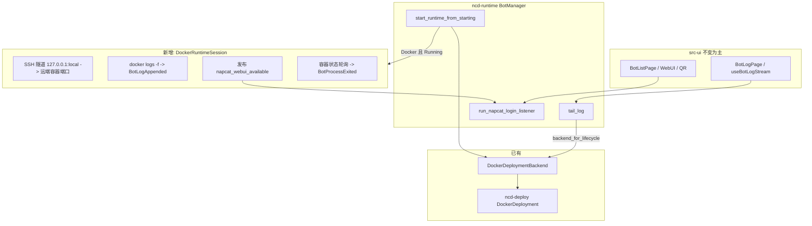

---

> 归档自 `.claude/plan/refactored-bubbling-squid.md`（2026-06-13）。非活 plan；实现进度以 `bot_manager` / Docker 会话提交为准。
# NC/SL 远端 Docker Bot 体验对齐「直接运行」

## Context

用户希望 NapCat / SnowLuma 在 **远程 SSH 主机 + Docker** 下的 Bot 体验，与 **远端/本机 Native 直接运行** 一致：列表启停、日志页、WebUI、扫码/登录态等应走同一套 UI，而不是只有容器能起来、其余能力空白。

**已确认范围**：仅 **远程 SSH + Docker**；不放开「本机 + Docker Desktop」（`bot_manager::backend_for_config` 对本机 Docker 的报错保持不变）。

**现状结论（调研）**：

| 能力 | Native（本机） | Docker（远端） |
|------|----------------|----------------|
| 启停路由 | `backend_for_config` → `NativeDeploymentBackend` | 已实现 → `DockerDeploymentBackend` |
| 历史日志 `tail_log` | 内存缓冲 / 文件 | `docker logs --tail` 已实现 |
| **`tail_log` 路由** | 按 flavor 选 baked backend | **Bug**：`tail_log` 仍走 `backend_for(flavor)`，Docker Bot 拉不到容器日志 |
| 实时日志 `bot_log_appended` | `NativeDeployment` stdout reader | **缺失**：无 `docker logs -f` 任务 |
| NapCat `napcat_webui_available` + LoginPoller | stdout 解析 / 固定 127.0.0.1:port | **缺失**：容器无 stdout 桥接；WebUI 在远端 127.0.0.1:6099 |
| SnowLuma WebUI / daemon Ready | 本机 daemon + `open_snowluma_webui` | **缺失**：无 daemon；WebUI/noVNC 在远端容器端口 |
| 进程退出 `bot_process_exited` | exit watcher | **缺失**：容器停/崩不发布事件 |
| 前端门禁 / 组件页拉镜像 | N/A | `docker-start-gate.ts` + 启动路由已有 |

底层能力已具备但未接到 Bot 生命周期：`ncd-host::RemoteLinuxHost::open_tunnel`、`DockerCli::logs`、`SecretStore` 中 Docker token/VNC、`run_napcat_login_listener` 等。

**额外风险**：`DockerDeploySpec::napcat_default()` / `snowluma_default()` 对每台主机使用 **固定宿主机端口**（如 6099、5099）。同一远端多 Bot 会端口冲突，需在 Docker 接入方案中一并处理（按 QQ 或序号偏移宿主机端口）。

---

## 目标架构（Mermaid）

原则：**不复制一套 Docker 专用前端**；尽量复用现有 `DomainEvent` 与 `useBotLogStream` / `useNapcatLogin` / `useOpenWebui`，在 runtime 层把 Docker 伪装成与 Native 相同的事件形状。

---

## 推荐实现方案

### 1. 统一 backend 解析（必修）

- 抽取或复用 `backend_for_lifecycle` 逻辑，供 **`tail_log`**（及今后其它按 Bot 读 runtime 的 API）使用。
- `tail_log`：有 `BotConfig` 时 **必须** `backend_for_config` / `backend_for_lifecycle`，禁止 `backend_for(flavor)`。
- 文件：`crates/ncd-runtime/src/bot_manager.rs`。

### 2. Docker 运行时会话（核心）

在 `ncd-runtime` 新增模块（建议 `docker_bot_session.rs` 或挂在 `native_deployment_adapter` 旁），由 `BotManager` 在 `start_runtime_from_starting` 成功 `confirm_running` 后启动，在 `stop` / `delete` / `BotProcessExited` / `shutdown_all` 时清理。

**会话持有**（per `BotId`）：

- `Arc<dyn Host>`（来自 `HostResolver`）
- `BotConfig` 快照（含 `deployment_type`、`backend_type`、`runtime_target`）
- 隧道句柄列表 `Vec<TunnelHandle>`（Drop 即关）
- 后台任务 JoinHandle（日志 follow、状态 watch）

**端口与规格**：

- 扩展 `DockerDeployment::build_spec` 或 Bot 层包装：在默认端口基础上为 **宿主机侧** 做 per-bot 偏移（例如 NapCat WebUI `6099 + f(qq_id)`，OB11 3000/3001 同步偏移），避免同机多容器冲突；偏移规则写入单测并文档化。
- 从 `SecretStore` 读 NapCat `WEBUI_TOKEN` / SnowLuma `VNC_PASSWD`（与 `bot_manager` 现有 key 一致）。

**NapCat Docker**：

1. 建立隧道：`TunnelSpec::local_to_remote(local_port, remote_host_port)`，远端目标为容器映射后的 **远端 loopback 端口**（与 compose 宿主机绑定一致，一般为 `127.0.0.1:host_port` 从 SSH 视角即 `127.0.0.1:映射端口`）。
2. 发布 `DomainEvent::napcat_webui_available { bot_id, port: local_port, token }`（与 Native 相同，使 `run_napcat_login_listener` → `NapCatLoginPoller` 无需改事件类型）。
3. **WebUI HTTP**：`ReqwestNapCatWebUiClient` 仅允许 `127.0.0.1` —— 隧道建立后 **继续用 local_port**，与现 Poller 兼容。
4. 可选：从 `docker logs` 解析 NapCat 面板 URL 作校验；解析失败时仍以「已知 token + 隧道端口」为准（token 由我们写入 compose `.env`）。

**SnowLuma Docker**：

1. 隧道：至少 **WebUI**（默认 5099）与 **noVNC**（6081，扫码）两条；端口随 per-bot 偏移。
2. **不假装 daemon Ready**：`isSnowlumaWebuiAvailable(daemon===ready)` 对 Docker Bot 不适用。两种子方案（推荐 A）：
   - **A**：容器 Running 后发布现有或新增事件，让前端视为可开 WebUI（例如在 `BotStatus.extra` 或新事件 `snowluma_docker_endpoints_ready`）；`open_snowluma_webui` 改为按 `BotConfig` 路由：Docker 时返回 `http://127.0.0.1:{tun_port}` + VNC 密码（SecretStore）。
   - **B**：扩展 `DaemonState` 语义（侵入面大，不推荐首版）。
3. 登录态：容器内 QQ 走 noVNC；可复用列表 **打开 noVNC URL**（隧道到 6081）而非本机注入 QQ 进程。

**日志**：

- 后台：`DockerCli::logs` 改为支持 **follow**（新增 `logs_follow` 或 `host.run_stream` 执行 `docker logs -f --since 0`），每行 `EventBusSink::publish_log_line`（channel `stdout`/`stderr` 与 Native 一致）。
- 与 `useBotLogStream` 兼容：历史仍 `tail_log`，增量靠 `bot_log_appended`。

**退出检测**：

- 周期 `observe`（已有 `DockerDeployment::observe`）或轻量 `docker inspect`：状态从 Running → Exited/缺失 → 发布 `bot_process_exited`，并 `dispose_poller`、结束日志 follow、关隧道。
- 注意与 `stop_bot` 主动停止的竞态：主动 stop 时由现有流程 `confirm_stopped`，watch 任务应识别「预期停止」避免双报（可用 generation 或 `stop_requested` 标志）。

### 3. Tauri / IPC 薄壳调整

- `open_snowluma_webui`（`src-tauri/src/commands/snowluma.rs`）：读取 `BotManager` 中该 bot 的 config；`deploymentType=docker` 时走 **Docker 会话** 的隧道 URL + `get_or_create_docker_vnc_passwd` 逻辑（勿再只读本机 `runtime.json`）。
- 可选：`bot_manager` 暴露 `resolve_webui_for_bot(bot_id)` 供 command 调用，保持 Layer 4 薄壳。
- `get_remote_webui_endpoint` 仍为 ServerProfile 级 stub，**不作为** Docker per-bot WebUI 主路径。

### 4. 前端（最小改动）

- `useOpenWebui` / `availability.ts`：SnowLuma Docker 时 `isWebuiAvailable` 条件扩展（例如 config `deploymentType===docker` 且 bot `Running`）。
- `useBotLogStream`：**无需改**（事件名不变）；Docker 会话发事件即可。
- `IdentityTab` / 门禁：**已有**；可在 Running 后增加一句「Docker 日志/WebUI 经 SSH 隧道」说明（可选）。

### 5. 测试与验证

**单元 / 集成（Rust）**：

- `tail_log` 对 Docker config 调用 mock `Host` + 断言走了 `DockerDeploymentBackend`（可扩 `bot_manager` 测试）。
- `build_spec` 多 bot 端口不碰撞。
- Docker 会话 mock：隧道 + 发布 `napcat_webui_available` 一次。

**手工 E2E**：

1. 组件页：远端主机 Docker 就绪 + 拉 NC/SL 镜像。
2. Bot 配置：远端 + Docker，启动。
3. 日志页：历史 + 实时有新行。
4. NapCat：WebUI 可开、二维码/在线状态与 Native 一致。
5. SnowLuma：WebUI/noVNC 可开、密码剪贴板。
6. 停止 / 容器异常退出：列表状态变 Stopped/Crashed，WebUI 按钮禁用。

---

## 关键文件（按改动优先级）

| 优先级 | 路径 |
|--------|------|
| P0 | `crates/ncd-runtime/src/bot_manager.rs`（tail_log 路由 + 启停挂钩会话） |
| P0 | 新建 `crates/ncd-runtime/src/docker_bot_session.rs`（或等价） |
| P0 | `crates/ncd-deploy/src/deployments/docker.rs` / `ncd-domain` `DockerDeploySpec`（端口分配） |
| P0 | `crates/ncd-deploy/src/docker/cli.rs`（`logs -f` 流式） |
| P1 | `crates/ncd-runtime/src/native_deployment_adapter.rs`（`EventBusSink` 复用） |
| P1 | `src-tauri/src/commands/snowluma.rs` |
| P1 | `src-ui/core/domain/webui/availability.ts` + `hooks/webui/useOpenWebui.ts` |
| P2 | `docs/context/codemap.md`（补 Docker Bot 会话落点） |

**复用**：`EventBusSink`、`HostResolver`、`DockerDeploymentBackend::tail_log`、`run_napcat_login_listener`、`TunnelSpec` / `RemoteLinuxHost::open_tunnel`、`docker_webui_secret_store` wiring（`src-tauri` setup）。

---

## 非目标（本计划不做）

- 本机 Windows Docker Desktop Bot 部署。
- 远端 Native 直跑（仍报错引导 Docker）。
- 重写组件页「拉镜像」流程（仅消费已拉镜像）。
- Config drift / 热推送对 Docker 容器内配置的完整 parity（可后续：NapCat 经隧道调 WebUI API）。

---

## 实施顺序建议

1. 修 `tail_log` 路由 + 端口分配（可独立合入）。
2. Docker 会话骨架：启停挂钩、隧道、NapCat `webui_available`、日志 follow。
3. 容器退出 watch + poller 清理。
4. SnowLuma WebUI / noVNC 命令与前端可用性。
5. 测试 + codemap 更新。