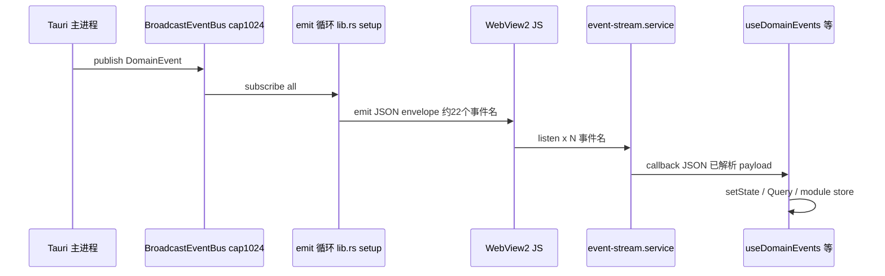

# WebView2 渲染进程内存风险专章

> 面向 NapCatQQ-Desktop（Tauri 2 + React + **Windows WebView2**）  
> 方法：静态代码 + 并行扫描结论，**未做** Performance/Memory 实测  
> 日期：2026-06-13  
> 关联：`memory-leak-risk-scan.md`（原生进程）、本机 `C:\ProgramData\NapCatQQ Desktop` 磁盘扫描（用户环境）

---

## 1. 为什么单独写 WebView2

在 Windows 上，用户任务管理器里常看到：

- **NapCatQQ Desktop**（或 `ncd-tauri` 主进程）— Rust + Tokio + SSH/Docker
- **Microsoft Edge WebView2** 子进程 — Chromium 渲染器，跑 `src-ui` 打包后的 JS/DOM

二者**内存分开记账**。只盯主进程无法判断「界面卡、越用越占内存」是否来自 **WebView2 渲染堆**、**GPU/纹理** 或 **IPC 带来的 JS 分配**。

本产品为**托盘长驻**（`CloseRequested` → `prevent_close` → 隐藏托盘），WebView2 进程与主进程可连续运行数天，任何「订阅未卸、缓存只增、大图/Canvas 残留」都会被时间放大。

---

## 2. 架构：数据如何进 WebView2

| 环节 | 位置 | WebView2 侧影响 |
|------|------|-----------------|
| 扇出 | `src-tauri/src/lib.rs` setup 内 `spawn` + `handle.emit` | 高频时 IPC 与 **JSON 解析** 压力 |
| 事件名 | `src-ui/core/services/event-stream.service.ts` `DOMAIN_EVENT_NAMES`（22 项） | 每套订阅 = **22 个** `listen` |
| 订阅封装 | `src-ui/hooks/events/useDomainEvents.ts` | `useEffect([])` + cleanup `unlisten` |
| 业务消费 | 见 §4 | 是否把 payload **长期存入** JS 堆 |

**Invoke 路径**（`src-ui/core/ipc/transport.ts`）：命令返回同样经序列化；体量通常小于**持续事件流**，但大列表（容器、组件 detect）会制造短时峰值。

---

## 3. WebView2 / Tauri 配置层面

| 项 | 现状（静态） | 风险含义 |
|----|--------------|----------|
| 窗口数 | `tauri.conf.json` 单主窗 `main` | 无多窗叠加；风险集中在单渲染进程 |
| webview / devtools 节 | **未见**显式配置 | 发布版是否带调试能力、内部缓存策略依赖 Tauri/WebView2 默认 |
| 透明 / Mica | 装饰与合成 | 略增合成层；通常次于 DOM/JS 堆 |
| capabilities | `windows: ["main"]` | 权限面收敛，不直接防内存涨 |

**结论**：代码侧**没有**针对 WebView2 的内存上限、进程回收或「闲置挂起渲染器」策略；长会话完全依赖前端生命周期写对。

---

## 4. 前端：会推高 WebView2 堆的路径

### 4.1 P1 — 事件订阅乘数 + 持续解析

**机制**：

- `eventStreamService.subscribe` 对 **每个** `DOMAIN_EVENT_NAMES` 调用 `listen`（`event-stream.service.ts`）。
- 每个调用 `useDomainEvents` 的组件/ hook = **独立的一套** 22 路监听（除非共用同一 subscribe 返回值，当前模式是**每 hook 各订一套**）。
- Tauri 事件 payload 进入 JS 后，业务 handler 里 `setState` / `queryClient.setQueryData` / store `setState`。

**长驻订阅（App 级，设计如此）** — `AppNext.tsx`：

- `useComponentActionEventBridge`
- `useDockerDeployProgressBridge`
- `useDockerInstallProgressBridge`

各 1 套 `useDomainEvents`，路由切换**不卸载** AppNext → 合理，但若 handler 或 store **只增不减**，WebView2 堆仍涨。

**页面级**（离开页应卸载）：

- `useBotLogStream`（Bot 日志页）
- `useBotConfig` / `useBotSnapshots`
- `useEventStream`（诊断面板，有 `MAX_RECORDS=100`）

**P1 触发条件**：Bot/任务活跃 + `bot_log_appended` / `component_action_progress` / `docker_*` 高频；或某组件 **未走 cleanup**（条件渲染/HMR/异常路径）。

**与原生联动**：主进程 `BroadcastEventBus` 默认容量 **1024**（`events.rs`，2026-06-13 自 128 上调），慢消费者仍可能 `Lagged` 丢事件；WebView2 仍可能对**已送达**的事件持续分配。

---

### 4.2 P1 — 模块级 Store 终态可永久保留

| Store | 文件 | 行为 |
|-------|------|------|
| 组件任务 | `componentActionStore.ts` | `tasks` / `taskTargets`；用户关闭「任务队列自动清理」时**终态不删** |
| Docker 部署/安装 | `dockerDeployProgressStore.ts`、`dockerInstallProgressStore.ts` | 同上 + `lingerTimers` |

注释已说明：生命周期对齐**应用窗口**而非页面。重度装组件/部署用户，**Record&lt;taskId, …&gt;** 在 WebView2 堆中可线性增长。

---

### 4.3 P2 — React Query 缓存 + 事件驱动更新

`AppProvidersNext.tsx`：HMR 复用 `QueryClient`；`useBotSnapshots` 等对 `bot_state_changed` 做 `setQueryData`。

领域对象（snapshots、配置、远端列表）随 Bot/服务器数量上升；**gcTime** 未到前缓存常驻渲染进程关联的序列化图。长会话 + 多 Bot 时 WebView2 堆**随业务规模**上升，属产品取舍，非经典泄漏，但体感像「越用越大」。

---

### 4.4 P2 — 日志 UI：有界 state，但 DOM 可能全量

| 层 | 上限 | 文件 |
|----|------|------|
| 内存数组 | 1000 行 | `log-buffer.ts` `MAX_LINES` |
| 历史 tail | 1000 | `useBotLogStream` → `tailLog` |
| Desktop 日志 | 轮询 800 行 | `useDesktopLogStream`（**刻意不用** `desktop_log_appended` 事件） |

`BotLogPage.next.tsx`：**未见**虚拟列表；1000 行 × 每行 DOM 节点仍可在 WebView2 中占可观内存与布局成本。打开日志页长时间 + 高频 `appendLine` → **渲染器**压力大于 **JS 数组**本身。

---

### 4.5 P2 — 主题切换：截图 + 全屏层 + GSAP

`themeTransition.ts`：

- `html-to-image` `toPng(document.body, …)` → 大 **data URL / 图像位图**
- 创建全屏 `overlay` + `will-change: clip-path` + GSAP 长动画
- 正常结束 `remove()` + `running` 守卫 + 安全 timeout

**风险**：动画进行中再次切主题、或异常打断 →  overlay/动画上下文/大图短时**叠加**。对「偶尔改外观」用户多为峰值；对自动化/测试反复切主题可能累积。

---

### 4.6 P2 — Canvas / RAF / Observer

| 组件/Hook | 资源 | 清理 |
|-----------|------|------|
| `SplashConfetti.tsx` | Canvas 粒子 + RAF + `resize` | `cancelAnimationFrame` + `removeEventListener` + safety timeout |
| `Dialog.tsx` 高度动画 | `ResizeObserver` + RAF + GSAP tween | `disconnect` + `tweenRef.kill()` |
| `useThemeTokens.ts` | `MutationObserver` + `matchMedia` + 探针 `span` | effect return 里清理 |
| `GsapPresence` / `useMotion` | GSAP context / hover | 项目约定用 helper + kill |

**风险边界**：正常 unmount 路径较完整；**快速路由切换、StrictMode 双挂载、HMR** 下偶发漏清理 → WebView2 侧表现为 **RAF/监听残留**（难用静态证明，属 WebView2 常见嫌疑类）。

---

### 4.7 P3 — 其它

- **Mock 事件**（非 Tauri）：`events.mock.ts` 周期 emit，仅浏览器预览。
- **localStorage** 偏好双写：主要占存储配额，堆影响通常小于 store/Query。
- **Recharts / 概览曲线**：`useResourceMonitor` 历史长度有界（`PERFORMANCE_MONITOR_HISTORY_SIZE`），可控。

---

## 5. 症状对照：怎么猜是不是 WebView2

| 任务管理器现象 | 更可能主因 | 建议第一眼 |
|----------------|------------|------------|
| **WebView2** 持续上涨，主进程平稳 | §4.1–4.4 前端堆积；或仍在日志页/任务页 | 关 Bot 日志页、关「任务队列不自动清理」试 1h |
| **主进程** 涨，WebView2 平稳 | 原生 `run_streaming` 行缓冲、Docker pull、事件总线 String | 见 `memory-leak-risk-scan.md` §3 |
| **两者齐涨** | 日志/进度 **洪水**：Rust emit + JS 再存一份 | 降日志级别、避免长时间开日志页 |
| 仅启动后涨一点再平 | `SplashConfetti`、首屏 Query 冷拉 | 正常；若永不回落再查 §4.5/4.6 |
| 切主题/外观时尖峰 | `themeTransition` 截图 | 预期峰值；若峰值后不回落查 overlay 残留 |

---

## 6. 已有缓解（WebView2 相关）

1. Desktop 会话日志：**轮询 tail**，避免 `desktop_log_appended` 打爆 UI（`useDesktopLogStream` 注释）。
2. Bot 日志数组：**1000 行**环形（`log-buffer.ts`）。
3. `useDomainEvents`：**cancelled + unsubscribe** 模式。
4. `event-stream`：聚合 **unlisten** 数组。
5. GSAP：**context / kill / bindHover** 体系（`motion.ts`、组件内 `tweenRef.kill()`）。
6. 诊断 `useEventStream`：**最多 100 条**事件记录。
7. 单窗口 + 托盘退出路径：`shutdown_all` + `runtime.shutdown`（减少「杀进程留僵尸 WebView2」的非常规情况，正常退出仍依赖 Tauri/WebView2 运行时）。

---

## 7. 无实测时的最小观测清单（约 30–60 分钟）

在**不改编码**前提下，用任务管理器「详细信息」看 **WebView2** 与主进程 **专用工作集**：

1. **基线**：启动 → 进概览，静置 10 min，记 WebView2 工作集。
2. **日志页**：打开某一 Bot 日志页，Bot 有输出时观察 20 min；再返回列表，再等 10 min（看是否回落）。
3. **任务风暴**：触发一次组件安装或 Docker 拉镜像，进度条结束后 30 min 是否回落。
4. **主题**：连续切换外观/主题 5 次，是否出现**阶梯式**上涨不回落。
5. **托盘**：最小化托盘 2h 再打开，WebView2 是否明显高于步骤 1（长驻空闲泄漏嫌疑）。

可选（开发构建）：Edge **远程调试** WebView2（`WEBVIEW2_ADDITIONAL_BROWSER_ARGUMENTS=--remote-debugging-port=9222` 等，需自行评估安全）→ Memory 堆快照对比步骤 1/2。

---

## 8. Top 5 长会话关注点（WebView2 优先）

1. **多套 22 路 `listen`**：`useDomainEvents` 每实例一套；App 级桥 + 打开中的页面叠加；cleanup 失败 = 确定性上涨。
2. **任务 store 关闭自动清理**：`componentActionStore` / Docker progress **终态永久 Map**。
3. **IPC 日志类事件 + 日志页 DOM**：原生若高频 `bot_log_appended`，前端 1000 行 **全量 DOM**。
4. **主题切换 `toPng` + 全屏 GSAP**：频繁操作时的峰值与残留。
5. **React Query + 多 Bot/多远端**：缓存体积随配置规模增长，WebView2 堆「业务线性」而非 bug 时也会变大。

---

## 9. 与磁盘数据根的关系（用户机 `ProgramData`）

WebView2 **不直接**读 `C:\ProgramData\NapCatQQ Desktop` 目录；该路径影响**主进程**与落盘日志体积（约 193 MB 以 `runtime/` 安装为主）。  
磁盘上 `log/*.log` 83 个、`ssh_keys` 15 个等属于**磁盘卫生**，与 WebView2 堆**无一对一关系**；但若用户同时在设置页轮询 Desktop 日志，会周期性 **invoke 读盘** → 短时 JS 分配峰值，通常小于事件风暴。

---

## 10. 后续若要做工程化（本文档不实施）

- 集中式 **单例 EventBus**（全应用共享 1 套 listen，按 kind 分发），降低 22×N 乘数。**已落地**（2026-06-13）：`domain-event-hub.ts` + `useDomainEvents` 改走 hub。
- 任务 store **终态上限**或与「自动清理」开关联动默认上限。**已落地**（2026-06-13）：`TASK_QUEUE_TERMINAL_RETENTION_MAX_WHEN_AUTO_OFF` + `trimProgressStoresWhenAutoCleanupOff`（plan `memory-leak-small-fixes` Phase B）。
- Bot 日志页 **虚拟滚动**（1000 行 DOM 上限仍偏大）。**已落地**（2026-06-13）：`BotLogPage.next.tsx` + `@tanstack/react-virtual`。
- 主题过渡：降分辨率、复用单 overlay 池、禁止动画重入。
- 发布构建显式关闭 devtools / 评估 WebView2 环境变量（需查 Tauri 2 官方 Windows 配置）。

---

## 11. 证据索引

| 主题 | 路径 |
|------|------|
| 事件名清单 | `src-ui/core/services/event-stream.service.ts` |
| 订阅生命周期 | `src-ui/hooks/events/useDomainEvents.ts` |
| 单例枢纽 | `src-ui/core/services/domain-event-hub.ts` |
| App 级桥 | `src-ui/app/AppNext.tsx` |
| 任务 store | `src-ui/hooks/components/componentActionStore.ts` |
| Docker store | `src-ui/hooks/docker/dockerDeployProgressStore.ts` |
| 日志有界 | `src-ui/core/domain/events/log-buffer.ts` |
| 主题截图 | `src-ui/core/design/themeTransition.ts` |
| 开屏 Canvas | `src-ui/shared/ui/motion/SplashConfetti.tsx` |
| Rust emit | `src-tauri/src/lib.rs` setup |
| 总线容量 | `crates/ncd-runtime/src/events.rs` |

---

*专章结束。若与 `memory-leak-risk-scan.md` 结论冲突，以代码为准并更新两文档。*