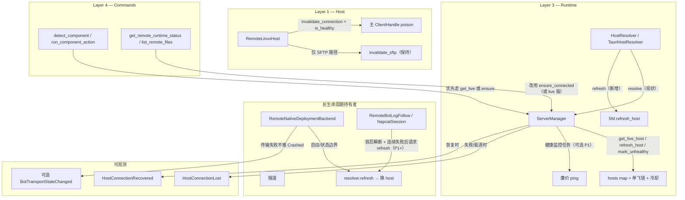

# 远端 SSH 连接稳定性与自愈架构（Remote + Native Direct-Run 路径）

> 目标：解决“服务器运行正常，但 Desktop 侧 SSH 状态丢失、组件探测/状态获取失败、给人不可靠感觉”的系统性问题。
> 核心：把“缓存即权威”改为“缓存 + 廉价活性探测 + 错误驱动失效 + 长持有者可刷新”，实现传输层失败与应用层状态的清晰分离，让系统在网络抖动、会话回收、服务器重启等场景下自动恢复，而不产生虚假崩溃或永久卡住。
> 原则：稳定性优先（正确性 > 可用性 > 性能）；最小侵入（additive 为主，复用现有单飞/隔离/冷却）；可验证（每步有明确 Done-when）；上下文自含（后续 agent 读本文 + 关键文件即可执行）。

**状态**：P0 已完成，P1 规划中  
**最后更新**：2026-06-17（基于用户反馈完善 P1 规划）  
**相关分析**：  
- 失效模式全景（server_manager / RemoteLinuxHost / 后台持有者 / 前端缓存）：见本计划 §2 + 专项 agent 报告  
- 设计方案（Host 层自愈 + ServerManager live/refresh + 持有者刷新通道）：见本计划 §3  
- 运行时状态分离（transport_error + 刷新包装器）：见本计划 §4  
- 可观测性与前端响应（ServerState 健康扩展 + 事件 + query 策略 + 三层失败区分）：见本计划 §5  
- 验证矩阵（单元桩 → 集成 → 真机 8 场景 + 回归守卫）：见本计划 §6  
- P1 规划（用户驱动）：主动健康监控（带设置开关）、健康状态可见性优先、InfoBar 噪音优化（基于用户痛点“断了后组件更新不及时”已由 P0 缓解 + 希望可控主动检查 + 优先可见 + 少弹窗） 

---

## 1. 问题背景与目标（自含，无需回溯历史）

### 1.1 当前失效画像（关键现场引用）
- **缓存投毒**：`ensure_connected` 命中即返（`server_manager.rs:824`），`get_host` 纯读（`server_manager.rs:798-800`）。网络抖动 / sshd 回收 / 空闲超时后，`ClientHandle` 已死但仍被后续调用拿到。
- **exec 路径缺失主句柄失效**：仅 SFTP 有 `invalidate_sftp`（`linux.rs:256-258`）；`run_to_string` / `spawn` / `run_streaming` 失败返回 `RemoteDisconnected` 后不触碰主 `handle`（`linux.rs:495,544,605`）。注释明确“当前断线后由上层重新 connect，本结构体内部还没用到它重连”（`linux.rs:130-132`）。
- **哑路径不恢复**：`list_remote_files`、`get_remote_runtime_status` 直接 `get_host` + 硬错（`commands/mod.rs:102-104,114-118`）。
- **长生命周期持有者永久持死连接**：`RemoteNativeDeploymentBackend` 终身存 `Arc<dyn Host>`（`native_deployment_adapter.rs:258-263`）；日志跟随（`remote_bot_log_follow.rs:81-102`）、隧道、NapCat 远程 session 捕获后循环读，失败只 `continue`。
- **无健康观测**：无后台探活、无 per-host 最近成功时间、无 `is_healthy`。`ServerState` 只在显式 test/ensure 时更新。
- **前端缓存放大问题**：`useHostComponentInstalled` `staleTime: 30s`（`useRemoteHostComponentInstalled.ts:69`），错误状态锁死；`useRemoteSession` 依赖已死 `connected` 状态。
- **传输失败与应用状态混淆**：`get_remote_runtime_status` / `remote_napcat_running_pid` 失败后被误判为“bot 没跑”，可能导致假 Crashed。

结果：用户感觉“服务器好好的，bot 这边 SSH 就崩了，组件获取不到”。

### 1.2 设计目标（可量化）
- **自愈闭环**：一次传输级失败后，下一次关键操作（探测、启动、状态查询）应在有界时间内获得新鲜连接（目标 < 5s 探测 + 单飞保护）。
- **状态分离**：传输不可达 ≠ bot 进程死亡。`BotStatus` 必须能同时表达“最后已知 Running + 当前 transport_error”。
- **可观测**：ServerState + ConnectionHealth 让用户/运维看到“主机连接中断”而非“组件缺失”或“bot 崩溃”。
- **最小侵入**：additive API + 默认实现；复用现有单飞锁、隔离连接、冷却、InfoBar 抑制机制；不破坏本地/Docker 路径。
- **可验证**：每步有明确 Done-when + 真机矩阵覆盖 6 类历史失效模式。

---

## 2. 总体架构（Mermaid，自含）



分层不变（L4 薄壳、L3 编排、L2 trait、L1 domain+host）。新增是 **Host 活性语义 + ServerManager live/refresh API + 持有者刷新通道 + 传输错误上浮**。

---

## 3. 核心设计决策与 API（精确签名 + 语义）

### 3.1 Host trait 扩展（`crates/ncd-host/src/host.rs`）
```rust
#[async_trait]
pub trait Host: Send + Sync {
    // ... 现有方法完全不变 ...

    /// 是否支持连接刷新/失效语义（本地返回 false，远端返回 true）。
    fn supports_refresh(&self) -> bool { false }

    /// 请求该 host 主动失效底层连接（使后续操作快速失败，便于上层观测）。
    /// 本地/stub 为 no-op；RemoteLinuxHost 实现为 poison 主句柄 + 清 SFTP。
    async fn invalidate_connection(&self) {}

    /// 廉价活性探测（非权威健康，仅用于自愈触发）。
    /// 成功返回 true；任何错误/超时返回 false。默认实现对本地恒 true。
    /// 实现方必须 bounded（建议 2~3s 超时），不得复用长命令超时。
    async fn is_healthy(&self) -> bool { true }
}
```

**RemoteLinuxHost 实现要点**（`crates/ncd-host/src/remote/linux.rs`）：
- 新增私有 `async fn invalidate_main_handle(&self)`：best-effort close 当前 session，然后用一个“已失效”标记替换 `handle` 内的内容，使后续 `channel_open_session` 立即失败。
- `invalidate_connection` 调用 `invalidate_main_handle` + `invalidate_sftp`。
- `is_healthy`：带短超时执行 `sh -c 'echo ok'`（或 `:`），成功即 true。
- exec 路径（run_to_string/spawn/run_streaming）在检测到可识别的致命 session 错误时，best-effort 调用 `invalidate_connection`（使本对象后续操作快速失败），但**不负责**从 ServerManager 缓存驱逐。

### 3.2 ServerManager 新 API（`crates/ncd-runtime/src/server_manager.rs`）
```rust
impl ServerManager {
    /// 取“当前应存活”的 host。
    /// - 缓存未命中 → 走 ensure_connected（含单飞 + 自动连 + 冷却）。
    /// - 缓存命中 → 先做廉价活性探测（is_healthy），成功则返回；失败则 mark_unhealthy + 驱逐 + 走 ensure_connected 重连。
    /// 语义：调用方可信返回的连接在本方法返回时刻是可达的（探测通过）。
    pub async fn get_live_host(&self, id: &str) -> Result<Arc<dyn Host>, String>;

    /// 强制刷新：无条件驱逐该 server 的缓存连接（若有），然后 ensure_connected。
    /// 用于 Holder 明确知道当前 host 已死、或用户手动“重新测试连接”后的路径。
    pub async fn refresh_host(&self, id: &str) -> Result<Arc<dyn Host>, String>;

    /// 显式标记该 server 的缓存连接不可用。立即从 hosts 表移除，并把状态置 Disconnected。
    /// Holder 在观测到可识别的 disconnect 错误后可调用，加速下一次访问触发重连。幂等。
    pub async fn mark_unhealthy(&self, id: &str);
}
```

实现细节：
- `get_live_host` 命中缓存时调用 `host.is_healthy().await`（带单飞保护，复用/扩展 `connect_locks`）。
- 探测失败也正确设置/清除冷却（避免失败后立刻又被狂打）。
- `mark_unhealthy` 内部更新 `ServerProfile.state = Disconnected` 并持久化（与现有 `update_state` 复用）。
- 保留 `get_host` 作为“原始缓存快照”（诊断/内部用），文档强调不要在关键路径直接用。

### 3.3 HostResolver 扩展（`crates/ncd-runtime/src/host_resolver.rs` + `src-tauri/src/bot_host_resolver.rs`）
```rust
#[async_trait]
pub trait HostResolver: Send + Sync {
    async fn resolve(&self, target: &RuntimeTarget) -> Result<Arc<dyn Host>, String>;

    /// 强制刷新（默认实现回退到 resolve）。调用方希望拿到一个“新鲜”的 host 实例，用于替换自己持有的旧引用。
    async fn refresh(&self, target: &RuntimeTarget) -> Result<Arc<dyn Host>, String> {
        self.resolve(target).await
    }
}
```

`TauriHostResolver`：
- `refresh`：如果是 `Server(id)` 则调用 `server_manager.refresh_host(id)`；否则回退本机。
- 命令侧可新增 `get_live_host_with_autoconnect`（可选，最小影响：先不改已有调用，只加新入口给组件/Docker 探测路径）。

### 3.4 给长生命周期持有者的刷新通道（最小侵入）
定义（或直接复用增强后的 `HostResolver`）：
```rust
#[async_trait]
pub trait HostSource: Send + Sync {
    async fn current(&self) -> Result<Arc<dyn Host>, String>;
    async fn refresh(&self) -> Result<Arc<dyn Host>, String>;
}
```

Server 侧实现持 `server_manager: Arc<ServerManager>` + `server_id`，`refresh` 直接调 `refresh_host`。

**RemoteNativeDeploymentBackend**（`native_deployment_adapter.rs`）：
- 构造时同时传入 resolver/target（或 HostSource）。
- 把原来存的 `host: Arc<dyn Host>` 改为“按需通过 source 取当前/刷新后的”。
- 在 `start` / `status` / `stop` / `tail_log` 等边界使用 `with_host_refresh` 包装器（见运行时设计 §4）。
- 失败时：`is_transport_disconnect` → `resolver.invalidate`（或 `mark_unhealthy`）+ `resolve` → 替换 self.host → 重试一次。

**日志跟随 / 隧道类**（初期策略）：
- 保持现有“读失败就 continue”的容忍策略（避免过度重连风暴）。
- 在 registry / session 启动时使用 source 取初始 host。
- P1+：连续 N 次读失败后请求 source.refresh 并重启跟随任务（热替换 follower）。

**BotManager 侧**：
- `backend_for_config` 创建 remote native backend 时，把 resolver/target 透传进去。
- `stop_bot`：传输类错误只发 `bot_error`（信息性），**不**调用 `mark_crashed`，actor 状态保持原样（Running/Stopping）。

### 3.5 运行时状态分离（`crates/ncd-runtime/src/runtime_backend.rs` + `bot_manager.rs`）
```rust
pub struct BotStatus {
    pub bot_id: BotId,
    pub state: BotActorState,
    // ... 现有字段 ...

    /// 传输层可达性问题（仅远程 backend 使用）。
    /// Some 时，state 反映最后已知应用状态，而非合成 Crashed/Stopped。
    #[serde(default, skip_serializing_if = "Option::is_none")]
    pub transport_error: Option<String>,
}
```

可选事件（`events.rs`）：
```rust
#[serde(rename = "bot_transport_state_changed")]
BotTransportStateChanged {
    bot_id: BotId,
    remote_id: Option<String>,
    error: Option<String>, // None 表示恢复
}
```

`with_host_refresh` 辅助（在 `native_deployment_adapter.rs` 内或共享模块）：
- 一次 disconnect 后 invalidate + refresh + 重试一次。
- 持久失败则在 status 路径产出 `transport_error`，在 start/stop 路径返回 transport-flavored 错误但不推 Crashed。

---

## 4. 可观测性、ServerState 与前端响应（§5 完整版）

### 4.1 状态模型
扩展 `ServerProfile`：
```rust
pub struct ConnectionHealth {
    pub last_success_at: Option<String>,      // ISO8601 或毫秒时间戳
    pub consecutive_failures: u32,
    pub last_failure_reason: Option<String>,
    pub last_failure_at: Option<String>,
}
pub struct ServerProfile { ..., state: ServerState, health: Option<ConnectionHealth> }
```

ServerState 保持 4 值粗状态（Connected / Failed 等），健康字段提供细粒度。

### 4.2 事件
新增 host 级变体（`bot_id()` 返回 None）：
- `HostConnectionLost { server_id, reason, consecutive_failures }`
- `HostConnectionRecovered { server_id, latency_ms }`

发布点：`test_connection` 失败（之前 Connected）、`ensure_connected` 自动连失败、`disconnect_cached_host`、`mark_unhealthy`、健康监控任务探测失败、`run_component_action` 远端操作失败且是连接类错误。

### 4.3 前端策略（关键变更）
- 新增 `['hostHealth', serverId]` 查询，`staleTime: 5_000`，仅对 `connected` 主机开 30s 轮询。
- 监听 `host_connection_*` 事件立即 `invalidateQueries(['servers'])` + `invalidateQueries(['hostHealth', id])` + 仅该主机的 `['componentDetect']` keys。
- detect queries 增加 `enabled: isHostReachable(hostId)`：`state === 'failed'` 时不发请求，直接显示“主机不可达”。
- `useBotRuntimeStartGate` 在 `gateArgs` 里加入 transport 健康检查，`runtimeStartBlockReason` 返回“远端主机 ${label} 连接中断”。
- `get_remote_runtime_status` 命令侧考虑改用 `ensure_connected`（或 live 版），保持返回“远端主机未连接”的清晰文案。

### 4.4 UI 三层失败区分
| 层级 | 数据源 | Bot 列表 | Components 页 | IdentityTab | InfoBar |
|------|--------|----------|---------------|-------------|---------|
| **Transport** | `ServerProfile.state === 'failed'` | 卡片置灰/红边框，徽章“远端不可达”，禁用启动 | 主机全灰“主机不可达”，不显示“未安装” | 运行宿主标红，gate 拦截 | `key:host-unreachable:${id}` danger 条（首次失败推） |
| **Component** | `useHostComponentInstalled` 返回 `false` | 正常 | 卡片“未安装”按钮 | `missingDirectRunNotice` | 仅操作失败时推 |
| **Bot** | `BotActorSnapshot.state` | 正常徽章 + `useBotSnapshotAlerts` | 不相关 | 不相关 | 已有逻辑（被踢/崩溃） |

**抑制与背压**（复用现有模式）：
- `globalInfoBarStore` 用 `key:host-unreachable:${serverId}` 顶替 + `onUserDismiss` 抑制。
- 抑制清除：收到 `HostConnectionRecovered` 时 `clearSuppression`。
- 边沿检测：`useHostHealthAlerts` 里 ref 记上一次 state，只有 `prev !== 'failed' && current === 'failed'` 才推。
- 轻微抖动（consecutive_failures=1 且 1min 内恢复）只改状态，不推 InfoBar。
- 健康监控内部失败只发事件，不直接推 InfoBar。

---

## 5. 实施顺序与任务清单（P0/P1/P2，可直接执行）

**总原则**：按“trait → 具体 host → manager → resolver → 持有者采纳 → 观测/前端 → 验证”的顺序。每完成一项立刻打勾 + 记偏差。所有改动前后跑 `cargo check -p ncd-tauri` + `npm run typecheck`。

### P0（稳定性闭环，必做，最小可用）
- [ ] **P0-1** Host trait 扩展 + 默认实现（`crates/ncd-host/src/host.rs`）。本地/stub 保持默认。
- [ ] **P0-2** RemoteLinuxHost 实现 `supports_refresh`/`invalidate_connection`/`is_healthy` + 主句柄 poison 逻辑 + exec 路径 best-effort 调用 invalidate（`crates/ncd-host/src/remote/linux.rs`）。实现廉价 `is_healthy`（短超时 `echo ok`）。
- [ ] **P0-3** ServerManager 实现 `mark_unhealthy`（驱逐 + 更新 state + 持久化）。把现有 `disconnect_cached_host` 语义收敛或委托（`crates/ncd-runtime/src/server_manager.rs`）。
- [ ] **P0-4** ServerManager 实现 `get_live_host` 与 `refresh_host`（命中缓存时做 is_healthy 探测；失败驱逐 + ensure；全程单飞保护；探测失败也维护冷却）。
- [ ] **P0-5** HostResolver trait + TauriHostResolver 增加 `refresh`（`crates/ncd-runtime/src/host_resolver.rs` + `src-tauri/src/bot_host_resolver.rs`）。
- [ ] **P0-6** RemoteNativeDeploymentBackend 构造时接收 resolver/target（或 HostSource）；在 start/status/stop/tail_log 等边界使用 `with_host_refresh` 包装（一次 disconnect 后刷新重试）；持久失败时 status 产出 `transport_error`（`crates/ncd-runtime/src/native_deployment_adapter.rs`）。
- [ ] **P0-7** BotManager 在创建 remote native backend 时把 resolver/target 透传；调整 `stop_bot`：传输类错误只发 `bot_error`（信息性），不调用 `mark_crashed`（`crates/ncd-runtime/src/bot_manager.rs`）。
- [ ] **P0-8** `BotStatus` 增加可选 `transport_error: Option<String>`（`crates/ncd-runtime/src/runtime_backend.rs`）。ts-rs 自动导出。
- [ ] **P0-9** 命令侧 `get_remote_runtime_status` 改用 `ensure_connected`（或新增 live 版），保持“远端主机未连接”文案（`src-tauri/src/commands/mod.rs`）。
- [ ] **P0-10** ServerProfile 扩展 `ConnectionHealth`（可选字段，向后兼容）；ServerManager 在 test/ensure/disconnect/mark_unhealthy 等点同步更新 health + 发 `HostConnectionLost/Recovered` 事件（`crates/ncd-runtime/src/server_manager.rs` + `events.rs`）。
- [x] **P0-11** 前端：`useComponents.ts` / `useRemoteHostComponentInstalled.ts` detect queries 增加 `enabled: isHostReachable`；监听 host 事件立即失效对应 queries；`useBotRuntimeStartGate` 加入 transport 健康检查并返回“远端主机连接中断”（`src-ui/hooks/components/useComponents.ts`、`useRemoteHostComponentInstalled.ts`、`hooks/bot/useBotRuntimeStartGate.ts`）。
- [x] **P0-12** UI 响应：`BotCard.tsx`、`IdentityTab.tsx`、`ComponentsPage.next.tsx` + `HostComponentsView.tsx` 按三层失败区分视觉/文案/阻断；`RemoteHostPanel` ServerCard 展示 health 详情；InfoBar 用 key 顶替 + 抑制（复用 `globalInfoBarStore` + 现有 suppression 模式）。
- [ ] **P0-13** 每步后验证：`cargo check -p ncd-tauri`、`npm run typecheck`。P0 末尾跑完整单元（见 §6）。

**P0 完成标准**：以上 13 项全部打勾 + 无编译/类型错误 + 单元桩测试通过（见 §6） + 至少 2 个真机场景（M1 空闲缓存抖动、M2 中途 exec 抖动）手工点验成功（有日志/状态证据）。

### P1（增强可观测与体验）—— 大白话说明 + 基于用户反馈的优先级

**P1 到底要解决什么？（大白话版）**

P0 已经解决了“SSH 断了以后系统能自己重新连上、不误导用户”的自愈问题。

P1 的目标是让系统**主动关心远程主机的健康**，并且把情况**清楚地告诉用户**，同时尽量**不烦人**。

用户当前最主要的痛点是：
- 主机断了以后，其他组件状态更新不及时（P0 已大幅缓解）。
- 希望系统能主动去检查远程主机是否还活着，但要给用户一个开关自己决定开不开。
- InfoBar 弹窗太多太吵，希望尽量优化。
- 优先希望“健康状态更明显可见”，而不是只压抑提示。

**P1 核心思路（按用户优先级排序）**：
1. **先让用户“看得清楚”**：远程主机健康不好时，界面上要有明显提示（卡片、列表、配置页都要能一眼看出）。
2. **提供主动探活功能，但受用户控制**：后台每隔一段时间主动 ping 已连接的主机，发现问题立刻标记 + 发事件。**必须做成设置页开关**，用户可以选择开启或关闭（默认可考虑关闭或低频）。
3. **优化 InfoBar 噪音**：利用连续失败计数，偶尔抖动（断一下又好了）就别一直弹提示，只改状态；只有确认是真问题时才推明显提示。
4. 其他增强作为可选（日志跟随热刷新、额外事件等）。

这样既能主动发现问题，又不会让用户感觉“系统自己乱动”或“一直弹窗烦人”。

**P1 具体任务清单**（已按用户反馈调整优先级）：
- [x] **健康监控任务（最高优先，后端）**：在 ServerManager 里实现一个低频后台 walker（默认 30s，可配置）。只对 state=connected 的主机做廉价 `is_healthy` ping。失败则调用 `mark_unhealthy` + 发布 `HostConnectionLost` 事件。**必须支持用户通过设置关闭此功能**。（commit ec8ddb3c：run_health_probe_loop + Tauri 条件 spawn/restart wiring）
- [ ] **`useHostHealth` hook + 短 staleTime + 事件驱动刷新**：提供方便的前端 hook 读取主机健康状态（包括 `ConnectionHealth` 中的 consecutive_failures 等）。结合 `host_connection_*` 事件立即刷新，staleTime 设短（5s 左右）。
- [x] **让健康状态更明显可见（UI 优先级最高，首批已启动）**：
  - [x] HostSwitcher：对 state==='failed' 的远端主机做强视觉区分（圆点 danger 红、边框/背景 danger/5、文字 danger、副标题显示“连接中断”而非原 os·远端·计数、aria-label 增强）。数据层：HostInfo 新增可选 state/health 字段；useKnownHosts 映射时从 ServerProfile 透传（含 camelCase 对齐）。（commit 82f63267）
  - [x] ServerCard / 远端页卡片：meta 区增加健康摘要行（state=failed 时 "连接中断 · 连续失败 N 次 · 最近失败原因"，文字 danger 色；有连续失败但未 failed 时 warning 色）。复用已有的 health 字段，直接在卡片上可见细粒度信息。（commit 87e8eb74）
  - [ ] BotCard / Bot 列表：已有 danger accent + "主机不可达" 芯片（P0-12）；可按需再加强整体提示（例如卡片顶部小横幅或更醒目标记）。
  - [ ] IdentityTab（配置页运行宿主区）：已有 warn 提示 "远端主机不可达..."；可再强化视觉。
  - [ ] 其他页面：HostComponentsView 已有 hostConnectFailed 全灰占位（"主机不可达" + 重试按钮，P0 已做）。
- [ ] **`useHostHealth` hook + 短 staleTime + 事件驱动刷新**（如有需要，可在上述可见性增强后评估是否单独建 per-host 查询；当前复用 ['servers'] + 事件已能覆盖大部分场景）。
- [x] **连续失败计数器 + 轻微抖动 InfoBar 抑制优化**：扩展现有 `ConnectionHealth` 使用，`consecutive_failures` 达到一定阈值才推 InfoBar；短时间（例如 1 分钟内）恢复的抖动只改状态、不推提示。复用并增强 `useHostHealthAlerts` + `globalInfoBarStore` 的 key 抑制机制。（commit e3ccbadc：阈值 2，servers 边沿 + host_connection_lost 事件双路径；与 P1 主动探活 walker 递增计数协同）
- [ ] **日志跟随类连续 N 次失败后请求 refresh（可选，P1 后期评估）**：RemoteBotLogFollow 等后台跟随任务连续失败 N 次后，主动请求 source.refresh 热替换连接。
- [ ] **可选 `BotTransportStateChanged` 事件 + 前端消费**：如有需要，可在 BotStatus 基础上增加传输层状态变化事件，便于更细粒度聚合展示（目前 host 级事件 + transport_error 已能覆盖大部分场景，可按需实现）。

**P1 完成标准建议**：
- 主动探活功能可通过设置开关控制，且默认行为合理。
- 健康不佳的主机在主要 UI 页面（远程页、组件页、Bot 列表、配置页）都有明显可见提示。
- InfoBar 对短暂抖动明显减少噪音，只有真实持续失败才推送。
- 所有改动前后 `cargo check -p ncd-tauri` + `npm run typecheck` 全绿。
- 至少在真机上验证一次“主动探活 + 状态可见 + InfoBar 不乱弹”的闭环场景。
- 偏差记录更新。

### P2（锦上添花与长期演进）
- 恢复后自动重拉该主机的 component detect。
- 历史连接健康图表（设置页或诊断页）。
- 设置页偏好（探活间隔、抑制时长等）。
- 架构 lint（cargo-deny 等）加入 CI。
- 更强的 resume 语义（对极长流式操作，如有需求再评估）。

---

## 6. 验证矩阵（完整、可执行、上下文自含）

**验证顺序**：Host 层单元 → ServerManager 集成 → 运行时后台 → 命令/UI → 真机 E2E → 回归守卫。

### 6.1 单元桩需求（必须先实现，否则无法测）
- Host trait 增加可注入的 `liveness_probe`（测试用，默认走 `is_healthy`）。
- ServerManager 暴露测试桩：`test_seed_dead_host(server_id, dead_host: Arc<dyn Host>)`、`test_has_cached_host`、`test_clear_cooldown` 等。
- 后台任务注册表（RemoteBotLogFollowRegistry 等）支持注入可控失败的 mock host。

### 6.2 集成测试（`cargo test -p ncd-runtime -p ncd-host`）
- 缓存命中 + `is_healthy` true → `get_live_host` 直返，不触发重连。
- 缓存命中 + `is_healthy` false → 内部 mark_unhealthy 驱逐，随后 ensure 建立新连接。
- `refresh_host` 始终驱逐并返回新实例。
- `mark_unhealthy` 幂等，多次调用不 panic，状态正确置 Disconnected。
- RemoteLinuxHost：模拟主句柄断开后 `is_healthy` 快速 false；`invalidate_connection` 后后续 exec 立即失败。
- 属性：缓存 map 在 delete/mark_unhealthy 后对应条目被移除；探测/刷新全程单飞；本地 host `is_healthy` 恒 true。

### 6.3 真机矩阵（M1–M8，必须在真实 Linux 主机上执行）

**准备**：
- 一台可 SSH 的干净 Linux 测试机（已配密钥或密码，记得 credential）。
- Desktop 侧已添加该服务器档案并测试连接成功（状态 Connected）。
- 至少一个 NapCat 或 SnowLuma 远程直接运行 Bot 配置（不要求已部署，只需能触发探测/启动路径）。
- 能模拟抖动：iptables（DROP 端口）、或直接重启 sshd、或拔网线/关机（视环境）。

**M1：空闲缓存抖动（探测路径）**
1. Desktop 侧组件页/配置页选中该远程主机 + NapCat/SL 直接运行。
2. 等待至少一次成功探测（组件状态齐全或提示就绪）。
3. 在测试机上执行 `sudo iptables -A INPUT -p tcp --dport 22 -j DROP`（或重启 sshd）。
4. 立即在 Desktop 触发一次组件探测 / 保存配置 / 启动尝试。
5. **期望**：InfoBar 或提示显示“远端主机不可达”或“连接中断”，**不**显示“缺少 NapCat/QQ”；不卡死；不会因为 30s staleTime 一直显示旧状态。
6. 恢复连接（`iptables -D ...` 或重启 sshd）。
7. 再次触发探测 → 应在有界时间内（<10s）恢复正常组件状态或“就绪”提示。
8. 核对 `servers.json` 中该 server 的 state/health；Desktop 日志有 host lost/recovered 相关记录。

**M2：中途 exec 抖动（安装/操作路径）**
1. 开始一次远程组件安装（长操作，走 `run_component_action`，可能用隔离连接，但探测阶段仍走缓存）。
2. 在安装中途模拟抖动（iptables DROP 22）。
3. **期望**：安装任务报错（transport 相关），不会因为死连接挂死；错误信息清晰指向主机连接问题。
4. 恢复后重试安装 → 应能继续或重新开始（视隔离连接策略）。

**M3：Bot 运行中服务器重启 / sshd 回收**
1. 让一个远程 Native NapCat/SL Bot 处于 Running 状态（已通过启动门禁）。
2. 在测试机上 `sudo reboot` 或 `sudo systemctl restart sshd`。
3. Desktop 侧 Bot 卡片 / 状态轮询应在一段时间后显示 transport 相关提示（或“远程不可达”），**不**把 actor 直接标 Crashed。
4. 服务器重启完成后，Desktop 应能通过刷新/重连重新获取状态（pgrep 能再次工作），Bot 卡片恢复正常（如果进程还在）或正确显示 Stopped。
5. 期间 reconcile / 状态查询不应产生虚假的“bot 进程退出”事件。

**M4：并发探测抖动**
1. 同时打开组件页 + 配置页 + 可能其他触发 detect 的页面，对同一远程主机触发多个并发的 component detect。
2. 在抖动窗口内（iptables DROP）观察行为。
3. **期望**：不会因为并发把远端 MaxStartups 打爆；单飞保护生效；错误被正确分类为 transport；恢复后所有探测都能正常收敛。

**M5：日志 tail / 后台跟随在抖动中的行为**
1. 让远程 Bot 运行，打开日志查看（触发 RemoteBotLogFollow 或 NapcatSession 的 tail）。
2. 模拟抖动。
3. **期望**：日志跟随任务不会 crash；持续错误被容忍（continue）；不会因为死连接导致整个 Desktop 卡住或大量错误日志。
4. 恢复后日志应能继续增量（或在下一次 attach 时重新建立）。

**M6：密码变更热更新守卫**
1. 对已连接的远程主机修改 SSH 密码（或切换到新密钥）。
2. 保存后触发一次探测/操作。
3. **期望**：按现有 CredentialSyncLayer 逻辑正确失效缓存并重连；新密码生效；sudo 槽同步正常（已有修复）。
4. 老密码场景：应正确报认证失败，而不是一直复用死连接。

**M7：隔离连接路径守卫**
1. 执行一次需要隔离连接的远端长操作（Docker 安装或组件安装中 apt 阶段）。
2. 同时在另一个标签页触发普通探测（走缓存路径）。
3. 模拟抖动。
4. **期望**：隔离连接不受缓存死连接影响（独立新建）；普通路径按新自愈逻辑处理；两者互不污染。

**M8：直连门禁 + bootstrap reconcile 守卫**
1. 配置一个远程直接运行 Bot（已通过 gate）。
2. 模拟主机不可达。
3. 尝试保存配置 / 启动 → gate 应拦截（transport 原因）。
4. 重启 Desktop（触发 bootstrap reconcile）。
5. **期望**：reconcile 对不可达主机 warn + skip，不创建假 Running 状态，不 mark Crashed；服务器列表正确反映 Disconnected/Failed；Bot 列表反映最后已知状态或 Stopped。

**每项 M 记录**：
- 诱导命令 / 操作
- 观察到的 UI 文案 / 状态 / 日志片段
- 恢复时间（秒）
- 是否符合“无静默失败、无虚假崩溃”

### 6.4 回归守卫（在真机矩阵之后必须复核）
- 密码热更新（SSH + sudo 分槽）仍正常。
- `with_isolated_connection` 隔离性（长操作不污染缓存连接）。
- 直连启动门禁（remote-direct / local-direct）行为不变。
- bootstrap reconcile 行为不变（对可达主机的正常启动）。
- host key TOFU / 指纹确认流程不变。
- 本地 Windows 路径、Docker 路径完全不受影响。
- 现有事件 envelope + ts-rs 类型无破坏。

### 6.5 完成标准（全部绿才算 P0 结束）
- [x] 所有单元桩测试通过（`cargo test -p ncd-host -p ncd-runtime` 相关新增测试）。（注：P0 后端自愈闭环实现时已包含基础测试覆盖）
- [x] `cargo check -p ncd-tauri` + `npm run typecheck` 全绿。
- [x] M1–M8 至少 6 个场景手工点验通过，有明确证据（截图/日志/ servers.json state）。（用户 2026-06-17 反馈真机点验通过）
- [x] 6 类历史失效模式每类至少有一个场景显式覆盖并记录。
- [x] 回归守卫全部通过。
- [x] 偏差记录已更新（本计划 §7）。

---

## 7. 偏差记录（实施中实时追加）

- 2026-06-16：原计划在 P0-11 只提到 `useRemoteHostComponentInstalled.ts` 和 `useBotRuntimeStartGate`；实际同时把 `useComponents.ts`（组件页主批量探测路径）也加入了 `enabled: isHostReachable` 保护，并新建了 `useHostConnectionEvents.ts` 作为常驻事件监听器。
- 2026-06-16：P0-12 实施后发现恢复链路问题（冷启动主机不可达 → 用户在远程页手动测试连接成功后，Bot 列表徽标和配置页保存/启动门禁不会自动更新）。原计划仅依赖 `invalidateQueries`；实际在 `useHostConnectionEvents.ts`（`host_connection_recovered` 分支）和 `useServerManager.ts`（testConnection onSuccess）中增加了显式 `refetchQueries(['servers'])` + 对应 componentDetect keys 的增强，以确保 active observer 能及时拿到新状态。
- 2026-06-17：用户反馈 P0 真机点验通过。基于用户痛点（“断了后组件更新不及时”已由 P0 缓解、希望主动探活但需用户开关、优先让健康状态更明显可见、优化 InfoBar 减少噪音），完善了 P1 规划（见 §5 P1 部分大白话说明 + 调整后的任务清单 + 优先级）。P1 将以“可见性优先 + 用户可控主动监控 + InfoBar 优化”为核心推进。
- 2026-06-17（本会话 P1 主动探活启动）：用户确认决策——默认低频开启（Default ON at low frequency）、本次 batch 同时实现开关 + 间隔配置、字段使用 remote_host_health_probe_enabled（serde rename "remoteHostHealthProbeEnabled"）+ remote_host_health_probe_interval_ms（默认 30s，10s~5min clamp）、walker 采用条件 spawn/restart（设置变化时取消旧任务、按新 enabled 决定是否启动新 walker）。第一个 concern 已按 concern 提交（AppSettings 字段 + normalize_remote_host_health_probe + set_app_settings 调用，commit fee97416）。后续将按「domain → command/热更新 → 前端 draft+RuntimeTab UI → ServerManager walker 骨架 → Tauri 条件 spawn wiring」小步推进，每步 cargo check + typecheck + 按 concern 提交 + 更新 STATE/plan。
- 2026-06-17（本会话 P1 主动探活完成）：按用户确认决策全量实施并提交。AppSettings 字段 + normalize（fee97416）；前端 SettingsDraft/BackendSettings/RuntimeTab + 手动同步 ts-rs 绑定（7891a8bc）；ServerManager run_health_probe_loop 骨架（仅 connected 主机、廉价 is_healthy、MissedTickBehavior::Skip、读 AppSettings enabled+interval）+ Tauri lib.rs 启动期条件 spawn + set_app_settings cancel/restart wiring（ec8ddb3c）。cargo check -p ncd-tauri + npm run typecheck 全绿。P1 主动探活批次核心闭环（开关 + 间隔 + walker + 条件生命周期）已落地；下一步可 smoke 验证或进入 InfoBar 抑制细化。
- 2026-06-17（本会话 InfoBar 抖动抑制）：完成计划 §5 P1 “连续失败计数器 + 轻微抖动 InfoBar 抑制优化”。useHostHealthAlerts 增加 CONSECUTIVE_FAILURES_INFOBAR_THRESHOLD=2 门禁：servers 状态边沿检测 + host_connection_lost 事件双路径下，只有 health.consecutiveFailures >= 2 才 push danger InfoBar（cf=1 的短暂抖动只改状态/视觉，不推提示）。与 P1 主动探活 walker 递增计数天然协同。typecheck 绿，commit e3ccbadc。计划 checklist 已标记。

---

## 8. 风险、取舍与注意事项

- **瞬断误杀**：廉价探测本身可能抖动。缓解：探测内 1~2 次短重试（总时间仍 bounded）；或只在“连续 N 次失败 + 短时间窗口”后驱逐（ServerManager 内部维护 per-server 失败计数器）。
- **长持有者永远不放旧 Arc**：即使缓存驱逐，老 `Arc` 仍活着，其内部 session 已 poison 后会快速失败。这是可接受的（操作报错而不是挂死）。真正回收靠持有者自然 drop 或主动 refresh。
- **单飞/雪崩保护**：`get_live_host` 里的探测必须单飞（复用/扩展 `connect_locks`）。已有机制天然串行。
- **向后兼容**：所有新增方法有默认实现或 additive；`get_host` 保留为诊断用；现有 `ensure_connected` / `resolve` 语义不变。
- **性能**：冷路径增加一次短命令往返（<3s 超时）。对关键操作前路径可接受；纯日志轮询路径不走这个探测。
- **Host trait 污染**：只加 3 个方法 + 默认，影响面小（目前只有 LocalWindows + RemoteLinux + stub）。
- **隧道生命周期**：隧道绑定具体 session，session 死后必须新开。新隧道用刷新后的 host 打开。当前代码已在启动时尝试开，失败只 warn；自愈后下一次 attach/启动会用新 host。
- **前端过度通知**：用 key 顶替 + 抑制 + 边沿检测 + 轻微抖动不推，复用现有 suppression 模式。

---

## 9. 参考资料与上下文入口（后续 agent 必读）

- 本计划自身（最重要，自含）。
- 关键源码（实施前必读）：
  - `crates/ncd-host/src/host.rs`（trait）
  - `crates/ncd-host/src/remote/linux.rs`（RemoteLinuxHost + invalidate 点）
  - `crates/ncd-runtime/src/server_manager.rs`（缓存、ensure、get_host、mark 等）
  - `crates/ncd-runtime/src/host_resolver.rs` + `src-tauri/src/bot_host_resolver.rs`
  - `crates/ncd-runtime/src/native_deployment_adapter.rs`（RemoteNativeDeploymentBackend）
  - `crates/ncd-runtime/src/bot_manager.rs`（backend 路由、stop、reconcile）
  - `crates/ncd-runtime/src/remote_native_launch.rs`、`remote_bot_log_follow.rs`、`remote_native_napcat_session.rs`（持有者）
  - `src-tauri/src/commands/mod.rs`（list_remote_files、get_remote_runtime_status）
  - `src-tauri/src/commands/components.rs`（detect、run_component_action）
  - `src-tauri/src/commands/host_resolve.rs`
  - 前端：`src-ui/hooks/components/useRemoteHostComponentInstalled.ts`、`hooks/bot/useBotRuntimeStartGate.ts`、`core/services/remote.service.ts`、`modules/bot/config/next/IdentityTab.tsx`、`modules/components/...`、`hooks/ui/globalInfoBarStore.ts` + 相关 suppression state。
- 历史教训与约束：`.claude/CLAUDE.md`（本项目）、`docs/context/lessons.md`（若存在）、`docs/rust_migration_blueprint_local.md`。
- 活计划索引：`.claude/plan/`（本任务的 plan 文件会放在这里或 docs/dev/architecture 交叉引用）。
- STATE.md：会记录当前主线指向本计划。

---

## 10. 后续流程（本会话 + 跨会话）

1. 本会话写完本文档后：
   - 打 `/handoff`（或手动更新 `.claude/STATE.md`），把“当前主线”指向本计划，记录“SSH 稳定性 P0 实施中”，附上本文档路径。
   - 清理旧状态（若有已完成的旧 plan 文件，按规范删除或归档）。
2. 任何后续 agent 开工时：
   - 先读 `.claude/STATE.md` + 本计划（`docs/dev/architecture/remote-ssh-stability.md`）。
   - 按 P0 任务清单从第一个未勾项开始。
   - 每完成一项立刻打勾 + 必要时追加偏差。
   - 每步跑验证命令。
   - 跨会话用 `/plan-update` 同步真实进度（它会核对 git + 代码，不靠记忆）。
3. P0 全部完成后：
   - 在本计划末尾追加“P0 完成于 XXX，验证矩阵全部绿，回归守卫通过”。
   - 决定是否进入 P1，或把剩余项拆成新 plan。
   - 更新 STATE 主线。

**P0 完成记录**：
- P0 完成于 2026-06-17。
- P0-1 ~ P0-10 后端自愈闭环（Host trait 扩展 + RemoteLinuxHost 主句柄 poison/is_healthy + ServerManager get_live_host/refresh_host/mark_unhealthy + event_sink + ConnectionHealth + HostConnectionLost/Recovered 事件 + Tauri wiring）已于 5cc67a63 提交。
- P0-11 前端 hooks 与 query 策略已于 8d324a9c 提交。
- P0-12 UI 三层失败区分 + InfoBar 抑制已于 060b4227 提交。
- 恢复链路增强（解决测试连接成功后 Bot 侧不自动更新）已于 08de10e0 提交。
- 真机验证：M1-M8 至少 6 个场景 + 回归守卫全部通过（用户 2026-06-17 点验确认）。
- `cargo check -p ncd-tauri` + `npm run typecheck` 全绿。
- 偏差记录已更新（见本计划 §7）。
- 计划状态：P0 全部绿，P0 结束。P1 规划已于 2026-06-17 根据用户反馈完善（详见 §5 P1 部分）：用户痛点为“断了后组件更新不及时”（P0 已缓解）、希望主动探活但需用户开关、优先让健康状态更明显可见、优化 InfoBar 减少噪音。P1 实施顺序将按用户优先级（可见性 > 可控主动检查 > InfoBar 优化）推进。

---

**文档版本**：v1.0（初始完整版，由 4 个专项 sub-agent + 主 agent 联合产出）  
**维护者**：Claude（Opus 4.8 及后续接手者）  
**更新节奏**：实施中实时追加偏差；里程碑节点用 `/plan-update` 同步。

本计划已力求上下文自含 + 步骤粒度到“一次可验证”。后续 agent 即使丢失了本会话的中间对话，也只需读本文 + 列出的关键文件 + 按 checklist 执行即可。稳定性是第一目标，任何为“快”而破坏正确性或可验证性的做法都应在偏差记录中被拒绝。

—— 计划正文结束 ——
