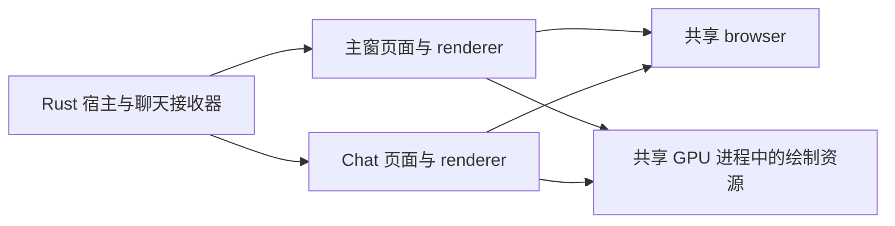

# 主窗口与 Chat 弹窗并存的内存调查

2026-10-07，代码基线 `26f43651`。用户确认场景是主窗口与 Chat 弹窗同时打开。

**主要方向：新增渲染进程和绘制资源的成本，加上 Chat 入口加载的主应用模块。应优先减轻 Chat 页面与绘制成本，并回收已经不用的主窗；Suspend 不能解决两个窗口同时可交互时的开销。**

这轮完成源码调查和 release 隔离对照，没有修改产品行为。下面的数值来自空白页和一条测试消息的 Chat 页面，不是连接真实账号后的完整主窗与 Chat 双窗实测。尚不能判定真实场景是否另有长时间泄漏。

## 实测

环境：Windows，本机 WebView2 `154.0.4258.62`，DPR 1.5，NVIDIA RTX 4060 Laptop GPU，驱动 `32.0.16.1692`。存在 GameViewer 虚拟显示适配器。

探针使用当前 `dist/` 的生产前端与 release Rust 构建。每次运行使用独立临时 WebView 数据目录，不安装生产 `AppState`，不读取真实配置，不连接 OneBot。Chat 使用测试账号与一条文本消息。

每个阶段采三个相邻样本，下表取中位数；每种内容只进行一次无远程调试的完整运行。这不是三次独立冷启动的统计验收。

| 场景 | 空白页私有内存 MiB | Chat 私有内存 MiB | Chat 渲染进程合计 MiB | Chat GPU 私有内存 MiB | 渲染进程数 |
| --- | ---: | ---: | ---: | ---: | ---: |
| 没有窗口 | 4.0 | 3.9 | 0 | 0 | 0 |
| 一份页面，Normal | 167.0 | 242.3 | 52.2 | 106.6 | 1 |
| 两份页面，Normal | 232.4 | 359.5 | 101.4 | 162.6 | 2 |
| 两份页面均隐藏并设 Low | 200.0 | 272.6 | 84.6 | 93.1 | 2 |
| 两份页面进一步 Suspend | 197.8 | 266.3 | 82.7 | 92.1 | 2 |
| 销毁一份，保留一份已挂起页面 | 174.7 | 218.7 | 41.5 | 92.2 | 1 |
| 全部销毁 | 6.3 | 6.8 | 0 | 0 | 0 |

探针原生窗口从创建起保持隐藏；Normal 阶段 WebView controller 没有被主动设为不可见。CDP 检查确认页面此时报告 `visibilityState = visible`、Chat 工作区与测试消息实际挂载。它能测出页面和 WebView 的驻留成本，不能替代两个原生窗口都显示在桌面上的输出缓冲、DWM 与操作体验测量。

两轮均返回 `MULTIWINDOW_RESULT Ok(())`；两份页面的 Suspend 回调均成功。退出后通过进程父子关系检查，没有残留探针进程或其直接子进程。原生窗口配置沿用主窗的透明与 Mica 配置。

可以从数据得到：

- 第二份 Chat 页面增加 **117.2 MiB**，其中渲染进程增加 **49.2 MiB**、GPU 增加 **56.0 MiB**。
- 第二份空白 WebView 也增加 **65.4 MiB**。固定窗口和引擎成本占有明显份额；两种增量之差约 51.8 MiB，提示页面侧仍有优化空间，但不是严格的因果分账。
- 两份 Chat 都隐藏并 Low 后减少 **86.9 MiB**，主要来自 GPU。此收益不能直接套到两个窗口都在前台的场景。
- Suspend 比已经隐藏并 Low 的状态只再减少 **6.3 MiB** 私有内存。工作集反而从 356.6 MiB 波动到 388.2 MiB，因此不能仅凭任务管理器工作集下降判断总分配减少。
- 关闭所有页面后，进程与内存回落。这轮短时隔离测试没有显示窗口销毁后继续累积资源；没有覆盖真实账号、多图历史或数小时使用。

独立的 CDP 诊断运行确认两份 Chat 页面都显示了测试消息。强制 GC 后 JS 活对象分别约 **6.52 / 6.55 MiB**，每页 307 个 DOM 节点、430 个 JS 事件监听。这个 JS 堆指标不包含全部 Blink/C++、解码图片与 GPU 内存。

## 代码证据与判断

| 证据 | 观察 | 判断 | 优先处理路径 |
| --- | --- | --- | --- |
| E1：`multiwindow-chat-default.log`、`multiwindow-blank-default.log` | 两窗各有 renderer，但共享 browser/GPU；空白页也明显增长 | F1，已验证：进程环境共享不能消除第二个页面和绘制面的成本 | P1：降低 Chat 单页成本，测试绘制资源 |
| E2：`src-ui/main.tsx:3` → `AppBootGate.tsx:6` → `AppNext.tsx` | Chat 路由判定前已经静态导入主应用；Chat 实际加载 729,850 字节的入口 JS，全部已加载 JS 约 1.83 MiB | F2，已验证：只渲染 Chat 不等于只加载 Chat 模块；具体可省多少尚未 A/B | P1：主窗启动门改为分支按需加载，必要时建立独立 Chat 构建入口 |
| E3：`AppNext.tsx:180`、`chatStore.ts:1266` | 弹出交接卸载主窗 Chat、保存草稿、释放账号 store；主窗再点 Chat 时会聚焦现有弹窗 | F3，已验证：当前路径已有交接，不能把主窗与弹窗并存直接解释成两份完整聊天档案同时驻留 | P2：检查实际交接与回收状态，避免重复改已存在的机制 |
| E4：`chat_window.rs:179`、`:248`、`lightweight.rs:31` | 新窗 reveal 时，`release_main` 且无组件任务才回收主窗；已有 Chat 窗的复用分支没有处理 `release_main` | F4，代码路径已验证，实际影响待复现：显式请求释放主窗，在复用分支可能被忽略 | P2：区分“聚焦 Chat，保留控制台”与“转入 Chat，释放控制台”两种意图，分别验证 |
| E5：`webview_scheduler/policy.rs:177` 与初轮 `multiwindow-chat.log` | 初轮八窗测试在隐藏后有一窗回到可见/Normal，最后 TrySuspend 返回 `0x8007139F`；`Focus(true)` 无条件 wake | F5，候选：原生焦点事件可能覆盖隐藏目标状态。尚未在真实主窗与 Chat 场景确认 | P2：复现隐藏与焦点交错，检查原生可见性、代次和最终 controller 状态 |
| E6：`chat_window.rs:227`、`tauri.conf.json:23` | Chat 克隆主窗配置，继承透明和 Mica；GPU 是新增成本的重要部分 | F6，配置与成本已验证，具体归因待 A/B：透明合成、绘制层、DPI 和页面内容要分别测 | P3：只对 Chat 做透明/Mica/不透明对照，保留主窗外观 |

E2 的模块加载证据不代表主应用组件全部挂载，也不代表所有主窗业务请求在 Chat 中执行。

已有消息工作集与档案预算分别是 1000 条/估算 8 MiB、5000 条/估算 16 MiB，窗口内共享消息对象，不能简单把两个预算相加当作固定占用。这些预算不限制浏览器引擎、字体、图片解码或 GPU 资源。真实图多群聊仍需要单独测量。

当前进程关系可以概括为：



## 建议的修复顺序

1. **先减轻 Chat 入口。** 主窗启动模块在确定窗口角色后才加载；检查公共标题栏、provider 和偏好模块的静态依赖。对照已加载资源和 renderer 私有内存，以实际收益决定是否进一步做多入口构建。
2. **主窗与 Chat 都在使用时保留双窗；主窗不用时回收。** 现有轻量模式已经能销毁主 WebView，需核对复用分支、组件任务门控、终端回放与隐藏/焦点事件。不能通过关闭用户正在使用的控制台来宣称双窗问题解决。
3. **做 Chat 绘制配置 A/B。** 先对透明/Mica、页面合成层与实际 DPI 做实验，比较私有内存、滚动帧时间、CPU、文字与阴影效果。GPU 进程是共享的，必须按整个进程组计量，不能把全部 GPU 内存归给一个窗口。
4. **保持已有缓存边界，补真实账号长时测量。** 包括图片多的群、切换会话、隐藏一窗而另一窗可见、恢复、交接草稿和反复打开。只在实测显示消息/媒体持有导致增长时继续改数据缓存。

Suspend 放在后续：它要求 controller 不可见，会暂停脚本；本轮额外私有内存收益较小。实验中的 Low → Suspend 顺序仅用来比较收益；生产若加入 Suspend，应按官方要求建立明确模式与恢复流程，验证消息补齐和 IPC 队列，不能直接叠加现有 Low/Normal 策略。

不建议把禁用 GPU、禁用站点隔离或强制 renderer 合并作为默认修复。微软的同站点进程合并反馈说明该路径受 WebView2 内部实现限制；浏览器参数也不承诺长期支持。`reparent` 可以移动一个 WebView 的父窗口，但不能让同一份可交互页面同时出现在两个窗口。

## 复跑与产物

探针：[chat_multiwindow_probe.rs](../../src-tauri/examples/chat_multiwindow_probe.rs)。`two` 测 1/2 窗；不传 `two` 测 1/2/4/8 窗；`blank` 使用空白页面。通用探针名字保留早期多窗调查范围。

```powershell
cargo rustc -p ncd-tauri --example chat_multiwindow_probe --release --features tauri/custom-protocol,tauri/dynamic-acl -- -C link-arg=/STACK:8388608

$savedProbeArgs = $env:WEBVIEW2_ADDITIONAL_BROWSER_ARGUMENTS
try {
    Remove-Item Env:WEBVIEW2_ADDITIONAL_BROWSER_ARGUMENTS -ErrorAction SilentlyContinue
    & .\target\release\examples\chat_multiwindow_probe.exe two 2> .\tmp\perf\replay-chat.log
    & .\target\release\examples\chat_multiwindow_probe.exe blank two 2> .\tmp\perf\replay-blank.log
} finally {
    $env:WEBVIEW2_ADDITIONAL_BROWSER_ARGUMENTS = $savedProbeArgs
}
node .\tmp\perf\multiwindow-summarize.mjs .\tmp\perf\replay-chat.log .\tmp\perf\replay-blank.log
```

构建会嵌入现有 `dist/`；如果前端已修改，先生成相应生产前端，避免测试旧产物。本轮没有重建产品 MSI。

原始日志、CDP 页面检查、汇总脚本与汇总 JSON 保留在本机 `tmp/perf/`，该目录不进 git：

| 产物 | SHA-256 |
| --- | --- |
| `multiwindow-chat-default.log` | `F76992AD64F86B9D6492AC812ACA6A31B82F222427512753D53A1D7000F890FA` |
| `multiwindow-blank-default.log` | `07975E950E62DF8B545182AB3761ADA55E176700814C4417B5F6466C05194EC3` |
| `multiwindow-pages.json` | `F093E58654B3E924028A4B93F574CF3E0B8FFADF048097ACE5E682A439741D4E` |
| `dual-window-summary.json` | `20C7263AF24421A3C2DEEC6F707867FDEE4E5510D96E3BE26CBC563315441DB3` |
| 最终探针 exe | `16E409BD0AFEB79E07F7438068B87BB4CD6699B5E723F3AA511CF134F21C4F17` |
| `dist/index.html` | `2549FA29E72F118178667AC6555040BA3347FBE812D3B0B4DEB6C3938449803C` |

首轮探针修正了 SDK 回调返回 `bool` 与配置 URL 的 API 使用；初轮八窗隐藏场景又暴露焦点干扰。最终受控对照不转发原生 Focus 事件，只保留 Destroyed 清理，因此不能用这轮结果宣称产品焦点竞争已经修复。初轮失败日志保留，未作为成功的 Suspend 对照。

后续产品验收需要新 release 的真实主窗与 Chat 并存曲线，至少包括两个窗口均显示、仅隐藏主窗、主窗回收、恢复控制台、持续收消息与图多群聊。分别记录 renderer、GPU、宿主、私有内存、工作集、CPU 与交互时延。

## 官方依据

- [WebView2 进程模型](https://learn.microsoft.com/en-us/microsoft-edge/webview2/concepts/process-model)：相同数据目录与一致环境选项可共享进程组，renderer 分配仍由引擎决定。
- [MemoryUsageTargetLevel](https://learn.microsoft.com/en-us/dotnet/api/microsoft.web.webview2.core.corewebview2.memoryusagetargetlevel)：Low 是 best effort，脚本继续运行，可能通过换页降低驻留；不保证分配量同步减少。
- [TrySuspend](https://learn.microsoft.com/en-us/microsoft-edge/webview2/reference/win32/icorewebview2_3?view=webview2-1.0.3537.50)：要求 controller 不可见，成功也是 best effort。
- [MicrosoftEdge/WebView2Feedback #5135](https://github.com/MicrosoftEdge/WebView2Feedback/issues/5135)：同站点 renderer 合并参数的实现限制说明。
- [WebView2 性能建议](https://learn.microsoft.com/en-us/microsoft-edge/webview2/concepts/performance)：共享环境、减少实例、优化内容与实际场景测量。
- [WebView2 浏览器参数](https://learn.microsoft.com/en-us/microsoft-edge/webview2/concepts/webview-features-flags)：用于测试与诊断，不保证长期支持。
- [Tauri Webview::reparent](https://docs.rs/tauri/latest/tauri/webview/struct.Webview.html#method.reparent)：移动 WebView 到给定父窗口。
