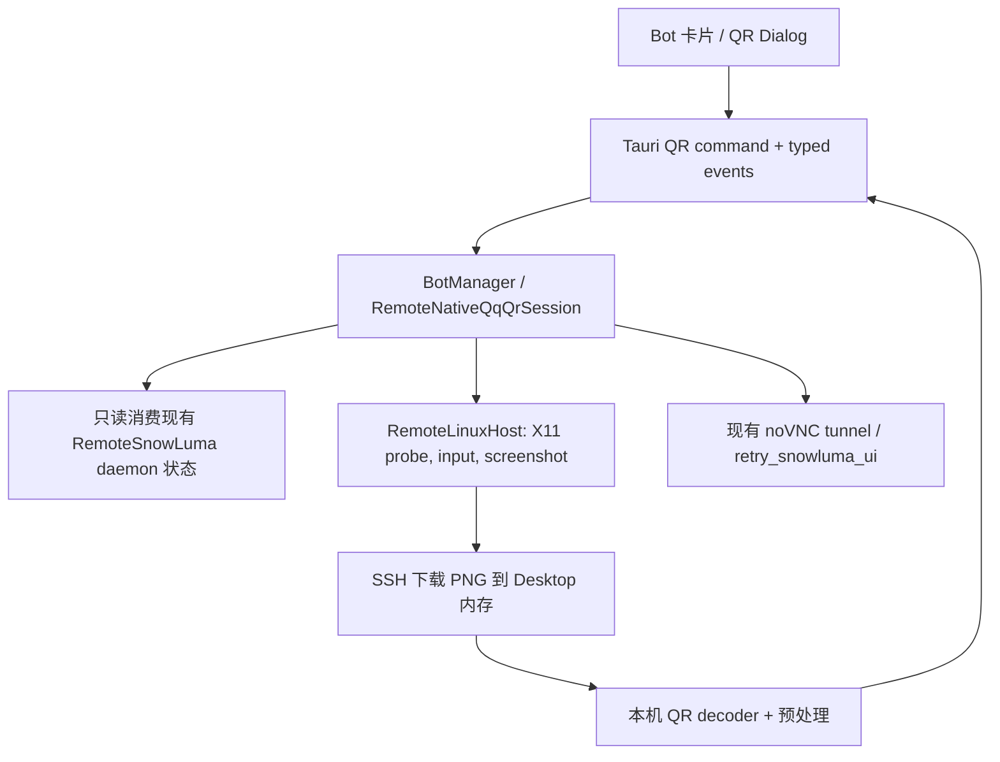
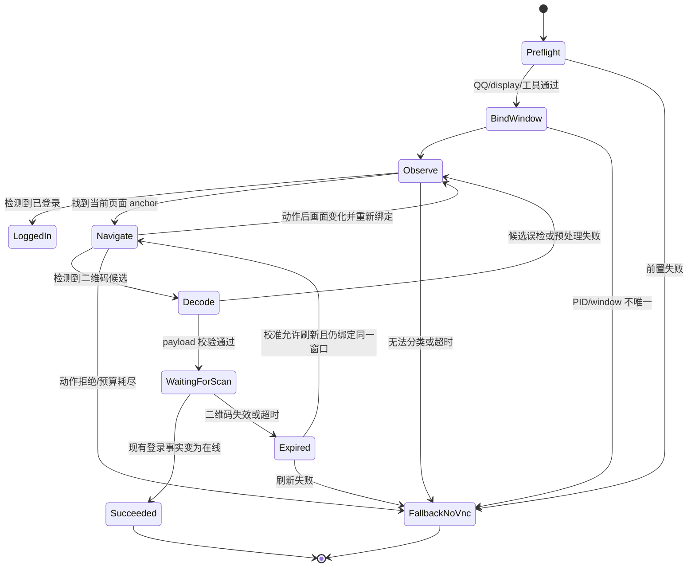

# 远端 Native SnowLuma QQ 二维码登录

日期：2026-08-30  
状态：设计范围已获批准；实施前须通过动态校准闸门  
范围：仅远端 Linux Native SnowLuma；不修改 SnowLuma 运行时、Hook、WebUI 或远端资产

## 1. 问题与边界

远端 Native SnowLuma 已能在目标主机上启动 QQ、共享 Xvfb/窗口管理器/x11vnc/websockify，并通过 SSH 隧道提供 WebUI 与 noVNC。现有 `SnowLumaLoginState::WaitingForQrScan` 只表达“等待扫码”，不提供 QQ 原生窗口中的二维码；现有前端二维码弹窗服务于 NapCat WebUI 的 `qrcodeurl`，不能直接复用为 SnowLuma 的数据来源。

本设计增加一条旁路：桌面通过既有 `Host` 在远端 X11 显示器上识别并操作目标 QQ 窗口，抓取窗口截图，下载到本机内存，由本机二维码解码器解析 payload，再以类型化事件交给 UI 渲染。QQ、SnowLuma 与 noVNC 仍是被消费的现有能力，不因本功能改写或增加协议。

包含：

- 远端 Native SnowLuma 单 Bot 的二维码获取、刷新、过期与取消。
- X11 显示器、QQ PID、窗口和二维码之间的绑定。
- 截图工具、输入工具、分辨率、主题、语言和 QQ 构建差异的能力探测与适配。
- 解码失败时保留现有 noVNC 手动扫码路径。

不包含：本机 Windows、远端 Docker、NapCat、SnowLuma 代码或配置变更、QQ 二进制补丁、远端二维码解码、直接调用 QQ 私有 native API、删除 noVNC、自动重启 QQ/daemon。

## 2. 已确认的 QQ 静态证据

证据来源：`work/qq-nt-qr-navigation-2026-08-30/report/qr-login-static-report.md`，对象为 `wrapper.node.i64`，只读 IDA MCP 分析。

- `sub_180625C4C`（`0x180625c4c`）是 QR session 的 `GetQRCodePicture` 实现；调用点为 `sub_180662250`（`0x18066229e`）与 `sub_180662544`（`0x1806625cf`）。
- `sub_180C9C7BE`（`0x180c9c7be`）是 `NodeIKernelLoginService.getQRCodePicture` 的 Node 绑定，要求零参数，调用 native virtual method，并向 JS 返回布尔值。
- `sub_181EE3E14`（`0x181ee3e14`）序列化回调结果，字段为 `pngBase64QrcodeData`、`qrcodeUrl`、`expireTime`、`pollTimeInterval`。
- `sub_181EE3CB3`（`0x181ee3cb3`）以一个结果参数调用 JS 属性 `onQRCodeGetPicture`（`0x181ee3d52`）。
- 静态结果证明了“JS `getQRCodePicture()` → native 异步 QR session → `onQRCodeGetPicture({...})`”的数据获取链，但没有证明 Desktop 或其它外部调用方能触发它。
- 在追踪函数中没有找到 ShellExecute、浏览器导航、窗口创建、页面路由或本地二维码文件落盘证据；也没有证明哪个 UI 路由会展示该回调结果。

因此实现不得把私有 binding 当作可用入口，也不得从这些字段推断出 QQ 页面导航。动态校准必须先证明真实 QQ UI 的导航序列，屏幕路径是本设计的唯一实现入口。

## 3. 架构与数据流

新增能力放在 Desktop 自有的 domain/traits/runtime/Tauri/UI 边界内。这里“不得修改 SnowLuma”特指不改 `ncd-backend-snowluma` 的既有实现、不改 SnowLuma 远端运行时/Hook/WebUI/配置资产，也不新增 SnowLuma 协议；Desktop 侧只读消费既有 daemon、Host、进程和隧道事实，新增的截图、输入、解码与会话编排由 Desktop 自己持有。

边界职责：

- domain：`QrLoginSession`、绑定信息、二维码结果、失败原因、事件 envelope；所有跨边界类型由 Rust 派生 TypeScript。
- traits：截图源、X11 能力探测、输入执行、二维码解码器的可替换契约；测试用 Mock Host，不把 SSH 细节带进 UI。
- runtime：按 `server_id + bot_id` 编排校验、导航状态机、会话取消、截图调度、PID/window 绑定和事件发布。它不改变 SnowLuma 登录状态，不拥有 QQ 或 daemon 生命周期。
- Tauri：只做参数转换、权限校验入口和错误转字符串；提供开始、取消、刷新/重试以及获取 noVNC fallback 的薄壳。
- UI：在现有 Bot 卡片入口展示 QR；成功显示解码 payload，在线或过期时清理；任何自动化失败都能打开现有 noVNC。

二维码事件必须携带 `v: u32`、`server_id`、`bot_id`、`session_id`、`capture_generation` 和结果状态。事件只更新对应 Bot，旧 session 的迟到事件必须被丢弃。

## 4. 远端前置条件与能力探测

启动 QR session 前必须确认：

1. 配置是远端 Linux Native SnowLuma，目标 Bot 已启动或可由现有 reconcile 找到；不为 Docker、Local 或 NapCat 创建此 session。
2. 现有远端 daemon 对应的 Xvfb/display 可用，QQ 进程由同一 SSH 用户或该用户可访问的 X server 运行；解析 `DISPLAY` 与必要的 `XAUTHORITY`，不得只凭默认值猜测。
3. 远端具备一条截图链：优先 `scrot`、`gnome-screenshot` 或 ImageMagick `import`；也可使用 `xwd` 配合 `convert` 输出 PNG。探测结果记录工具和版本，不安装新包，不改 SnowLuma。
4. 远端具备窗口事实与输入能力：`xprop`/`xwininfo`/`wmctrl` 至少一条窗口枚举链，`xdotool` 或等价 XTest 工具至少一条聚焦、点击、按键链；缺失即转 noVNC。
5. 本机 QR decoder 可用，截图传输有大小、耗时和并发上限；远端无须联网。

能力探测是每个 session 的短命快照，并按 `host_id + display + tool_fingerprint` 缓存；连接重建或 display 改变时失效。远端命令使用受限参数和安全路径，不能把 QQ、WebUI、VNC 密码放入命令行或探测输出。

## 5. PID 与窗口绑定

绑定优先级必须可证明，不能用“当前唯一 QQ 进程”跨 Bot 猜测：

1. 读取现有 `pid_bot_<qq_id>` 与状态文件；确认 PID 存活、`/proc/<pid>/exe`（或等价事实）与库存选中的 `qq_bin` 相符，并核对命令行中的 `-q <qq_id>`（可获取时）。
2. 导入或 reconcile 场景没有可信 pidfile 时，复用现有远端 QQ PID 探测；单主进程兜底只允许该主机确实只有一个 Native SnowLuma Bot。多 Bot 无唯一证据时拒绝自动化。
3. 通过 `_NET_WM_PID`、窗口树、窗口 class/title 枚举目标窗口；优先精确 PID，其次只接受已验证的 QQ 子进程 PID。窗口不可唯一归属时不点击、不解码，转 noVNC。
4. 每次动作前重验 PID、进程 executable、display、window id 和窗口几何；窗口重建后重新绑定。不得把全屏截图中碰巧出现的二维码归给另一个 Bot。

绑定结果是 session 内存数据，不写入 BotConfig 或 servers.json。截图若必须先抓 root，再只能用于候选窗口定位；完成绑定后切换为目标窗口截图。

## 6. 截图、导航与本地解码

截图在远端 X11 完成，在本机解码。优先无损 PNG；不得使用 JPEG。远端临时文件使用 session 随机目录、权限 `0600`，下载成功或取消时立即删除；清理失败只记录类别和清理结果，不保留截图路径作为用户数据。

每轮截图遵循“重验绑定 → 聚焦目标窗口 → 截图 → 下载 → 释放输入锁”。截图只保留本机内存中的当前帧和上一帧摘要。默认每秒不超过一次，动作后的首轮可短暂提高频率；单帧大小、总时长和总帧数都有限制。

本机解码器对当前帧按以下顺序处理：原图、灰度、对比度/阈值、候选区域裁剪、有限倍数缩放。对同一 payload 去重，并校验 UTF-8、长度、控制字符和 QR 版本边界；不假定 payload 一定是 `https://`，也不把 `pngBase64QrcodeData` 当成远程 URL。解码结果只在内存传给 UI，日志记录哈希和长度，不记录内容。

## 7. 自适应导航状态机

准确的 QQ 导航顺序是动态依赖，不能凭静态 IDA 证据或固定坐标实现。实现前必须在 Kunming 测试主机完成一次真实观测，形成校准产物：

`work/qq-nt-qr-navigation-2026-08-30/report/qq-qr-navigation-calibration.md`

该产物是实施闸门，必须包含 QQ 构建标识、display/分辨率/缩放、初始登录态、每个观察状态的截图摘要、可识别 anchor、动作类型与等待条件、可接受变体、失败分支、成功解码样本和重复运行结果。现有 `qr-login-static-report.md` 只能作为静态证据，不能替代此产物；校准产物不存在或没有 Kunming 实机重复结果时，不进入生产实现阶段。

运行时使用校准产物描述的状态图，而不是固定像素脚本：

每个导航动作必须有 anchor 前置、动作后变化判定、超时和最大重试次数；禁止连续盲点。适配维度至少包括窗口尺寸和 DPI、浅色/深色主题、语言文本变化、登录/账号选择/更新或协议弹窗、QQ 构建差异、窗口重建、多 Bot 同屏和已有登录态。无法确认页面语义时宁可停止并交给 noVNC。

## 8. 生命周期与并发

- 每个 `bot_id` 同时只有一个 QR session；重复开始复用当前 session 或返回明确的“已有会话”结果，不创建第二套动作循环。
- 同一 `server_id + display` 共享一把输入/聚焦锁，防止多 Bot 并发抢焦点；解码可在释放锁后进行，发布前仍需核对 generation。
- session 不持有 daemon、QQ 或 noVNC 的所有权，不因取消、失败、UI 关闭而停止远端进程。Bot stop、进程退出、SSH Host 替换、daemon display 改变或 Bot 删除会取消 session 并清理临时文件。
- 所有远端命令、下载和解码都可取消；取消优先于 ticker。session 超时后只发布一次终止状态，迟到帧和事件按 session id 丢弃。
- SSH 重连后使用新 Host 和新绑定重新开始，禁止复用旧窗口 id、旧截图或旧 display。

## 9. 安全与数据处理

二维码 payload 是短期登录凭据，应按敏感数据处理：

- 全程经既有 SSH Host 传输；不经第三方服务、不上传远端、不调用外部解码 API。
- 远端截图临时文件权限为 `0600`，成功下载、失败、取消和超时都走清理；本机不落盘截图或 payload。
- 日志只记录 server/bot/session、工具能力、帧大小、哈希、解码状态和错误类别；禁止记录 PNG、base64、QR 文本、窗口截图和密码。
- UI 关闭、成功、失效、切换 Bot 时立即清理内存中的 payload；不自动写剪贴板。显示 QR 的组件不发起网络请求。
- Tauri command 只允许配置中的目标 Bot；路径由运行时生成并做 POSIX 规范化和 shell quoting，用户输入不能成为命令片段。

## 10. 失败与 noVNC fallback

以下情况统一结束自动化并给出原因：Host/SSH/display 不可用、工具缺失、X11 权限不足、PID/window 不唯一、校准 anchor 不匹配、动作无效、截图超时、二维码候选无法解码、二维码失效、Bot 已在线、并发锁超时或 session 被取消。

失败不会改变 SnowLuma login state，也不会杀 QQ、重启 daemon 或修改远端文件（临时截图清理除外）。UI 保留“打开 noVNC 桌面”入口；隧道缺失时可调用现有 `retry_snowluma_ui` 重建 WebUI/noVNC 连接，仍不重启 Bot。noVNC 使用当前已有的动态远端端口和密码流程，二维码旁路不能削弱原有手动扫码能力。

## 11. 测试与验收

纯函数与 Mock Host：

- capability 输出解析、工具优先级、超时/大小边界和临时路径清理。
- PID/executable/`-q` 校验、窗口 PID 绑定、子进程绑定、多 Bot 歧义拒绝。
- 截图帧去重、预处理顺序、合法/非法 payload、二维码过期与结果清理。
- 状态机的 anchor 缺失、动作后无变化、刷新、取消、generation 丢弃和重试预算。
- domain/IPC JSON round-trip；事件 `kind`、`tauri_event_name()` 与 `v` envelope 一致。

Kunming 实机验收必须使用校准产物中的构建和环境，并覆盖冷启动、热接管、reconcile 后启动、已登录、首次扫码、过期刷新、SSH 重连、窗口重建、浅色/深色、缩放变化和同机多 Bot。每项都要保留“状态转移 + 最终结果 + noVNC 可用性”的可追溯记录，不把截图或 QR payload 纳入仓库。

验收标准：

1. 目标远端 Native SnowLuma 在具备能力的环境中能得到当前 QQ 登录二维码 payload，UI 能本地渲染并在登录成功后清除。
2. 任一绑定或解码不确定性都不会误操作另一 Bot，并能在不重启 QQ 的前提下转 noVNC。
3. 不具备截图/输入工具、X11 权限或校准变体时，错误可见且 noVNC 路径仍可用。
4. 不修改 `ncd-backend-snowluma`、SnowLuma 远端资产、Hook/WebUI 协议或 noVNC 端口/密码语义。
5. 运行过程中不落盘截图或 payload，日志无敏感内容，取消和 SSH 重连不会遗留后台任务。

## 12. 分阶段边界

0. 动态校准闸门：只在 Kunming 测试主机观测真实 QQ 导航，提交规定的校准产物；静态 IDA 分析不满足闸门。
1. 契约层：新增 domain/traits 类型和 IPC 事件，补充纯函数与 round-trip 测试；不连接远端、不改 SnowLuma。
2. 远端采集层：实现能力探测、PID/window 绑定、X11 输入、PNG 截图和安全清理；只依赖既有 Host/daemon 事实。
3. 本机解码与状态机：实现预处理、去重、导航适配、取消和并发锁；以校准产物为唯一导航输入。
4. Tauri/UI：接入 Bot 卡片和 QR dialog、状态提示、刷新/取消以及现有 noVNC fallback；不新增顶层路由。
5. 实机验收：按校准矩阵完成远端 Native SnowLuma 验证，确认未触碰 SnowLuma 和其它 backend 的范围。

任何阶段都不能通过猜测 QQ 导航序列来绕过第 0 阶段；没有校准产物就不进入第 1 阶段的生产实现。